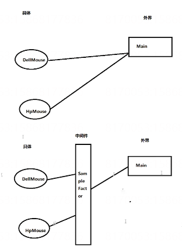

## 简单工厂

简单工厂模式又叫静态工厂方法（Static Factory Method）模式。简单工厂模式是由一个工厂对象决定创建出哪一种产品类的实例。简单工厂模式是工厂模式家族中最简单实用的模式，可以理解为是不同工厂模式的一个特殊实现。

特点：只生产一种品牌（类型）的产品，在工厂中动态创建。

缺点：当增加新产品（子类）时，需要修改简单工厂类的代码，违反开闭原则。

## 案例

生产手机。

普通生产流程：脚本直接引用具体类，耦合度高。

``` C#
abstract class Mouse { }
class DellMouse : Mouse
{
    public DellMouse() { Console.WriteLine("生产了一个戴尔鼠标"); }
}
class HpMouse : Mouse
{
    public HpMouse() { Console.WriteLine("生产了一个惠普鼠标"); }
}
// 测试
DellMouse dellMouse = new DellMouse();
HpMouse hpMouse = new HpMouse();
```

引入简单工厂：

``` C#
class SimpleFactory
{
    public Mouse Produce(MouseType type)
    {
        Mouse mouse = null;
        switch (type)
        {
            case MouseType.DellMouse:
                mouse = new DellMouse();
                break;
            case MouseType.HpMouse:
                mouse = new HpMouse();
                break;
            default:
                break;
        }
        return mouse;
    }
}
// 测试
SimpleFactory factory = new SimpleFactory();
Mouse dell = factory.Produce(MouseType.DellMouse);
```

