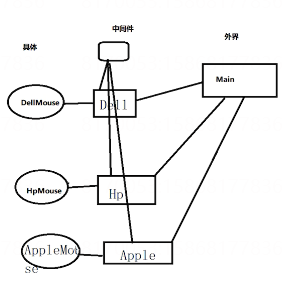

工厂模式是为了避免简单工厂模式中新增产品品牌（类型）时直接修改工厂类。将简单工厂划分为更为具体的子工厂，并用统一的工厂基类管理。

特点：只生产一种品牌（类型）的产品，在具体的子类工厂中创建。



``` C#
abstract class Factory
{
    public abstract Mouse Produce();
}
class DellFactory
{
    public override Mouse Produce() { return new DellMouse(); }
}
class HpFactory
{
    public override Mouse Produce() { return new DellMouse(); }
}
// 测试
HpFactory factory = new HpFactory();
Mouse mouse = factory.Produce();
```
