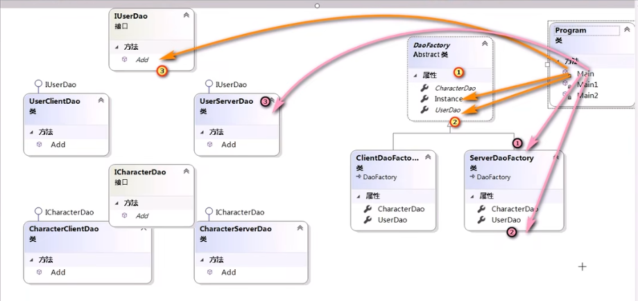

抽象工厂模式是为了解决工厂模式新增系列产品时的问题。

特点：可以生产多种产品。

## 案例

脚本通过不同的方式如客户端、服务端对用户的数据进行操作。

``` C#
// 用户客户端数据操作对象
class UserClientDao
{
    public void Add(User val) { }
}
// 用户服务端数据操作对象
class UserServeDao
{
    public void Add(User val) { }
}

// 脚本
if (gameType == "Client")
{
    UserClientDao userClientDao = new UserClientDao();
    userClientDao.Add(new User)
}
else if (gameType == "Serve")
{
    UserServeDao userServeDao = new UserServeDao();
    userServeDao.Add(new User)
}
```

变化点：不同的数据操作方式。目标：优化设计，使得增加数据操作方式时，不修改脚本代码。

使用接口和一个数据操作对象工厂封装脚本中的变化。

``` C#
interface IUserDao
{
    public void Add(User val);
}
// 用户客户端数据操作对象
class UserClientDao : IUserDao
{
    public void Add(User val) { }
}
// 用户服务端数据操作对象
class UserServeDao : IUserDao
{
    public void Add(User val) { }
}
// 数据操作对象工厂：生产两种数据操作对象
class DaoFactory
{
    // 用户数据
    public static IUserDao UserDao 
    {
        get
        {
            if (gameType == "Client")
                return new UserClientDao();
            else if (gameType == "Serve")
            	return new UserServeDao();
        }
    }
    // 装备数据
    public static IEquipmentDao EquipmentDao 
    {
        get
        {
            if (gameType == "Client")
                return new EquipmentClientDao();
            else if (gameType == "Serve")
            	return new EquipmentServeDao();
        }
    }
    // 角色数据
    // 道具数据
    // ...
}
// 脚本
IUserDao userDao = DaoFactory.UserDao;
userDao.Add(new User);
```

上述代码出现新的问题：当需要操作的数据种类较多时，需要多次选择操作类型（客户端/服务端）。是否能只选择一次，此后都按该方式操作各类数据。

通过数据操作工厂来**选择创建子类工厂**，而具体的操作类型对象由子类工厂指定创建。

``` C#
// 数据操作对象工厂：生产创建子类工厂
abstract class DaoFactory
{
    public static DaoFactory Instance
    {
        get // 此处仍违反开闭原则，可以使用反射进行优化
        {
            if (gameType == "Client")
                return new ClientDaoFactory();
            else if (gameType == "Serve")
            	return new ServeDaoFactory();
        }
    }
    // 用户数据
    public abstract IUserDao UserDao { get; }
    // 装备数据
    public abstract IEquipmentDao EquipmentDao { get; }
    // 角色数据
    // 道具数据
    // ...
}
// 客户端数据操作对象工厂：生产客户端数据操作对象
class ClientDaoFactory : DaoFactory
{
    public override IUserDao UserDao
    {
        get { return new UserClientDao(); }
    }
    public override IEquipmentDao EquipmentDao
    {
        get { return new EquipmentClientDao(); }
    }
}
// 服务端数据操作对象工厂：生产服务端数据操作对象
class ServeDaoFactory : DaoFactory
{
    public override IUserDao UserDao
    {
        get { return new UserServeDao(); }
    }
    public override IEquipmentDao EquipmentDao
    {
        get { return new EquipmentServeDao(); }
    }
}
// 脚本
DaoFactory daoFactoy = DaoFactory.Instance; // 选择子工厂，即数据操作方式
IUserDao userDao = daoFactoy.UserDao; // 选择数据
userDao.Add(new User); // 选择操作
```



反射优化：

``` C#
// 数据操作对象工厂：生产创建子类工厂
abstract class DaoFactory
{
    private static DaoFactory instance;
    public static DaoFactory Instance
    {
        get // 反射优化
        {
            if (instance == null) // 使用一次反射即可
            {
                // 定义规则：命名空间+gameType+Factory
                Type type = Type.GetType("space." + gameType + "Factory");
                instance = Activator.CreateInstance(type) as DaoFactory;
            }
            return instance;
        }
    }
}
```

此框架的优点：

- 脚本不涉及数据存储、访问方式，仅涉及操作行为。该框架适用于系列/方式会改变但对数据的操作不变的开发；如数据存储在客户端/服务端或者使用不同版本的数据库处理数据，不管怎么变，要做的事情不变。
- 实现并行开发：在抽象工厂类和接口开发结束后，剩下的工作可以并行开发。

缺点：

- 繁琐。
- 难。