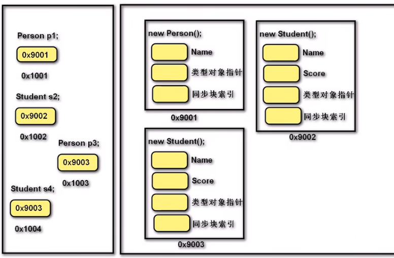

## 封装

**封装指导如何设计一个类**。从**数据角度**讲，将一些基本数据类型复合成一个自定义类型（符合人类思考方式，便于操作数据）；从**方法角度**讲，向类外提供功能，隐藏实现的细节；从**设计角度**讲，分而治之，封装变化，高内聚，低耦合。

封装可以松散耦合，降低了程序各部分之间的依赖性；简化编程，使用者不必了解具体的实现细节，只需要调用对外提供的功能；增强安全性，以特定的访问权限来使用类成员，保护成员不被意外修改。

广义封装：从整个项目的设计角度出发。狭义封装：通过访问修饰符控制类成员的访问权限。

访问修饰符：

- `public`：访问不受限制。
- `private`：默认，访问仅限于此类。
- `protected`：访问仅限于此类或派生类。
- `internal`：访问仅限于当前程序集。
- `protected internal`：访问仅限于此类、派生类或当前程序集中的类。
- `private protected`：访问仅限于此类或当前程序集中此类的派生类。

对于狭义封装，类中的字段属于类的特征，通常私有化；方法属于类的行为，通常公开化。对字段的私有化虽然禁止了恶意访问和赋值，但也阻止了正常的访问或赋值需求，因此需要提供一组间接访问、修改类中私有化字段的方法。

可以使用`readonly`关键字来声明只读字段。只读字段可以在声明或构造函数中初始化，每个类或结构的实例都有⼀个独立的副本。可以与`static`⼀起使用，声明静态只读字段。静态只读字段可以在声明或静态构造函数中初始化，静态常量字段只有⼀个副本。

## 继承

继承是**复用**现有类的功能并在其基础上对功能、**概念**进行扩展的一种手段。继承统一概念，并以层次化的方式管理类。继承隐含了“is a”的关系，即子类应该是从属父类范畴，具有较高耦合度：父类改变时，无需通知子类；类之间切换不灵活。

继承通常适用于多个了类具有相同的数据或行为，且多个类从概念上是一致的从而需要进行统一处理。

类完全支持继承。可将多个类中共有的部分提取出来，作为父类。

继承是通过使用**派生**完成的。在子类声明时于类名称后面追加冒号`:`和需要继承的类名来指定父类（基类）。类继承基类时，会继承除构造函数外的所有成员。

继承是**单继承**，但因基类可能继承自其他类而具有传递性，即类可以间接继承多个类。类不继承实例、构造函数以及终结器。派生类可以添加新成员，但无法删除继承成员的定义。所有类都继承`object`类。使用`base`关键字可以在子类中调用父类的字段、构造参数、方法等成员；使用`this`关键字调用本类中的成员。

``` C#
// 在Point2D类的基础上定义一个Point3D
public class Point3D : Point2D
{
    public float Z { get; set; }
    public Point3D(float x, float y, float z) : base(x, y) { Z = z; }
}
```

子类可以继承父类中的全部内容，除了：

- 父类的私有内容无法直接访问，但实际已继承，可以通过反射等操作获取相关内容。
- 父类的构造方法不能继承，但当实例化子类时先进入子类构造方法，然后调用父类的构造方法（默认会隐式调用无参构造方法，可使用`base()`显示调用父类含参构造方法），父类的字段交由父类构造函数去初始化，最后再调用子类构造方法，子类字段由子类自己的构造函数初始化。**相当于在实例化子类之前会先实例化一个父类，子类中有一个隐藏引用指向该父类实例，因此子类可以继承父类中全部内容**。

``` C#
// 显示调用父类无参构造方法
public Son() : base() { }
```

## 转型

派生类类型可隐式转换成任意基类类型，即父类引用可引用任意子类实例。因为子类中隐式包含了一个父类实例，当父类引用指向子类的对象时，子类对象会隐式转换为父类类型（**向上转型**）。该引用指向子类实例中的父类实例，只能调用父类方法，而不能调用子类方法。

``` C#
// 向上转型
// 常规写法
Father father = new Son();
// 变形写法
Son son = new Son();
Father mson = (Father)son;
```

子类引用指向父类对象（向下转型）时需要强制转换，且前提是父类引用要先指向子类对象。

``` C#
// 向下转型
Father father = new Son();
Son son = (Son)father;// 成功

Father f = new Father();
Son s = (Son)f;// 报错
```

引用类型决定可以访问的成员。

``` C#
// 父类型引用 指向 父类型对象，只能访问父类成员
Person p1 = new Person();
// 子类型引用 指向 子类型对象，即可访问父类成员也可访问子类成员
Student s2 = new Student();
// 父类型引用 指向 子类型对象，(受类型制约)只能访问父类成员
Person p3 = new Student();
// 如果需要访问子类成员，需要将引用类型向下转型
Student s4 = p3 as Student;
// 不存在子类型引用 指向 父类型对象
```



## 多态

继承将相关概念的共性进行抽象并提供了一种复用的方式；多态在共性的基础上体现了类型及行为的个性化，即一个行为有多个不同的实现。

**多态让对象具有多选择**，即父类同一种动作或者行为（父类引用调用同一个方法）在不同子类上有不同的实现。

三个条件实现多态：父类引用、子类对象、方法覆盖。变量不存在重写覆盖。属性、静态方法没有多态性。实现手段：**重写**虚方法、抽象方法和接口（依赖抽象）。

父类方法、属性、索引器或事件声明前使用`virtual`修饰的为虚成员（不能与`static`、`abstract`、`private`或`override`⼀起使用），会被不同子类**重写**。子类使用`override`表明重写父类同名成员。在子类里面重写虚函数之后，指向子类对象的父类引用不管在哪里调用都是调⽤重写之后的方法。

重写原理：类在加载时会在内存方法区开辟一块空间，存储该类型的方法表，包含方法名称和方法句柄。当父类引用指向子类对象并且子类重写了父类方法时，父类方法表中相应的方法句柄将会被修改为子类对象的方法句柄。修改是在运行期间执行的，每次父类引用指向子类对象并且子类重写了父类方法时都会进行修改。因此通过子类引用调用执行子类的方法，通过指向子类对象的父类引用也执行调用子类方法。

如果签名相同的方法在基类和派生类中都进行了声明，但是该方法没有分别声明为`virtual`和`override`，派⽣类就会**隐藏**基类方法。在子类的方法前使用`new`关键字，表示显示隐藏父类相同名字的方法，仅使用子类方法。通常用于覆盖继承而来的父类方法而执行子类的方法。

隐藏仅在子类加载时创建了子类的方法表而不修改父类方法表，因此通过子类引用调用执行子类的方法，通过父类引用执行调用父类方法。

重写和隐藏，即动态（晚期）绑定和静态（早期）绑定。绑定是指类型与关联的方法的调用关系，即一个类型能够调用哪些方法。静态绑定指调用关系是在运行之前即编译期间确定的，而动态绑定则指调用关系在运行期间确定。静态绑定因在编译期确定，不占用运行时间，所有调用速度比动态绑定快，但动态绑定更加灵活。

``` C#
class Shape
{	// virtual允许子类重写
    public virtual float GetArea(float bottom, float height)
    {
        return bottom * height;
    }
}
class Rectangle : Shape
{	// override重写父类中的虚方法
    public override float GetArea(float width, float height)
    {
        return width * height;
    }
}
class Circle : Shape
{
    // new表示隐藏父类中同名方法，仅使用子类的方法
    public new float GetArea(float radius)
    {
        return Math.PI * radius* radius;
    }
}
```

重载和隐藏不属于多态。重载的本质是多个方法，因此不属于多态。隐藏是调用子类执行子类方法、调用父类执行父类方法，本质仍是两个不同的方法，并且调用子类增加了耦合度（没有依赖抽象）。重写则是只调用父类方法，但因为父类方法的方法句柄被修改而指向了子类方法，从而能根据子类的不同而表现出不同的行为。

多态性可以应用于数组、传参、返回值，使其具有多种性质。

``` C#
Father fatherS = new Son();
Father fatherF = new Father();
// 多态用于数组
Father[] arr = new Father[2];
arr[0] = fatherS;
arr[1] = fatherF;
foreach (Father item in arr)
    item.Show();
// Output:
// This is Son
// This is Father

// 多态用于传参
public void Fun(Father f) {}
Fun(fatherS);
Fun(fatherF);

// 多态用于返回值
public Father Fun()
{
    return fatherS;// return fatherF
}
```
