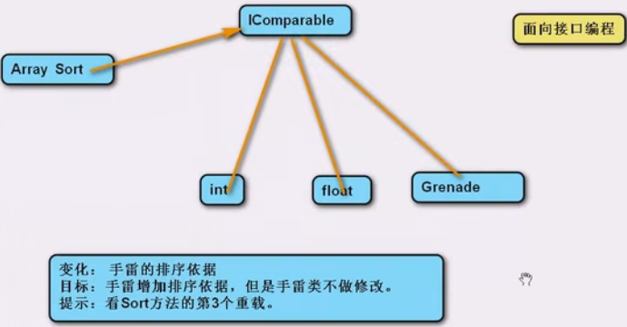

# 八大原则

## 开闭原则

开（放封）闭原则（Open-Closed Principle，OCP）指软件实体（类、模块、函数等）应该**对扩展开放，对修改关闭**，即允许在不修改源代码的情况下对其行为进行扩展，是目标，是总的**指导思想**。实现对修改封闭，关键在于抽象化。对一个事物抽象化，实质上是对一个事物进行概括、归纳、总结，将其本质特征抽象地用一个类来表示，这样类才会相对稳定，无需更改。扩展开放一般是通过继承和多态来实现，如此一来，可以保持父类的原样，只需在子类中添加些所需的新功能。

## 单一职责原则

单一职责原则（Single Resposibility Principle，SRP）的核心思想：**一个类只做好一件事情**。单一职责原则可以看作是高内聚、低耦合在面向对象原则上的引申。类的职责过多，容易导致类间职责依赖，提高耦合度，降低内聚性。通常意义下的单一职责，指的是类只有一种单一功能，不要为类设计过多的功能，交杂不清的功能会使代码杂乱，提高程序开发的难度和系统出错的概率，降低系统的可维护性。

适用于基础类，不适用基于基础类构造复杂的聚合类。

## 依赖倒置原则

依赖倒置原则（Dependecy Inversion Principle，DIP）的核心思想是**依赖抽象**。具体而言就是高层模块不依赖于底层模块，二者都依赖于抽象；抽象不依赖于具体，具体依赖于抽象。依赖倒置原则是对传统过程性设计方法的“倒转”，是高层次模块复用及其可维护性的有效规范。*抽象是稳定的，实现是多变的*。

依赖一定存在于类与类、模块与模块之间。类与类之间产生依赖时，依赖倒置原则的理解可以描述如下：依赖就是刚开始时具体细节间互相依赖，将实现的细节变成抽象类，降低类间耦合度。然后有了抽象类，继承自它的实现类也要依赖它。那倒置两字咋理解呢? 一般情况是先关注细节，然后根据细节抽象出来一些概括的方法，所以按常理一般抽象要依赖于细节的，而现在是是倒过来了，确定一个抽象类后，那些细节的实现得以抽象出来的方法为基准，并在子类中实现，从而变成了细节依赖于抽象。

当两个模块之间存在紧密的耦合关系时，最好的方法就是分离接口和实现：在依赖之间定义一个抽象的接口，供高层模块调用，底层模块实现接口的定义，从而有效控制耦合关系，达到依赖于抽象的设计目的。

依赖于抽象就是不对实现编程，而对接口编程。依赖于抽象是一个通用原则，而有些时候依赖于细节是在所难免的，我们需要根据具体情况在在抽象与具体之间进行取舍。

**抽象语义的三种实现**：1、抽象类是一个概念上的抽象；抽象类可以包含普通成员和抽象成员。2、接口是一组行为的抽象；接口只能包含抽象成员。3、而委托是一类行为的抽象；委托只能传递同一类的方法。

### 案例1

人可以通过坐火车和汽车回家，代码如下：

``` C#
class People
{
    public void GoHome(string type)
    {
        switch (type)
        {
            case "火车":
                Console.WriteLine("坐火车"); // 模拟功能
                break;
            case "汽车":
                Console.WriteLine("坐汽车"); // 模拟功能
                break;
            // 如果需要添加回家方式则需要修改源代码
        }
    }
}
```

扩展功能：增加一种交通方式：飞机。如果在上述代码中直接修改源代码，不可取，因此需要重新设计代码结构。按照封装变化的思想提炼出变化点：回家方式，因此用不同的类封装该变化。

``` C#
// 开闭原则
class Train
{
    public void Transport()
    {
        Console.WriteLine("坐火车");
    }
}
class Car
{
    public void Transport()
    {
        Console.WriteLine("坐汽车");
    }
}
```

但此时在`People`类中修改后，仍需要根据回家方式以修改源代码。

``` C#
class People
{
    public void GoHome(Train type)
    {
        Console.WriteLine("坐火车");
    }
    public void GoHome(Car type)
    {
        Console.WriteLine("坐汽车");
    }
}
```

此时根据依赖倒置原则， 从回家方式中抽象出类，然后在子类中实现细节。这样，`People`中直接调用父类的方法即可，父类方法可以用虚方法也可以用抽象方法。

``` C#
class People
{
    public void GoHome(Transport type)
    {
        type.Transport();
    }
}

abstract class Transport
{
    public abstract void Transport();
}
class Train : Transport
{
    public override void Transport()
    {
        Console.WriteLine("坐火车");
    }
}
class Car : Transport
{
    public override void Transport()
    {
        Console.WriteLine("坐汽车");
    }
}
```

### 练习2

需求：一家公司有如下几种岗位及该岗位计薪标准：普通员工（底薪）、程序员（底薪、项目分红）、测试员（底薪、Bug数乘10）。现定义员工管理器，记录所有岗位的员工，提供计算总薪资的方法。

变化点：岗位可能增加。

``` C#
class Employee // 普通员工
{
    public string Name;
    public float baseSalary;
    public virtual float GetSalary()
    {
        return baseSalary;
    }
}
class Programmer : Employee // 程序员
{
    public float bonus;
    public override float GetSalary()
    {
        return base.baseSalary + bonus;
    }
}
class Tester : Employee // 测试员
{
    public int bugCount;
    public override float GetSalary()
    {
        return base.baseSalary + bugCount * 10;
    }
}

class WorkerManager // 员工管理器
{
    List<Employee> employeeList;
    public float GetTotalSalary()
    {
        float totalSalary = 0;
        foreach (Employee employee in employeeList)
        {
            totalSalary += employee.GetSalary();
        }
        return totalSalary;
    }
}
```

## 组合复用原则

组合复用原则（Composite Reuse Principle，CRP）也叫合成/聚合复用原则（CARP），即在一个新的对象里面使用一些已有的对象，使之成为新对象的一部分；新的对象通过向这些对象的委派达到复用已有功能的目的。如果为了复用优先选择组合复用（耦合度更低，使用更灵活），而非继承复用。

### 案例3

对于练习2，当程序员老王需要调换岗位时，无法更改其内部的`GetSalary()`方法。此时，变化点是工作计薪方式。

``` C#
class Employee // 普通员工
{
    public string Name;
    public Job job;
    public virtual float GetSalary()
    {
        return job.GetSalary();
    }
}

public Job // 普通工作
{
    public float baseSalary;
    public virtual float GetSalary()
    {
        return baseSalary;
    }
}
class Programmer : Job // 程序员
{
    public float bonus;
    public override float GetSalary()
    {
        return base.baseSalary + bonus;
    }
}
class Tester : Job // 测试员
{
    public int bugCount;
    public override float GetSalary()
    {
        return base.baseSalary + bugCount * 10;
    }
}
```

## 里氏替换

里氏替换（Liskov Substitution Principle，LSP）指父类出现的地方可以被子类替换，在替换后依然保持原功能。里氏替换指导继承的设计，即继承后的重写。

子类要拥有父类的所有功能。子类在重写父类方法时，尽量选择扩展重写，防止改变了功能。

## 接口隔离

接口隔离（Interface Segregation Principle，ISP）指尽量定义小而精的接口，少定义大而全的接口。本质与单一职责相同，即功能拆分。

小接口之间功能隔离，实现类需要多个功能时可以选择多实现或接口之间作继承，代码更灵活。

## 面向接口编程而非面向实例

面向接口编程指客户端通过一系列抽象操作实例，而无需关注具体类型。

便于灵活切换一系列功能，实现软件的并行开发。



## 迪米特法则

迪米特法则（Law of Demeter，LOD）指类与类交互时，在满足功能要求的基础上，传递的数据越少越好，可以降低耦合度。

通常使用接口、事件屏蔽不相关数据。