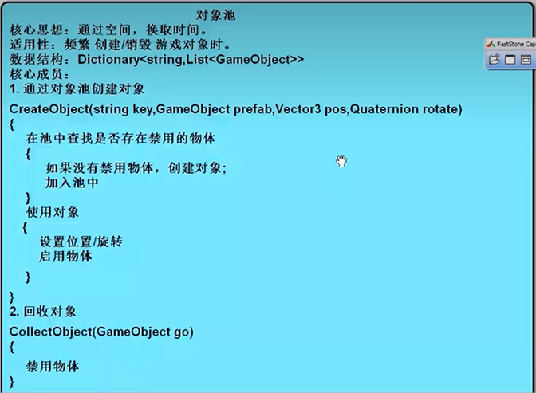

使用固定的对象池重用对象，取代单独地分配和释放对象，以此来达到提升性能和优化内存使用的目的。

所有频繁创建、销毁的对象都可以通过对象池创建、回收。这些对象需要重置脚本逻辑，即实现`IResetable`接口。



``` C#
public class GameObjectPool : MonoSingleton<GameObjectPool>
{
    private Dictionary<string, List<GameObject>> cache;
    // 初始化
    public override void Init()
    {
        base.Init();
        cache = new Dictionary<string, List<GameObject>>();
    }
    // 通过对象池创建对象
    public GameObject CreateObject(string type, GameObject prefab, Vector3 pos, Quaternion rotate)
    {
        // 检查对象池中是否有禁用（未使用）的对象
        GameObject go = FindUsableObject(type);
        // 没有，创建并入池
        if (go == null)
            go = AddObject(type, prefab);
        // 使用
        UseObject(go, pos, rotate);
        
        return go;
    }
    // 查找指定类别中可以使用的对象
    private GameObject FindUsableObject(string type)
    {
        if (cache.ContainsKey(type))
        	return cache[type].Find(go => !go.activeInHierarchy);
        return null;
    }
    // 添加对象
    private GameObject AddObject(string type, GameObject prefab)
    {
        GameObject go = Instantiate(prefab);
        if (!cache.ContainsKey(type))
            cache.Add(type, new List<GameObject>());
        cache[type].Add(go);
        return go;
    }
    // 使用对象
    private void UseObject(GameObject go, Vector3 pos, Quaternion rotate)
    {
        go.transform.postion = pos;
        go.transform.rotation = rotate;
        // 重置物体中全部脚本的逻辑
        IResetable[] resets = go.GetComponents<IResetable>();
        foreach (IResetable item in resets)
            item.ResetBeforeUse();
        go.SetActive(true);
    }
    // 回收对象
    public void CollectionObject(GameObject go, float delay = 0)
    {
        StartCoroutine(CollectionObjectDelay(go, delay));
    }
    private IEnumerator CollectionObjectDelay(GameObject go, float delay)
    {
        yield return new WaitForSeconds(delay);
        go.SetActive(false);
    }
    // 清空
    public void Clear(string type)
    {
        if (!cache.ContainsKey(type)) return;
        for (int i = cache[type].Count - 1; i >= 0; i--)
        {
            Destory(cache[type][i]);
        }
        cache.Remove(type);
    }
    public void ClearAll()
    {
        List<string> keys = new List<string>(cache.Keys);
        foreach (string item in keys)
        {
            Clear(item);
        }
    }
}

public interface IResetable
{
    void ResetBeforeUse();
}
```

