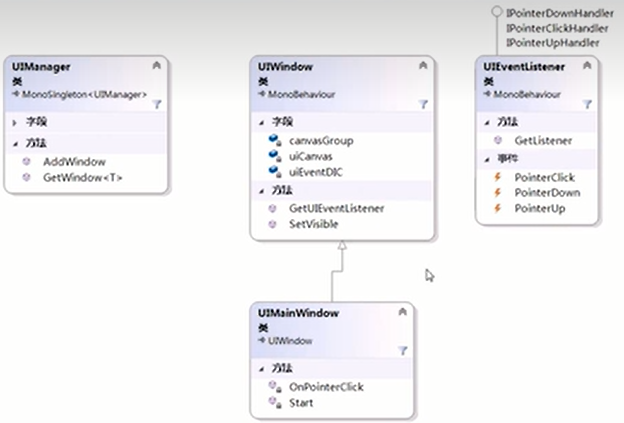

## 需求

1、UI窗口（Cavas）的统一管理（记录、提供显隐功能）。

2、UI事件的管理。

## 结构

根物体--窗口/画布--交互UI元素

根物体上UI管理器类UIManager来记录、管理各窗口。

父类UIWindow代表不同子类窗口，层次化方式管理并定义窗口共有行为。具体的窗口上置具体窗口类UIXXXWindow注册事件和提供交互行为。

在交互UI元素上绑定UI事件监听器UIEventListener，以管理该元素上所有的事件并监听操作。



## 核心类

UI窗口基类UIWindow：所有UI窗口的基类，用于代表所有窗口（概念继承，以层次化方式管理类）；定义所有UI窗口共有成员和行为。

``` C#
// UI窗口基类：定义所以窗口的公有成员
public class UIWindow ： MonoBehaviour
{
    private CanvasGroup canvasGroup;
    private Dictionary<string, UIEventListener> uiEventDic;
    private void Awake()
    {
        canvasGroup = GetComponent<canvasGroup>();
        uiEventDic = new Dictionary<string, UIEventListener>();
    }
    // 设置窗口可见性：默认等待1帧后显隐
    public virtual void SetVisible(bool state, float delay = 0) // 默认参数
    {
        // 协程调用延迟显隐
        StartCoroutine(SetVisabkeDelay(state, delay));
    }
    // 延迟显隐
    public IEnumerator SetVisabkeDelay(bool state, float delay)
    {
        yield return new WaifForSecont(delay); // 延迟
        // Unity建议UI窗口的显隐通过改变透明度而不是是否激活游戏物体实现，性能更好
        // 画布组canvasGroup：统一管理子UI元素的Alpha
        canvasGroup.alpha = state ? 1 : 0;
    }
    // 根据子物体名称获取UI事件监听器
    public UIEventListener GetUIEventListener(string name)
    {
        if (!uiEventDic.ContainsKey(name))
        {
            Transform tf = TransformHelper.FindChildByName(name);
            UIEventListener uiEvent = UIEventListener.GetUIEventListener(tf);
            uiEventDic.Add(name, uiEvent);
        }
        return uiEventDic[name];
    }
}
```

UI管理类UIManager：管理（记录、查找、禁用等）窗口。

``` C#
// UI管理器（单例）：管理、记录所有窗口，提供查找窗口的方法
public class UIManager : MonoSingleton<UIManager>
{
    // key：窗口类名称，Value：窗口对象引用
    private Dictionary<string, UIWindow> uiWindowDic;
    // 初始化UI管理器单例
    public override void Init()
    {
        base.Init();
        uiWindowDic = new Dictionary<string, UIWindow>(); // 初始化记录字典
        RecordAllUIWindow(); // 记录所有窗口
    }
    // 查找并记录所有UI窗口
    private void RecordAllUIWindow()
    {
        UIWindow[] uiArray = FindObjectsOfType<UIWindow>();
        foreach (UIWindow item in uiArray)
        {
            item.SetVisable(false); // 隐藏所有窗口
            uiWindowDic.Add(item.GetType().Name, item); // 记录窗口
        }
    }
    // 根据类型查找窗口
    public T GetUIWindow<T>() where T : class
    {
        string key = typeof(T).Name;
        if (!uiWindowDic.ContainsKey(key)) return null;
        return uiWindowDic[key] as T;
    }
    // 添加动态创建的窗口
    public void AddUIWindow(UIWindow window)
    {
        uiWindowDic.Add(window.GetType().Name, window);
    }
}
```

事件监听类UIEventListener：提供所有UGUI的带事件参数类的事件，类似EventTrigger。继承接口，使用委托抽象行为。附加到需要交互的UI元素上，负责监听操作。

``` C#
public class UIEventListener : MonoBehaviour, 
IPointerEnterHandler, IPointerExitHandler, IPointerDownHandler, IPointerUpHandler, IPointerClickHandler, IInitializePotentialDragHandler, IBeginDragHandler, IDragHandler, IEndDragHandler, IDropHandler, IScrollHandler, IUpdateSelectedHandler, ISelectHandler, IDeselectHandler, ISubmitHandler, ICancelHandler, IMoveHandler, IEventSystemHandler
{
    // 定义委托数据类型
    public delegate void PointerEventHandler(PointerEventData eventData);
    public delegate void BaseEventHandler(BaseEventData eventData);
    public delegate void AxisEventHandler(AxisEventData eventData);
    // 声明事件
    public event PointerEventHandler PointerEnter;
    public event PointerEventHandler PointerExit;
    public event PointerEventHandler PointerDown;
    public event PointerEventHandler PointerUp;
    public event PointerEventHandler PointerClick;
    public event PointerEventHandler InitializePotentialDrag;
    public event PointerEventHandler BeginDrag;
    public event PointerEventHandler Drag;
    public event PointerEventHandler EndDrag;
    public event PointerEventHandler Drop;
    public event PointerEventHandler Scroll;
    public event BaseEventHandler UpdateSelected;
    public event BaseEventHandler Select;
    public event BaseEventHandler Deselect;
    public event BaseEventHandler Submit;
    public event BaseEventHandler Cancel;
    public event AxisEventHandler Move;
    
    // 查找UIEventListener
    public static UIEventListener GetUIEventListener(Transform tf)
    {
        UIEventListener uiEvent = tf.GetComponent<UIEventListener>();
        if (uiEvent == null)
            uiEvent = tf.gameObject.AddComponent<UIEventListener>();
        return uiEvent;
    }
    
    public void OnPointerDown(PointerEventData eventData)
    {
        if (PointerDown != null) PointerDown(eventData);
    }
    public void OnPointerClick(PointerEventData eventData)
    {
        if (PointerClick != null) PointerClick(eventData);
    }
}
```

## 实现类

UI窗口类UIXXXWindow：在开始时给UI元素注册需要的交互事件，并提供交互行为。

``` C#
public class UIXXXWindow : UIWindow
{
    private void Start()
    {
        Find("Button").GetComponent<Button>().onClick.AddListener(OnGameStartClickButton);
        // 问题1：Find()根据名称/路径查找后代物体，导致名称/路径固定
        // 解决：变换组件助手类TransformHelper
        TransformHelper.FindChildByName("Button").GetComponent<Button>().
            onClick.AddListener(OnGameStartClickButton);
        // 问题2：只能注册Button的无事件参数类事件Onclick其他事件（光标按下、抬起、拖拽。。。）
        // 解决：事件监听类UIEventListener
        TransformHelper.FindChildByName("Button").GetComponent<UIEventListener>().
            PointerClick += OnPointClick;
        // 问题3：UI窗口查找UI事件监听器往往有多次
        // 解决：将获取UI事件监听器封装到父类
        GetUIEventListener("Button").PointerClick += OnPointClick;
    }
    private void OnPointerClick(PointerEventData eventData)
    {
        GameController.Instance.GameStart();
    }
    // private void OnGameStartClickButton()
    // {
    //     GameController.Instance.GameStart();
    // }
}
```

游戏控制器GameController：负责处理游戏流程。

## 使用

1、定义UIXXXWindow类，继承自UIWindow，负责处理该窗口逻辑。通过`GetUIEventListener()`方法获取需要交互的UI元素。

2、通过UIEventListener类提供的各种事件，完成交互行为。

3、通过UIManager访问各窗口：`UIManager.Instance.GetUIWindow<窗口类型>().方法();`。