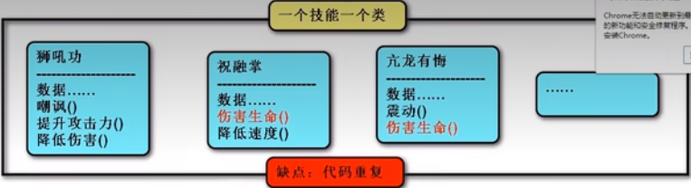
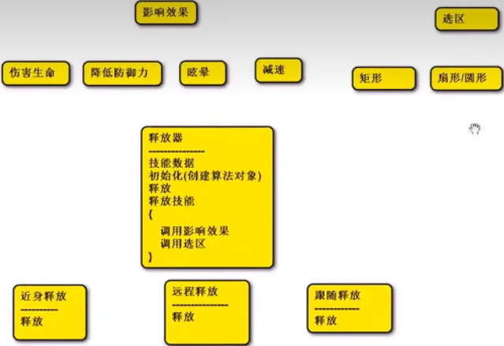
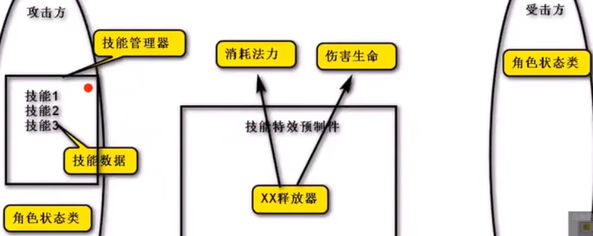
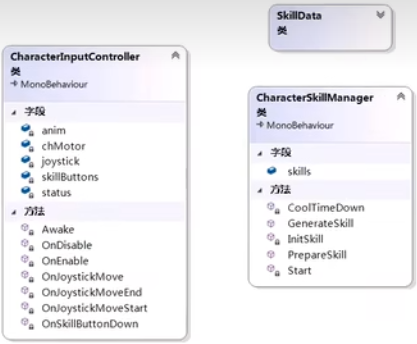
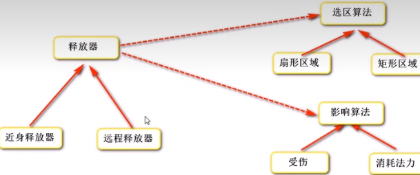
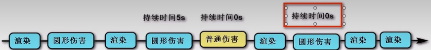
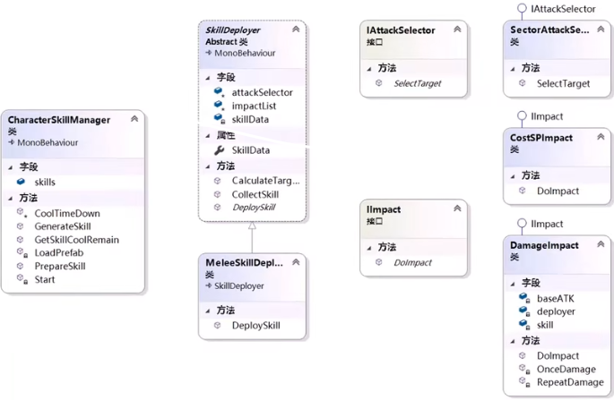

最简单的技能框架即一个技能为一个类，包含该技能所有数据和行为。此框架导致大量代码重复，低耦合，低内聚。



遵循封装、继承和多态的思想，用封装将需求用多个类划分开，确保每个类仅处理一个变化点；用继承找个父类统一管理子类；用多态调父执行子，不同的子具有不同效果，实现变化。





## 结构

SkillSystem：

1）Common=>SkillData、SelectorType、AttackType、CharacterSkillManager；

2）Deployer=>SkillDeployer、DeployerConfigFactory；

3）ImpactEffects=>IIMmpactEffect；

4）Selectors=>IAttackSelector。

## 通用类

技能数据类SkillData：存储技能数据。

``` C#
[Serializable]
public class SkillData
{
    public int id; // ID
    public string name; // 名称
    public string description; // 描述
    public int cooldown; // 冷却时间
    public int cooldownRemain; // 剩余冷却时间
    public int costMP; // 消耗
    public float attackDistance; // 攻击距离
    public float attackAngle; // 攻击角度
    public string[] attackTargetWithTags = {"Enemy"}; // 攻击目标的Tag
    public Transform[] attackTargets; // 攻击对象
    public string[] impactType = {"CostMP", "Damage"}; // 技能影响类型
    public int comboSkillID; // 下一连击技能ID
    public float damageRatio; // 伤害比率
    public float duration; // 持续时间
    public float damageInterval; // 伤害间隔
    public GameObject owner; // 释放/所属对象
    public string prefabName; // 预制件名字
    public GameObject prefab; // 创建的预制件对象
    public string animationConditionName; // 动画条件名称
    public string takenEffectName; // 受击特效名称
    public GameObject takenEffectPrefab; // 创建的受击特效预制件对象
    public int level; // 等级
    public SkillAttackType attackType; // 攻击类型：单攻Single、群攻Group
    public SkillSelectType selectorType; // 选择类型：扇形（圆形）Sector、矩形Rectangle
}
```

技能攻击类型类SkillAttackType

技能选择类型类SkillSelectType

角色技能系统类CharacterSkillSystem：封装技能系统（准备技能、播放动画、生成技能、移动旋转等），提供简单的技能释放功能。

``` C#
[RequireComponent(typeof(CharacterSkillManager))]
public class CharacterSkillSystem : MonoBehaviour
{
    private CharacterSkillManager skillManager;
    private Animator anim;
    private List<SkillData> skill; // 需要释放的技能
    private void Start()
    {
        skillManager = GetComponent<CharacterSkillManager>();
        anim = GetComponent<Animator>();
        ：// 利用动画事件在播放动画过程中释放技能
        GetComponentInChildren<AnimationEventBehaviour>().attackHandler += DeploySkill;
    }
    private void DeploySkill()
    {
        skillManager.GenerateSkill(skill);
    }
    // 使用技能攻击（为玩家提供）：在输入控制器中调用
    public void AttackUseSkill(int skillID, bool isCombo = false)// 迅速释放技能时出现Bug：skill被覆盖，使用动作队列解决/限制有效输入
    {
        // 如果触发连击，则从上一技能获取连击技能编号
        if (skill != null && isCombo)
            skillID = skill.comboSkillID;
        // 准备技能
        skill = skillManager.PrepareSkill(skillID);
        // 播放动画
        if (skill == null) return;
        anim.SetBool(skill.animationConditionName, true);
        // 生成技能：利用动画事件在播放动画过程中释放技能
        // 朝向目标
        if (skill.attackType != SkillAttackType.Single) return;
        Transform target = SelectTarget();
        if (target== null) return;
        transform.LookAt(target);
        // 选中目标
        SetSelectedActiveFx(false); // 取消上一个目标的被选状态
        selectedTarget = target; // 记录选择目标
        SetSelectedActiveFx(true);
    }
    // 设置选择状态
    private Transform selectedTarget; // 记录上一次的目标
    private void SetSelectedTarget(bool state)
    {
        // 对selectedTarget进行操作
        if (selectedTarget == null) return;
        CharacterSelected selectedOption = selectedTarget.GetComponent<CharacterSelected>();
        if (selectedOption) selectedOption.SetSelectedActive(state);
    }
    // 选择目标
    private Transform SelectTarget()
    {
        Transform[] target = new SectorAttackSelector().SelectTarget(skill, transform);
        return target.Length != 0 ? target[0] : null;
    }
    // 使用随机技能攻击（为NPC提供）
    public void UseRandomSkill()
    {
        // 从技能管理器中选择随机技能：先筛选可释放技能，再随机
        SkillData[] usableSkills = skillManager.skills.FindAll
            (skill => skillManager.PrepareSkill(skill.id) != null);
        if (usableSkills.Length == 0) return;
        int index = UnityEngine.Random.Range(0, usableSkills.Length);
        AttackUseSkill(usableSkills[index].id);
    }
}
```

## 核心类

技能管理器CharacterSkillManager：挂载于角色身上，管理和配置技能，负责判断、释放技能。技能的准备和生成可以封装。

``` C#
public class CharacterSkillManager : MonoBehaviour
{
    public SkillData[] skills; // 技能列表
    private void Start()
    {
        foreach (SkillData item in skills)
        	InitSkill(item);
    }
    private void InitSkill(SkillData data) // 初始化技能
    {
        // 资源映射表：资源名称：资源完整路径
        
        // 加载预制件
        // data.prefab = Resources.Load<GameObject>("URL" + data.prefabName);
        data.prefab = ResourcesManager.Load<GameObject>(data.prefabName);
        data.owner = gameObject;
    }
    public SkillData PrepareSkill(int id) // 准备技能：判断是否可以释放技能
    {
        // 根据ID查找技能数据
        SkillData data = skills.Find(skill => skill.id == id); // ArrayHelper
        // 判断条件，返回技能数据
        int mp = GetComponent<CharacterStatus>().MP;
        if (data != null && data.cooldownRemain <= 0 && data.costMP <= mp)
            return data;
        else
            return null;
    }
    public void GenerateSkill(SkillData data) // 生成技能
    {
        // 创建技能预制件
        //GameObject skillGo = Instantiate(data.prefab, transform.position, transform.rotation);
        // 创建、销毁、GC回收非常消耗性能：对象池。
        GameObject skillGo = GameObjectPoll.Instance.CreatObject
            (data.name, data.prefab, transform.position, transform.rotation);
        // 传递技能数据
        SkillDeployer deployer = skillGo.GetComponent<SkillDeployer>();
        deployer.SkillData = data; // 内部创建算法对象
        deployer.DeploySkill(); // 内部执行算法
        // 销毁技能
        //Destroy(skillGo, data.duration);
        GameObjectPool.Instance.Collection(skillGo, data.duration);
        // 开启冷却
        StartCoroutine(Cooldown(data));
    }
    private IEnumerator Cooldown(SkillData data)
    {
        data.cooldownRemain = data.cooldown;
        while(cooldownRemain > 0)
        {
            yield return new WaitForSeconds(1);
        	data.cooldownRemain--;
        }
    }
}
```



技能释放器SkillDeployer：创建算法对象，执行算法对象，释放方式。使用抽象工厂模式。



``` C#
public abstract class SkillDeployer : MonoBehaviour
{
    // 选区算法对象
    private IAttackSelector selector;
    // 影响算法对象
    private IImpactEffect[] impactArray;
    // 技能管理器传递
    private SkillData skillData;
    public SkillData SkillData
    {
        get;
        set
        {
            skillData = value;
            // 创建算法对象
            InitDeployer();
        }
    }
    // 初始化释放器
    private void InitDeployer()
    {
        // 创建算法对象
        // 选区
        selector = DeployerConfigFactory.CreateAttackSelector(skillData);
        // 影响
        impactArray = DeployerConfigFactory.CreateImpactEffects(skillData);
    }
    // 执行算法
    // 选区
    public void CalculateTargets()
    {
        skillData.attackTargets = selector.SelectTarget(skillData, transform);
    }
    // 影响
    public void ImpactTargets()
    {
        foreach (IImpactEffect item in impactArray)
            item.Execute(this);
    }
    // 释放
    public abstract void DeploySkill(); // 供技能管理器调用，由子类实现，定义具体释放策略
}
```

释放器配置工厂DeployerConfigFactory：提供创建释放器各种算法对象的功能，将对象的创建与使用分离。

``` C#
public class DeployerConfigFactory
{
    // 字典存储算法对象，减少使用反射的次数
    // 导致两个BUG：
    // 1、在持续伤害技能释放后再释放其他技能，停止持续伤害
    // 2、在释放某技能后立即释放其他技能，后释放技能执行两次
    private static Dictionary<string, object> cache;
    static DeployerConfigFactory()
    {
        cache = new Dictionary<string, object>();
    }
    public static IAttackSelector CreateAttackSelector(SkillData data)
    {
        // 选区对象命名规则：命名空间. + 枚举名 + AttackSelector
        // 例如扇形选区：ARPGDemo.Skill.SectorAttackSelector
        string selectorName = string.Format
            ("ARPGDemo.Skill.{0}AttackSelector", skillData.selectorType);
        return CreateObject<IAttackSelector>(selectorName);
    }
    public static IImpactEffect[] CreateImpactEffects(SkillData data)
    {
        IImpactEffect[] impacts = new IImpactEffect[data.impactType.length];
        // 影响效果命名规则：命名空间. + impactType[i] + Impact
        // 例如消耗法力：命名空间.CostMPImpact
        foreach (string item in data.impactType)
        {
            string impactName = string.Format("ARPGDemo.Skill.{0}Impact", item);
            impacts[i] = CreateObject<IImpactEffect>(impactName);
        }
        return impacts;
    }
    
    // 创建接口对象
    private static T CreateObject<T>(string className) where T : class
    {
        // 缺点：每次释放技能都使用 反射 创建算法对象，非常消耗性能
        // Type type = Type.GetType(className);
        // return Activator.CreateInstance(type) as T;
        // 既要利用反射的灵活性，也要减少使用反射的次数
        if (cache.ContainsKey(className))
        {
            Type type = Type.GetType(className);
        	object instance = Activator.CreateInstance(type);
            cache.Add(className, instance);
        }
        return cache[className] as T;
    }
}
```

攻击选区接口IAttackSelector

``` C#
public interface IAttackSelector
{
    // 搜索目标：技能数据，技能所在游戏物体的变换组件
    Transform[] SelectTarget(SkillData data, Transform skillTF);
}
```

攻击影响效果接口IImpactEffect

``` C#
public interface IImpactEffect
{
    void Execute(SkillDeployer deployer);
}
```

## 实现类

近身释放器MeleeSkillDeployer：在技能预制体上挂载，负责技能释放时的操作。

``` C#
public class MeleeSkillDeployer : SkillDeployer
{
    public override void DeploySkill()
    {
        // 执行选区算法
        CalculateTargets();
        // 执行影响算法
        ImpactTargets();
    }
}
```

扇形选区SectorAttackSelector：根据规则命名。

``` C#
public class SectorAttackSelector : IAttackSelector
{
    // 扇/圆形选区
    public Transform[] SelectTarget(SkillData data, Transform skillTf)
    {
        // 根据技能数据中的标签获取所有目标
        List<Transform> targets = new List<Transform>();
        foreach (string item in data.attackTargetWithTags)
        {
            GameObject[] tempGoArray = GameObject.FindGameObjectsWithTag(item);
            targets.AddRange(tempGoArray.Screen(go => go.transform));
        }
        // 判断攻击范围
        targets = targets.FindAll(tf => 
        	Vector3.Distance(tf.position, skillTf.position) <= data.attackDistance && 
        	Vector3.Angle(skillTf.forward, tf.position - skillTf.position) < data.attackAngle / 2
        );
        // 筛选出活的角色
        targets = targets.FindAll(tf => tf.GetComponent<CharacterStatus>().HP > 0);
        // 返回目标
        Transform[] result = targets.ToArray();
        if (data.attackType == SkillAttackType.Group || result.Length == 0)
            return result;
        Transform min = result.GetMin(tf => Vector3.Distance(tf.position, skillTf.position));
        return new Transform[] { min };
    }
}
```

消耗法力CostMPImpact：根据规则命名。

``` C#
public class CostMPImpact : IImpactEffect
{
    public void Execute(SkillDeployer deployer)
    {
        CharacterStatus status = deployer.SkillData.owner.GetComponent<CharacterStatus>();
        status.MP -= deployer.SkillData.costMP;
    }
}
```

伤害效果DamageImpact：根据规则命名。

``` C#
public class DamageImpact : IImapatEffect
{
    // SkillData data;
    public void Execute(SkillDeployer deployer)
    {
        // data = deployer.SkillData;
        deployer.StartCoroutine(RepeatDamage(deployer)); // 带来bug：两个技能共用data，不适用成员变量
    }
    // 重复伤害
    private IEnumerator RepeatDamage(SkillDeployer deployer)
    {
        float atkTime = 0;
        do
        {
            // 触发伤害效果
            Damage(deployer.SkillData);
            yield return new WaitForSeconds(deployer.SkillData.damageInterval);
            atkTime += deployer.SkillData.damageInterval;
            deployer.CalculateTargets(); // 重新计算目标
        } while (atkTime < deployer.SkillData.duration);
    }
    // 单次伤害
    private void Damage(SkillData data)
    {
        // 技能伤害 = 基础攻击力 * 伤害比率
        float attackDamage = data.owner.GetComponent<CharacterStatus>().baseAtk * data.damageRatio;
        foreach (Transform item in data.attackTargets)
        {
            CharacterStatus status = item.GetComponent<CharacterStatus>();
            status.Damage(attackDamage);
        }
    }
}
```

当缓存与携程同时使用时带来Bug：数据不使用一份，即不使用成员变量。



## 总结



1、每个类的作用。2、调用流程。3、框架的优点：封装每个变化；多态即调用接口执行子；依赖注入（控制反转）；界面和控制分离MVC；动态创建、动态绑定，并行开发。