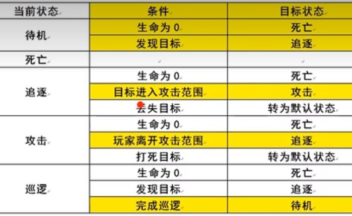
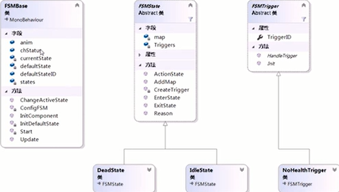

有限状态机（finite state machine，FSM），又称有限状态自动机，简称状态机，是表示有限个状态在不同条件下转换的**流程控制**系统。状态指物体/对象表现的状况，多指行为。状态以条件作为改变的依据。



变化点分析：条件、状态（行为）、条件与状态的映射。


状态机负责管理所有状态，进行条件的检测和协调、组织状态的迁移。条件类进行逻辑处理。状态机条件类是对状态切换具体条件的抽象。状态类是具体状态的抽象。

## 通用类

条件编号FSMTriggerID：状态类在创建条件对象、查找映射的状态编号时需要使用。

``` C#
public enum FSMTriggerID
{
    NoHealth, // 生命为0
    SawTarget, // 发现目标
    ReachTarget, // 目标进入攻击范围
    LoseTarget, // 丢失目标
    CompletePatrol, // 完成巡逻
    WithoutAttackRange, // 目标不在攻击范围
}
```

状态编号FSMStateID：状态类中添加映射，状态机初始化、切换状态时通过状态编号来查找状态。

``` C#
public enum FSMStateID
{
    None, // 无
    Idle, // 待机
    Dead, // 死亡
    Pursuit, // 追逐
    Attacking, // 攻击
    Default, // 默认
    Patrolling, // 巡逻
}
```

## 核心类

状态机条件类FSMTrigger：状态切换具体条件的抽象，隔离条件与状态。数据成员为枚举类型条件编号FSMTriggerID triggerId。方法成员为条件编号的初始化和条件检测。

``` C#
public abstract lass FSMTrigger
{
    public FSMTriggerID TriggerID { get; set; } // 条件编号
    public FSMTrigger()
    {
        Init();
    }
    public abstract void Init(); // 要求子类必须初始化条件，为条件编号赋值
    public abstract bool HandleTrigger(FSMBase fsm); // 逻辑处理
}

```

状态类FSMState是具体状态的抽象。数据成员为枚举类型状态编号FSMStateID state、条件列表List<FSMTrigger> triggers、转换映射表Dictionary<FSMTriggerID, FSMStateID> map。方法成员有添加条件映射、删除条件映射、查找条件映射、条件检测、进入状态、状态行为、退出状态。

``` C#
public abstract class FSMState
{
    public FSMStateID StateID { get; set; } // 状态编号
    private Dictionary<FSMTriggerID, FSMStateID> map; // 映射表
    private List<FSMTrigger> triggers; // 条件列表
    public FSMState()
    {
        map = new Dictionary<FSMTriggerID, FSMStateID>();
        triggers = new List<FSMTrigger>();
        Init();
    }
    public abstract void Init(); // 要求子类必须初始化状态，为状态编号赋值
    // 添加映射，由状态机调用
    public void AddMap(FSMTriggerID triggerId, FSMStateID stateId)
    {
        map.Add(triggerId, stateId); // 添加映射
        CreateTrigger(triggerId); // 创建条件对象
    }
    // 创建条件对象
    private void CreateTrigger(FSMTriggerID triggerId)
    {
        // 命名规则：命名空间 + 条件枚举 + "Trigger"
        Type type = Type.GetType("AI.FSM." + triggerId + "Trigger");
        triggers.Add(Activator.CreateInstance(type) as FSMTrigger);
    }
    // 检测当前状态的条件是否满足
    public void Reason(FSMBase fsm)
    {
        foreach (FSMTrigger item in triggers)
        {
            if (item.HandleTrigger(fsm))
            {
                // 条件满足则切换状态
                fsm.ChangeActiveState(map[item.TriggerID]);
                return;
            }
        }
    }
    // 为具体状态类提供可选实现
    public virtual void EnterState(FSMBase fsm) {};
    public virtual void OnState(FSMBase fsm) {};
    public virtual void ExitState(FSMBase fsm) {};
}
```

状态机FSMBase 

``` C#
public class FSMBase : MonoBehaviour
{
    private List<FSMState> states; // 状态列表
    private FSMState currentState; // 当前状态
    [Tooltip("默认状态编号")]
    public FSMStateID defaultStateID;
    private FSMState defaultState;
    private void Start()
    {
        InitComponent(); // 初始化组件
        ConfigFSM(); // 配置状态机
        InitDefaultState(); // 初始化默认状态
    }
    private void InitDefaultState()
    {
        defaultState = states.Find(state => state.StateID == defaultStateID); // 查找默认状态
        currentState = defaultState // 设置当前状态
        currentState.EnterState(this); // 进入状态
    }
    
    // 检测
    private void Update()
    {
        currentState.Reason(this); // 判断当前状态条件
        currentState.OnState(this); // 执行当前状态逻辑
    }
    // 配置状态机：创建状态对象，设置状态
    private void ConfigFSM()
    {
        states = new List<FSMState>();
        // 创建状态对象
        IdleState idle = new IdleState();
        // 设置状态映射
        idle.AddMap(FSMTriggerID.NoHealth, FSMStateID.Dead);
        // 添加状态
        states.Add(idle);
        
        // 死亡状态
        DeadState dead = new DeadState();
        states.Add(dead);
    }
    // 切换状态
    public void ChangeActiveState(FSMStateID stateId)
    {
        // 如果需要切换的状态是Default，则直接返回默认状态
        // 否则从状态列表中查找
        currentState.ExitState(this); // 离开上一状态
        // 切换状态
        currentState = stateId == FSMStateID.Default ? defaultState : states.Find
            (state => state.StateID == defaultStateID);
        // 进入下一状态
        currentState.EnterState(this);
    }
    // 为状态与条件提供的成员
    [HideInInspector]
    public Animator anim;
    [HideInInspector]
    public CharacterStatus chStatus;
    private void InitComponent()
    {
        anim = GetComponentInChildren<Animator>();
        chStatus = GetComponent<CharacterStatus>();
    }
}
```

## 实现类

待机状态类IdleState：根据规则命名。

``` C#
public class IdleState : FSMState
{
    public override void Init() // 初始化状态编号
    {
        StateID = FSMStateID.Idle;
    }
    public override void EnterState(FSMBase fsm)
    {
        base.EnterState(fsm);
        // 播放动画
        fsm.anim.SetBool(fsm.chStatus.chParams.idle, true);
    }
    public override void ExitState(FSMBase fsm)
    {
        base.ExitState(fsm);
        // 取消动画
        fsm.anim.SetBool(fsm.chStatus.chParams.idle, false);
    }
}
```

生命为0条件类NoHealthTrigger

``` C#
public class NoHealthTrigger : FSMTrigger
{
    public override void Init() // 初始化条件编号
    {
        TriggerID = FSMTriggerID.NoHealth;
    }
    public abstract bool HandleTrigger(FSMBase fsm)
    {
        return fsm.chStatus.HP <= 0;
    }
}
```

死亡状态类DeadState：根据规则命名。

``` C#
public class DeadState : FSMState
{
    public override void Init() // 初始化状态编号
    {
        StateID = FSMStateID.Dead;
    }
    public override void EnterState(FSMBase fsm)
    {
        base.EnterState(fsm);
        // 禁用状态机
        fsm.enabled = false;
    }
}
```

主要执行流程：状态机先初始化组件成员、配置状态、初始化默认状态，然后每帧检测当前状态的条件，然后状态类遍历所有条件对象，如果某个条件达成，则状态机切换状态，执行当前状态逻辑。

