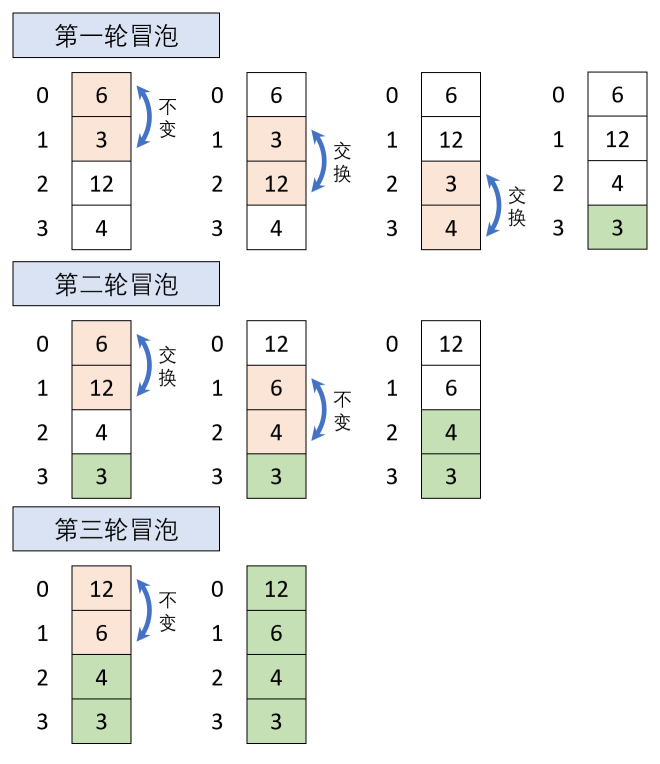

# 冒泡排序

冒泡排序（Bubble Sort）是最基础的交换排序，是通过两两比较待排序数据，不停比较、交换，将最小/大值泡出来。每一轮都可以泡出一个最小/大值，形似气泡上浮，所以称冒泡排序。

# 分析

如下图所示，有一无序数组`{6, 3, 12, 4}`，使用冒泡排序对其进行降序排列：

1. 第一轮：确定最小的元素。
   - 首先比较6和3，不需要移动。
   - 比较3和12，发现3比12小，交换二者位置。
   - 然后比较3和4，发现3比4小，再次交换。
2. 第二轮：确定第二个元素。
   - 首先比较6和12，6比12小，交换二者位置。
   - 比较6和4，此时不需要交换。
3. 第三轮：确定最后两个元素顺序。
   - 首先比较12和6，12比6大，不需要交换。

至此，原无序数组经冒泡排序已按降序排列。



# 实现

在代码中增加了输出语句，方便观察每次比较后结果。

```csharp
/// <summary>
/// 对int数组进行冒泡排序：从头到尾降序排列
/// </summary>
public void BuddleSort(params int[] array)
{
    // 数组长度
    int l = array.Length;
    // l - 1轮冒泡
    for (int i = 0; i < l - 1; ++i)
    {
        // 每轮冒泡比较剔除已确定元素，只比较l - 1 - i次
        for (int j = 0; j < l - 1 - i; ++j)
        {
            if (array[j] < array[j + 1])
                // 满足降序交换位置
                SwapArrayElement(array, j, j + 1);
            // 输出第i + 1轮冒泡第j + 1次比较后数组的顺序
            PrintArrayAfterComparison(array, i + 1, j + 1);
        }
    }
}

/// <summary>
/// 交换int数组中的两个元素
/// </summary>
public void SwapArrayElement(int[] array, int n, int m)
{
    int temp = array[n];
    array[n] = array[m];
    array[m] = temp;
}

/// <summary>
/// 在round轮冒泡time次比较后一行输出int数组，以制表符分隔元素
/// </summary>
public void PrintArrayAfterComparison(int[] array, int round, int time)
{
    Console.Write("第{0}轮第{1}次后结果：", round, time);
    PrintArray(array);
    Console.WriteLine();
}

/// <summary>
/// 一行输出int数组，以制表符分隔元素
/// </summary>
public void PrintArray(int[] array)
{
    for (int i = 0; i < array.Length; ++i)
        Console.Write("{0}\t", array[i]);
}
```

对于无序数组`{8, 4, 5, 3}`，上述代码输出结果为：

>第1轮第1次后结果：8 5 4 3
>第1轮第2次后结果：8 5 4 3
>第1轮第3次后结果：8 5 4 3
>第2轮第1次后结果：8 5 4 3
>第2轮第2次后结果：8 5 4 3
>第3轮第1次后结果：8 5 4 3

# 优化

## 外循环优化

在从上述结果中可以发现：在冒泡过程中，序列可能在未结束之前已处于有序状态，此时可引入一个`bool`类型的标记来判断下一轮冒泡是否有必要进行。

```csharp
/// <summary>
/// 外循环优化的冒泡排序
/// </summary>
public void BuddleSort(params int[] array)
{
    int l = array.Length;
    // 标记序列是否已经有序：如果在一轮冒泡中没有元素交换过，说明序列已经有序
    bool isOrdered;
    for (int i = 0; i < l - 1; ++i)
    {
        // 标记初始化
        isOrdered = true;
        for (int j = 0; j < l - 1 - i; ++j)
        {
            if (array[j] < array[j + 1])
            {
                // 有元素交换置为false
                isOrdered = false;
                SwapArrayElement(array, j, j + 1);
            }
            PrintArrayAfterComparison(array, i + 1, j + 1);
        }
        // 已经有序则直接退出排序
        if (isOrdered) break;
    }
}
```

对于无序数组`{8, 4, 5, 3}`，该代码输出为：

>第1轮第1次后结果：8 4 5 3
>第1轮第2次后结果：8 4 5 3
>第1轮第3次后结果：8 4 5 3
>第2轮第1次后结果：8 4 5 3
>第2轮第2次后结果：8 4 5 3

## 内循环优化

通过设置`bool`类型的标记可以减少不必要的冒泡轮次，但在此之前**仍然需要一轮没有交换的冒泡**才能确定后续冒泡不再需要进行。为了进一步减少不必要的操作，可以记录最后一次交换的位置，在此后的元素没有进行交换则必定是有序的，下一轮冒泡在记录的位置即可结束。

``` csharp
/// <summary>
/// 内循环优化的冒泡排序
/// </summary>
public void BuddleSort(params int[] array)
{
    int l = array.Length;
    // 记录最后一次交换的位置, 初始为数组末尾
    int lastSwapPos = l - 1;
    for (int i = 0; i < l - 1; ++i)
    {
        // 此轮冒泡中最后交换的位置
        int newSwapPos = -1;
        // 当前轮冒泡的结束位置为上一轮冒泡中最后交换的位置
        for (int j = 0; j < lastSwapPos; ++j)
        {
            if (array[j] < array[j + 1])
            {
                // 有元素交换则记录交换的位置
                newSwapPos = j;
                SwapArrayElement(array, j, j + 1);
            }
            PrintArrayAfterComparison(array, i + 1, j + 1);
        }
        // 只有进行元素交换才会改变newSwapPos，因此可以作为序列是否有序的标记
        if (newSwapPos == -1) break;
        lastSwapPos = newSwapPos;
    }
}
```

对于无序数组`{8, 4, 5, 3}`，该代码输出为：

> 第1轮第1次后结果：8 4 5 3
> 第1轮第2次后结果：8 4 5 3
> 第1轮第3次后结果：8 4 5 3
> 第2轮第1次后结果：8 4 5 3

## 双向冒泡排序

上述实现方式都采用单向遍历从头到尾遍历无序部分，但对于数组类型的数据，可以通过双向遍历来**减少循环次数**，提高效率。在双向遍历降序排列数组时，正向遍历将最小值泡至数组末尾，逆向遍历将最大值泡至数组头部。该种排序方式也叫双向冒泡排序。

``` Csharp
/// <summary>
/// 双向冒泡排序
/// </summary>
public void BubbleSort(params int[] array)
{
    // 记录数组长度
    int l = array.Length;
    // 无序部分左右边界，初始值为全部元素
    int lIndex = 0;
    int rIndex = l - 1;
    // 当左右边界重合时表明已经完成排序
    while (lIndex < rIndex)
    {
        // 记录最后交换的位置
        int newLIndex = -1;
        int newRIndex = -1;
        // 遍历无序元素
        for (int i = lIndex; i < rIndex; ++i)
        {
            // i为左指针，j为右指针
            int j = l - 1 - i;
            // 正向冒泡，最后交换位置的右边已经有序，所以为右边界
            if (array[i] < array[i + 1])
            {
                SwapArrayElement(array, i, i + 1);
                newRIndex = i;
            }
            // 逆向冒泡，最后交换位置的左边已经有序，所以为左边界
            if (array[j] > array[j - 1])
            {
                SwapArrayElement(array, j, j - 1);
                newLIndex = j;
            }
        }
        // 如果没有交换则已经有序
        if (newLIndex == -1 && newRIndex == -1) break;
        // 更新无序元素边界
        lIndex = newLIndex > lIndex ? newLIndex : lIndex + 1;
        rIndex = newRIndex < rIndex ? newRIndex : rIndex - 1;
    }
}
```

# 性能

时间复杂度：

- 最好情况下，原序列已经是有序的，只需要进行一轮比较，比较n-1次，移动0次，时间复杂度为O(n)。
- 最坏情况下，原序列是逆序的，需要进行n-1轮冒泡，每轮比较n-i (1<=i<=n-1)次。此时，比较总次数为(n-1+n-n+1)(n-1)/2即n(n-1)/2次，移动总次数为3n(n-1)/2，时间复杂度为O(n^2^)。
- 一般情况下，时间复杂度为O(n^2^)，与数据状况无关。

空间复杂度：在冒泡排序过程中，只在交换元素和有序标记时使用了临时变量，额外空间开销是常量级的，因此冒泡排序的空间复杂度为O(1)。

稳定性：对于冒泡排序而言，在做元素对比的时候，如果元素满足要求或者相等时，可以不进行操作，所以位置不会发生变化，因此冒泡排序是稳定的。