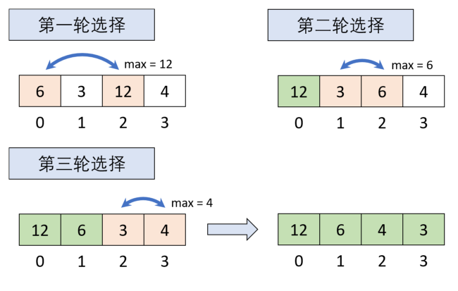

# 选择排序

选择排序（Selection Sort）的基础思想是在每一轮的比较中将最小/大值筛选出来，每轮比较结束后，将该值与目标位置上的元素交换。以此类推，直到所有元素均排序完毕。

# 分析

如下图所示，有一无序数组`{6, 3, 12, 4}`，使用选择排序对其进行降序排列：

1. 第一轮：遍历未排序部分，找到最大值12，将其与第一个元素交换位置。
2. 第二轮：继续遍历未排序部分，找到最大值6，并与第二个元素交换位置。
3. 第三轮：遍历剩余未排序部分，找到最大值4，与第三个元素交换位置。

至此，原无序数组经选择排序已按降序排列。



# 实现

```csharp
/// <summary>
/// 对int数组进行选择排序：从头到尾降序排列
/// </summary>
public void SelectionSort(params int[] array)
{
    // 记录数组长度
    int l = array.Length;
    // 最大元素索引
    int maxIndex;
    // n - 1轮选择
    for (int i = 0; i < l - 1; ++i)
    {
        // 初始化最大元素索引为无序元素起始位置
        maxIndex = i;
        // 遍历无序元素
        for (int j = i + 1; j < l; ++j)
        {
            // 记录最大元素的索引
            if (array[j] > array[maxIndex])
                maxIndex = j;
        }
        // 将最大元素移动到目标位置
        SwapArrayElement(array, i, maxIndex);
    }
}

/// <summary>
/// 交换int数组中的两个元素
/// </summary>
public void SwapArrayElement(int[] array, int n, int m)
{
    int temp = array[n];
    array[n] = array[m];
    array[m] = temp;
}
```

# 优化

在上述实现代码中，一次遍历只选择出最大元素。为了提高效率，可以在一次遍历中同时选出最大、最小元素，从而将遍历次数减半。

```csharp
/// <summary>
/// 优化后的选择排序
/// </summary>
public void SelectionSort(params int[] array)
{
    // 无序元素的左、右边界
    int lIndex = 0, rIndex = array.Length - 1;
    // 记录最大、最小元素索引
    int maxIndex, minIndex;
    // 当左、右边界重合时说明已经完成排序
    while (lIndex < rIndex)
    {
        // 初始化索引为左边界
        maxIndex = lIndex;
        minIndex = lIndex;
        for (int i = lIndex + 1; i <= rIndex; ++i)
        {
            // 标记最大和最小元素索引
            if (array[i] > array[maxIndex])
                maxIndex = i;
            else if (array[i] < array[minIndex])
                minIndex = i;
        }
        // 先移动最大元素
        SwapArrayElement(array, lIndex, maxIndex);
        // 最小元素如果在左边界则已经被交换至maxIndex
        if (minIndex == lIndex)
            minIndex = maxIndex;
        // 移动最小元素
        SwapArrayElement(array, rIndex, minIndex);
        // 更新边界
        ++lIndex;
        --rIndex;
    }
}
```

# 性能

时间复杂度：不管原序列是否已经有序，优化后的选择排序都需要进行n/2轮遍历，每次遍历比较2(n-1-2i) (0<=i<=n/2)次，此时比较总次数为(2n-2+2n-2-2n)n/4即n(n-2)/2次，移动总次数为3n，时间复杂度为O(n^2^)。

空间复杂度：在选择排序过程中，只在交换元素和标记索引时使用了临时变量，额外空间开销是常量级的，因此其空间复杂度为O(1)。

稳定性：选择排序是选择最大、最小元素与两端进行交换，如果序列中存在与两端元素相等的元素，序列的稳定性就可能被破坏。例如无序数组`{2, 2, 3, 9}`，在第一轮选择排序过后，`array[0]`与`array[3]`进行了交换，此时序列的稳定性就被破坏了，所以选择排序是不稳定的。