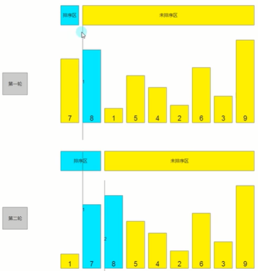
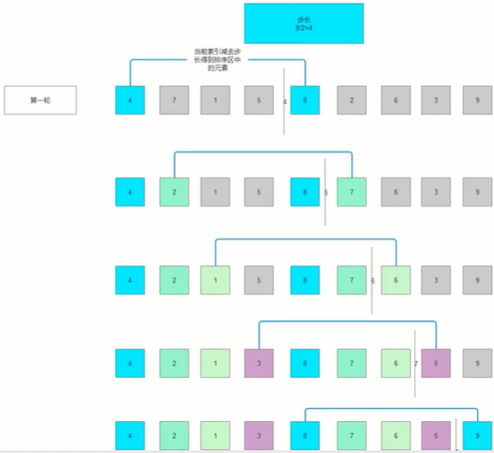
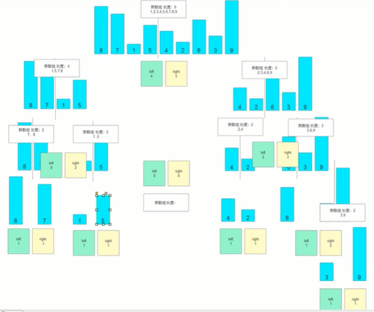
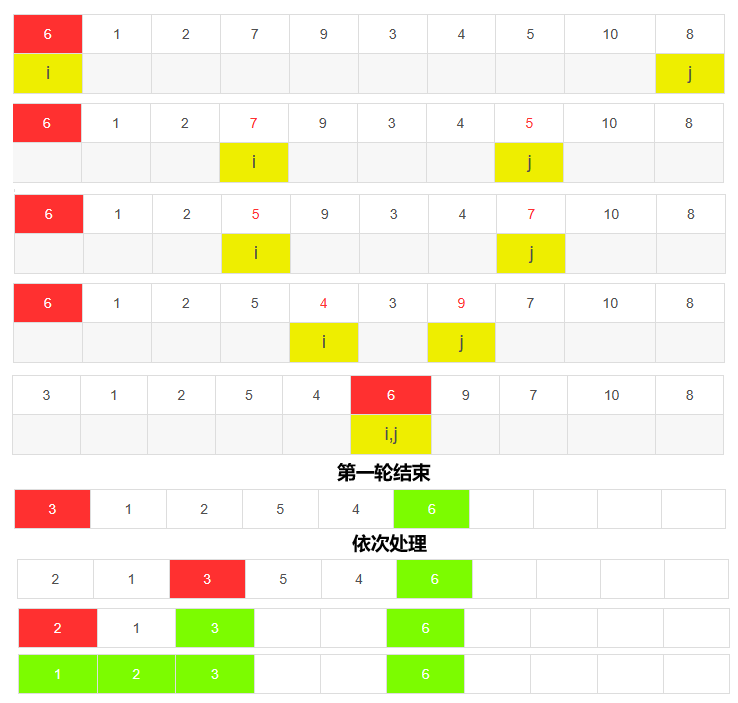

## 插入排序

插入排序如同整理扑克牌一般。先将无序序列分成排序区和未排序区，用一个索引值做分水岭。每轮比较，将未排序区第一个元素与排序区元素依次比较，将未排序区元素插入到合适位置，直到未排序区元素清空。



``` C#
public void InsetSort(int[] array)
{
    for (int i = 1; i < array.Length; i++)
	{
    	int noSortNum = array[i];
    	int sortIndex = i - 1;
    	while (sortIndex >= 0 && array[sortIndex] > noSortNum)
        	array[sortIndex + 1] = array[sortIndex--];
    	array[sorIndex + 1] = noSortNum;
	}
}
```

## 希尔排序

希尔排序（shell sort），也称递减增量排序算法，是插入排序的升级版，但是非稳定排序算法。希尔排序对几乎已排好序的序列可以达到线性排序的效率，数据移动幅度亦较大（插入排序每次只能将数据移动一位）。

希尔排序是将整个待排序序列分割成若干个子序列，分别进行插入排序。使用步长（初始步长为序列长度的一半，后面步长取半）确定序列的分割位置，以对子序列进行插入排序。



``` C#
public void ShellSort(int[] array)
{
    for (int step = array.Length / 2; step > 0; setp /= 2)
	{
    	for (int i = step; i < array.Length; i++)
		{
    		int noSortNum = array[i];
    		int sortIndex = i - step;
    		while (sortIndex >= 0 && array[sortIndex] > noSortNum)
    		{
        		array[sortIndex + step] = array[sortIndex];
        		sortIndex -= step;
    		}
    		array[sortIndex + step] = noSortNum;
		}
	}
}
```

## 归并排序

归并排序（merge sort）是建立在归并操作上的一种有效的排序算法。该算法是采用分治法（Divide and Conquer）的一个非常典型的应用。

归并排序即递归加合并，分为两部分：1）递归平分数组，2）基本排序规则。

首先利用递归不停将序列分割，至子序列长度小于2时停止。分割结束后，开始反向比较排序。比较时判断左右两边元素大小，依次放入新数组，直至所有子序列元素放入，返回该数组。从叶子到根依次比较、合并、返回结果。



``` C#
public int[] MergeSort(int[] array)
{
    if (array.Length < 2)
    	return array;
    int mid = array.Length / 2;
    int[] left = new int[mid];
    int[] right = new int[array.Length - mid];
    for (int i = 0; i < array.Length; i++)
    {
        if (i < mid)
            left[i] = array[i];
        else
            right[i - mid] = array[i];
    }
    return Sort(Merge(left), Merge(right));
}

public int[] Sort(int[] left, int[] right)
{
    int[] array = new int[left.Length + right.Length];
    int leftIndex = 0, rightIndex = 0, index = 0;
    while (leftIndex < left.Length && rightIndex < right.Length)
    {
        if (left[leftIndex] < right[rightIndex])
            array[index] = left[leftIndex++];
        else
            array[index] = right[rightIndex++];
        index++;
    }
    if (leftIndex >= left.Length)
    {
        for (index; index < array.Length; index++)
        array[index] = right[rightIndex++];
    }
    if (rightIndex >= right.Length)
    {
        for (index; index < array.Length; index++)
        array[index] = left[leftIndex++];
    }
}
```

## 快速排序

快速排序其实是冒泡排序基础上的递归分治法，又是一种分而治之思想在排序算法上的典型应用。冒泡排序每次对相邻的两个数进行比较，这显然是一种比较浪费时间的。

快速排序速度快，而且效率高，是处理大数据最快的排序算法之一。

> 《算法艺术与信息学竞赛》：
>
> 快速排序的最坏运行情况是 O(n^2^)，比如说顺序数列的快排。但它的平摊期望时间是 O(nlogn)，且 O(nlogn) 记号中隐含的常数因子很小，比复杂度稳定等于 O(nlogn) 的归并排序要小很多。所以，对绝大多数顺序性较弱的随机数列而言，快速排序总是优于归并排序。

快速排序首先以第一个元素为“基准”。把所有元素比基准值小的摆放在基准前面，所有元素比基准值大的摆在基准的后面（相同的数可以到任一边）。在一轮排序完成之后，该基准就处于数列的中间位置。最后递归地把小于基准值元素的子数列和大于基准值元素的子数列排序。



``` C#
public void QuickSort(int[] array, int begin, int end)
{
    if (begin >= end)
        return;
    int basic = array[begin], i = begin, j = end;
    while (i != j)
    {
        while (array[j] > basic && j > i)
            --j;
        while (array[i] < basic && j > i)
            ++i;
        if (j > i)
            Swap(int[] array, i, j);
    }
    array[begin] = a[i];
    a[i] = basic;
    QuickSort(array, begin, i - 1);
    QuickSort(array, i + 1, end);
}
```

## 堆排序

堆排序（heap sort）是指利用堆所设计的一种选择排序算法。堆积是一个近似完全二叉树的结构，并同时满足堆积的性质：即子结点的键值或索引总是小于即大顶堆（或者大于即小顶堆）其父节点。

首先将待排序的数组构造成一个堆，此时，整个数组的最大/小值就是堆结构的顶端。然后将堆首与堆尾交换，并将剩余待排序数组（个数为n-1）再构造成堆，如此反复执行，直到堆的尺寸为1，便能得到有序数组。

升序用大根堆，降序就用小根堆。

## 计数排序

## 桶排序

## 基数排序


