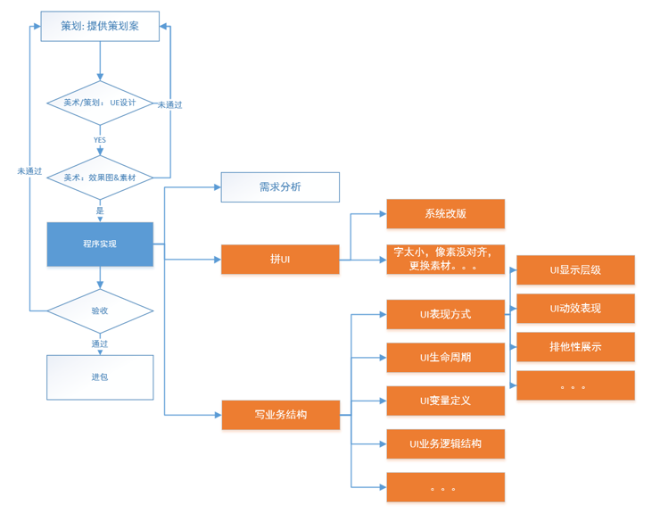
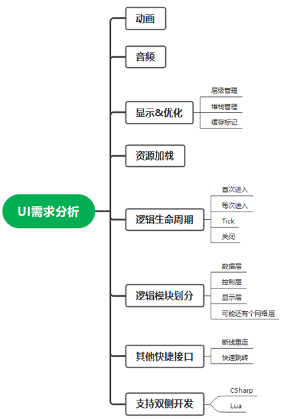

## UI开发痛点

原始UI开发方式弊端：工作量大，重复性工作多，开发效率低；接口不统一，维护难度大。

C#侧包含UI管理器，显示、关闭UIWindow，并维护UIWindow层级的管理。

Lua侧使用ControlManager维护所有UI系统，并依赖Window管理器。Window管理器可以减少Lua调用C#的频次，提高性能。具体系统分Service层、Model层、Control层、View层。Model层通过观察者模式驱动View层的更新。

## UI研发工作流

工作流（Workflow）即工作流计算模型，将工作流程中的工作如何前后组织在一起的逻辑和规则，在计算机中以恰当的模型进行表示并对其实施计算。工作流要解决的首要问题是：为实现某个业务目标，在多个参与者之间，利用计算机，按某种预定规则自动传递文档、信息或任务。工作流属于计算机支持的协同工作（Computer Supported Cooperative Work，CSCW）的一部分。后者是普遍地研究一个群里如何在计算机的帮助下实现协同工作的。

工作流能改进和优化业务流程，提高业务工作效率，实现更好的协同业务过程控制。

通常流程：UI系统策划、UE设计图、美术效果图与素材（资源后处理工具，资源去重校验工具等）、策划拼图（UI编辑器，UI配置表）、程序专注与业务逻辑本身（脚本自动生成工具）。

图集：公共图集、功能图集，减少Drawcall和内存占用。Android