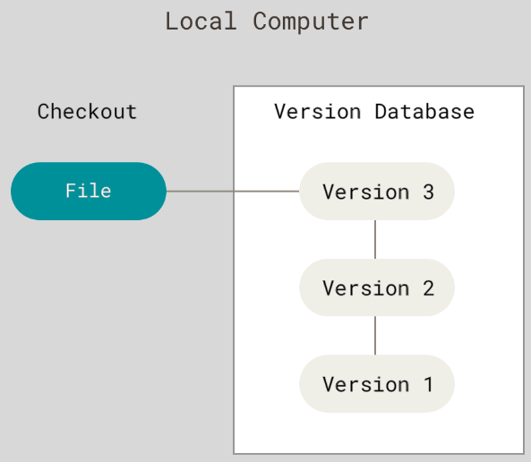
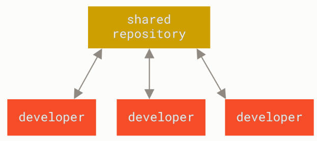
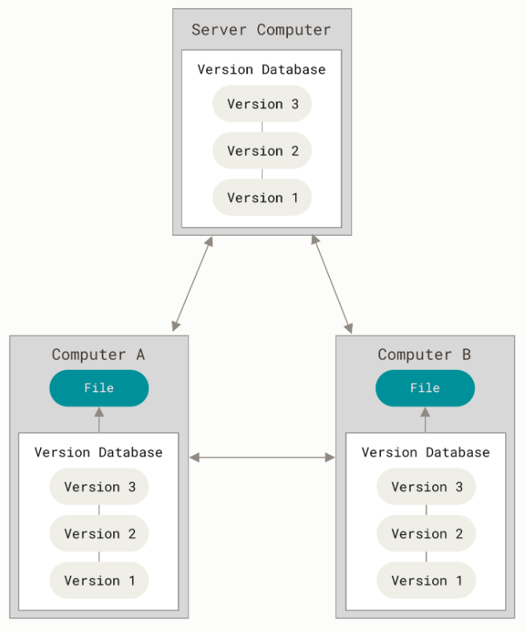
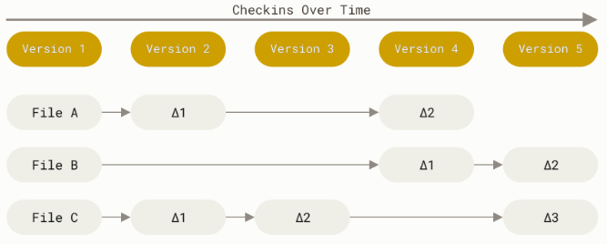
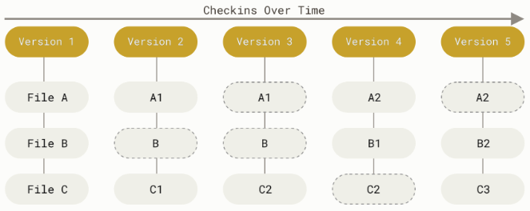

# 开始

## 关于版本控制

版本控制是一种记录一个或若干文件内容变化，以便将来查阅特定版本修订情况的系统。它仅需花费较小的代价，就可以将选定的文件甚至整个项目回溯到过去某个时间点的状态、比较文件的变化细节、查出最后是谁修改了哪个地方从而找出导致怪异问题出现的原因、恢复误删的文件等等。

**本地版本控制系统**大多采用某种简单的数据库来记录文件的历次更新差异。其中最流行的一种叫做修订控制系统（Revision Control System，RCS），其工作原理是在硬盘上保存补丁集（补丁是指文件修订前后的变化），通过补丁计算出各个版本的文件内容。

为了能让在不同系统上的开发者协同工作，**集中化的版本控制系统**（Centralized Version Control Systems，CVCS）应运而生。 这类系统都有一个单一的集中管理的服务器，保存所有文件的修订版本，而协同工作的人们都通过客户端连到这台服务器，取出最新的文件或者提交更新。相较于RCS，CVCS使得每个人都可以在一定程度上看到项目中的其他人正在做些什么，而管理员也可以轻松掌控每个开发者的权限，并且管理一个CVCS要远比在各个客户端上维护本地数据库来得轻松容易。然而，CVCS的缺点是中央服务器的单点故障。如果中央服务器发生损坏，又没有做恰当备份，那么将丢失所有数据——包括项目的整个变更历史，只剩下各自机器上保留的单独快照。RCS也存在类似问题。

**分布式版本控制系统**（Distributed Version Control System，DVCS）让客户端把代码仓库完整地镜像下来，包括完整的历史记录。这样，任何一处协同工作用的服务器发生故障，事后都可以用任何一个镜像出来的本地仓库恢复，因为每一次的克隆操作，实际上都是一次对代码仓库的完整备份。此外，DVCS可以指定和若干不同的远端代码仓库进行交互，使得开发者可以在同一个项目中和不同工作小组的人相互协作。

## Git

Linux内核开源项目有着为数众多的参与者。绝大多数的Linux内核维护工作都花在了提交补丁和保存归档的繁琐事务上（1991-2002年间）。到2002年，整个项目组开始启用一个专有的分布式版本控制系统BitKeeper来管理和维护代码。

到了2005年，开发BitKeeper的商业公司同Linux内核开源社区的合作关系结束，他们收回了Linux内核社区免费使用BitKeeper的权力。这迫使Linux开源社区（特别是Linux的缔造者Linus Torvalds）基于使用BitKeeper时的经验教训，开发出自己的版本系统。他们对新的系统制订了若干目标：

- 速度
- 简单的设计
- 对非线性开发模式的强力支持（允许成千上万个并行开发的分支）
- 完全分布式
- 有能力高效管理类似Linux内核一样的超大规模项目（速度和数据量）

自诞生于2005年以来，Git日臻成熟完善，在高度易用的同时，仍然保留着初期设定的目标。它的速度飞快，极其适合管理大项目，有着令人难以置信的非线性分支管理系统。

Git和其它版本控制系统（包括Subversion和近似工具）的主要差别在于Git对待数据的方式。从概念上来说，其它大部分系统以文件变更列表的方式存储信息，这类系统（CVS、Subversion、Perforce等等）将它们存储的信息看作是**一组基本文件和每个文件随时间逐步累积的差异**（它们通常称作**基于差异（delta-based）**的版本控制）。

Git则更像是把数据看作是对小型文件系统的一系列快照。在Git中，每当提交更新或保存项目状态时，它基本上就会对当时的全部文件创建一个快照并保存这个快照的索引。为了效率，如果文件没有修改，Git不再重新存储该文件，而是只保留一个链接指向之前存储的文件。Git对待数据更像是一个**快照流**。

Git是一个快速、可扩展的分布式版本控制系统（Version Control System，VCS），具有丰富的命令集，同时提供高级操作以及对内部结构的完全控制。

- 在Git中的绝大多数操作都只需要**访问本地文件和资源**，一般不需要来自网络上其它计算机的信息，因此大部分操作执行速度较快。
- Git中所有的数据在存储前都计算校验和，然后**以校验和来引用**。因此，在传送过程中丢失信息或损坏文件，Git能及时发现。
- 几乎所有的Git操作只会往数据库中添加数据，即几乎**不会执行任何可能导致文件不可恢复的操作**。

> Git用以计算校验和的机制叫做SHA-1散列，这是一个基于Git中文件的内容或目录结构计算出来由40个十六进制字符组成的字符串。实际上，Git数据库中保存的信息都是以文件内容的哈希值来索引，而不是文件名。
