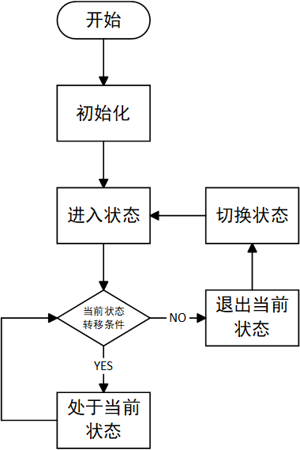

# 有限状态机

有限状态机（Finite-state Machine，FSM），又称有限状态自动机，简称状态机，是表示**有限个状态以及在这些状态之间的转移和动作等行为**的数学模型。FSM可以把模型的多状态、多状态间的转换条件解耦，降低程序耦合度，提高程序可维护性和可读性。

FSM中的状态（State）是有限的。动作（Action）是状态需要做的事情。状态转移（Transition）指一个状态执行了某些动作后转变为另一个状态的过程。转移条件（Transition Condition）是某个状态转移到另一个状态需要达成的条件。只有达到转移条件，状态机才能进入到下一状态并执行相应的动作。

有限状态机执行流程如下：



# 实现

## 公共部分

使用枚举`EState`表示FSM管理的所有状态。

``` csharp
public enum EState { }
```

使用枚举`ECondition`表示转移条件。

``` csharp
public enum ECondition { }
```

## 转移条件基类

转移条件基类`ConditionBase`是所有条件的抽象，包含一个ID和触发判断方法。

``` csharp
public abstract class ConditionBase
{
    private int id;

    /// <summary>
    /// ID
    /// </summary>
    internal int ID => id;

    internal ConditionBase(int id)
    {
        this.id = id;
    }

    /// <summary>
    /// 能否触发
    /// </summary>
    internal abstract bool CanTrigger(FSMBase fsm);
}
```

## 状态基类

状态基类`StateBase`是所有状态的抽象，拥有一个ID和条件映射，持有所属状态机的引用（方便通知状态机切换状态和利用状态机持有数据进行条件判断），向状态机提供添加映射、检测转移条件、进入状态、处于状态、离开状态的接口。

``` csharp
public abstract class StateBase
{
    private int id;

    /// <summary>
    /// ID
    /// </summary>
    internal int ID => id;

    /// <summary>
    /// 所属状态机
    /// </summary>
    internal FSMBase fsm;

    /// <summary>
    /// 条件状态映射表
    /// </summary>
    private Dictionary<int, int> map;

    /// <summary>
    /// 条件列表
    /// </summary>
    private List<ConditionBase> conditions;
    
    internal StateBase(FSMBase fsm, int id)
    {
        this.fsm = fsm;
        this.id = id;
        map = new Dictionary<int, int>();
        conditions = new List<ConditionBase>();
    }

    /// <summary>
    /// 添加映射
    /// </summary>
    internal void AddMapping(int conditionID, int stateID)
    {
        if (map.ContainsKey(conditionID))
        {
            XLogger.Warning($"条件映射已添加：{conditionID}-{stateID}", EExceptionModle.AI);
            return;
        }

        map.Add(conditionID, stateID);
        var condition = fsm.Factory.CreateCondition(conditionID);
        conditions.Add(condition);
    }

    /// <summary>
    /// 进入
    /// </summary>
    internal virtual void OnEnter() { }

    /// <summary>
    /// 处于
    /// </summary>
    internal virtual void OnStay() { }

    /// <summary>
    /// 退出
    /// </summary>
    internal virtual void OnExit() { }

    /// <summary>
    /// 检测转移条件
    /// </summary>
    internal virtual void Check()
    {
        int count = conditions.Count;
        for (int i = 0; i < count; i++)
        {
            if (conditions[i].CanTrigger(fsm))
            {
                fsm.SwitchState(map[conditions[i].ID]);
                return;
            }
        }
    }
}
```

## 有限状态机工厂

有限状态机工厂`FSMFactoryBase`是一个普通工厂，向状态机提供创建转移条件和状态对象的功能。

```csharp
public abstract class FSMFactoryBase
{
    /// <summary>
    /// 创建转移条件对象
    /// </summary>
    public abstract ConditionBase CreateCondition(int conditionID);

    /// <summary>
    /// 创建状态对象
    /// </summary>
    public abstract StateBase CreateState(FSMBase fsm, int stateID);
}
```

## 有限状态机基类

有限状态机`FSMBase`管理所有的状态，持有当前状态的引用，提供配置和更新状态机的接口。

``` csharp
public abstract class FSMBase
{
    /// <summary>
    /// 是否已经初始化
    /// </summary>
    public bool IsInited { get; private set; }

    /// <summary>
    /// 当前状态
    /// </summary>
    public StateBase CurrentState => states[currentStateID];

    /// <summary>
    /// 状态机工厂
    /// </summary>
    internal FSMFactoryBase Factory { get; private set; }

    /// <summary>
    /// 当前状态ID
    /// </summary>
    private int currentStateID;

    /// <summary>
    /// 状态列表
    /// </summary>
    private Dictionary<int, StateBase> states;
    
    public FSMBase(FSMFactoryBase fSMFactory)
    {
        Factory = fSMFactory;
    }
    
    /// <summary>
    /// 初始化：创建状态对象，设置状态映射
    /// </summary>
    public virtual void Init(Dictionary<int, Dictionary<int, int>> map, int defaultStateID)
    {
        if (IsInited)
        {
            return;
        }

        IsInited = true;
        // 配置状态机
        states = new Dictionary<int, StateBase>(map.Count);
        foreach (var kv in map)
        {
            var state = Factory.CreateState(this, kv.Key);
            foreach (var conditionKV in kv.Value)
            {
                state.AddMapping(conditionKV.Key, conditionKV.Value);
            }
            states.Add(kv.Key, state);
        }
        // 初始化状态机
        currentStateID = defaultStateID;
        CurrentState.OnEnter();
    }

    /// <summary>
    /// 更新
    /// </summary>
    public virtual void Update()
    {
        CurrentState.Check();
        CurrentState.OnStay();
    }

    /// <summary>
    /// 切换状态
    /// </summary>
    internal virtual void SwitchState(int stateID)
    {
        CurrentState.OnEnter();
        currentStateID = stateID;
        CurrentState.OnExit();
    }
}
```