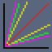
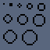
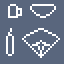
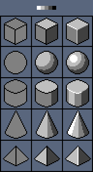
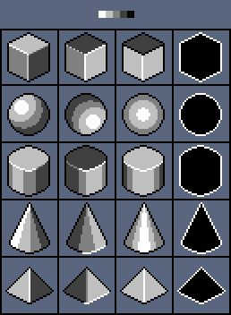
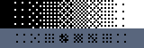

# 基础

## 线条和形状

水平直线和垂直直线容易画得，但在画斜直线时通常需要使用**固定的整数横竖比例**才能得到规整的直线条。不同的横竖比例可以得到不同角度的直线条。在大画布像素画中可以使用非整数比例绘画直线以获得特殊效果。

绘制曲线时需要确保其**曲率**是正确的（需要清除无关的锯齿，即与核心像素相邻的像素），同时避免曲线是的像素数量跳跃过大。

形状可以视作封闭的曲线。

> 圆形通常使用对应正方形创建。

 

## 着色和光照

亮度（Value）表征颜色的深和浅。对比度（Contrast）是两种颜色的差异程度。

正空间描述对象是什么，而负空间则描述对象不是什么。

3D空间中**五种基本几何形状**：立方体、球体、圆柱体、圆锥体、棱锥体。现实世界中的任何物体都可以由一或多种上述基本几何形状组成。每种立体几何形状都由简单2D形状构成，但正确的阴影和光照是产生立体感觉的原因。

立方体的阴影边缘菱角分明，而球体的阴影边缘则较为圆润。

 

抖动（Dithering）用于在不引入第三种颜色的情况下在两种颜色之间创建渐变，使得过渡更自然、平滑。抖动也可以用来表示特殊的质感。

