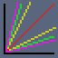
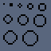
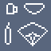
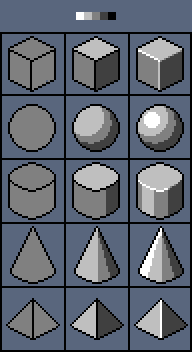
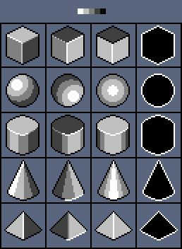
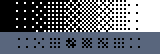
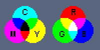
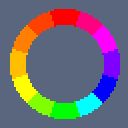

# 像素艺术大师课程

## 线条和形状

水平直线和垂直直线容易画得，但在画斜直线时通常需要使用**固定的整数横竖比例**才能得到规整的直线条。不同的横竖比例可以得到不同角度的直线条。在大画布像素画中可以使用非整数比例绘画直线以获得特殊效果。

绘制曲线时需要确保其**曲率**是正确的（需要清除无关的锯齿，即与核心像素相邻的像素），同时避免曲线上的像素数量跳跃过大。

形状可以视作封闭的曲线。

> 圆形通常使用对应正方形创建。

 

## 着色和光照

正空间描述对象是什么，而负空间则描述对象不是什么。

3D空间中**五种基本几何形状**：立方体、球体、圆柱体、圆锥体、棱锥体。现实世界中的任何物体都可以由一或多种上述基本几何形状组成。每种立体几何形状都由简单2D形状构成，但正确的阴影和光照是产生立体感觉的原因。

立方体的阴影边缘菱角分明，而球体的阴影边缘则较为圆润。

 

**抖动**（Dithering）用于在不引入第三种颜色的情况下在两种颜色之间创建渐变，使得过渡更自然、平滑。抖动也可以用来表示特殊的质感。

## 颜色和纹理

**色相**（Hue）是颜色的首要特征，是指能够比较确切地表示某种颜色色别的名称。**饱和度**（Saturation）指颜色的鲜艳程度，也叫做**纯度**。**亮度**（Value）指颜色的明亮程度，也叫**明度**。在HSV模型下，色相取值的范围为0-360°，饱和度和亮度的取值范围在0-100%。

在颜料中，三原色（Primary Color）指青、品红、黄（减色法），常被简化为红、黄、蓝，由于颜料的反射，三原色混合会得到黑色。在色光中，三原色则指红、绿、蓝（加色法），由于色光互相叠加，三原色混合会得到白色。

色轮（Color Wheel）可以直观的看到颜色的混合情况。色轮首先由三原色组成。三原色在色轮中平均分布。相邻两种原色混合得到二次色（Secondary Color），位于三原色之间。相邻的两种二次色混合则得到三次色（Tertiary Color）。在色轮中，只有原色不是由其他颜色调合得到的，每一种颜色都拥有部分相邻的颜色。

在色轮上，相邻的颜色成为**类比色**，直线相对的两种颜色称为**补色**。

为了显示颜色的明暗，色轮可以有多个环，从内向外明度逐渐降低，即内测为明色（Tint Color），外侧为暗色（Shadow Color）。

颜色搭配：

- 单色搭配（Monochromatic）：仅使用一种色相，但使用不同的明暗、饱和度。
- 类比色搭配（Analogous）：类比色都拥有共同的颜色，搭配会产生令人悦目、低对比度的和谐美感。
- 补色搭配（Complement）：补色形成强烈的对比效果，传达出活力、能量、兴奋等意义。补色要达到最佳效果，最好是其中一种面积较大，另一种较小，且需要略微降低饱和度以减弱对比。
- 分裂补色（Split Complement）：同时使用类比色及补色来确定颜色关系，这种搭配既具有类比色的低对比度的和谐，也有补色的力量感。

对比度（Contrast）是两种颜色的差异程度。
