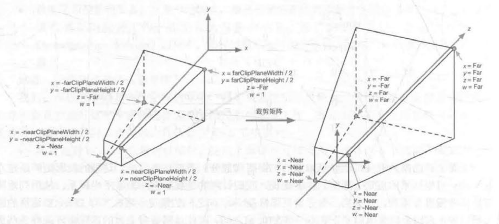
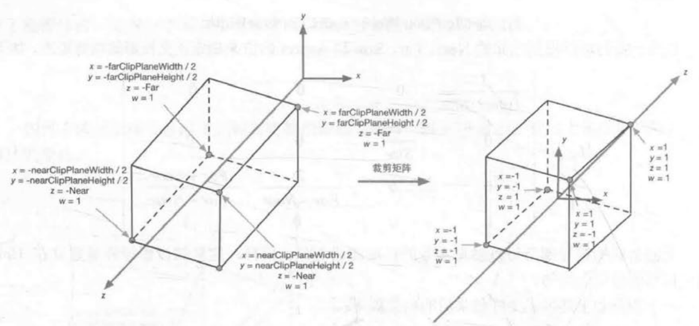

坐标空间是渲染中的重要概念，如顶点着色器将顶点坐标从模型空间转换到齐次裁剪坐标空间。渲染过程可以说是将顶点经过层层处理最终转换到屏幕空间的过程。

# 坐标空间的变换

欲定义一个坐标空间，必须指明原点位置和坐标轴方向，而这些数值实际上是相对于另一个坐标空间的。也就是说，坐标空间会形成一个层次结构——每个坐标空间都是另一个坐标空间的子空间，每个坐标空间都有一个父坐标空间。**对坐标空间的变换实际上是在父坐标空间和子坐标空间之间进行变换。**

假设有父空间P和子空间C，已知父空间中子空间的原点和单位坐标轴，通常有将子空间下的点或矢量A~C~转换到父空间下的A~P~，或将父空间下的点或矢量A~P~转换到子空间下的A~C~两种需求。可以用公式表示这两种转换：

> A~P~ = M~CToP~A~C~
> A~C~ = M~PToC~A~P~

其中M~CToP~表示从子空间变换到父空间的变换矩阵，M~PToC~是其逆矩阵（即反向变换）。二者求其一即可，另一个矩阵可以通过求逆矩阵的方式求得。

## 求解M~CToP~

当给定一坐标空间以及其中一点(a,b,c)时，如何确定其位置？

1. 从坐标空间原点开始；
2. 向X轴方向移动a个单位；
3. 向Y轴方向移动b个单位；
4. 向Z轴方向移动c个单位。

因此，已知子坐标空间C在父坐标空间P表示的原点O~C~和三个坐标轴x~C~、y~C~、z~C~。当给定一个子坐标空间中的点A~C~ (a,b, c)时，同样可以按照上述四个步骤确定其在父坐标空间下的位置A~P~：

1. 从原点O~C~开始；
2. 沿x~C~移动a个单位：O~C~ + ax~C~；
3. 沿y~C~移动b个单位：O~C~ + ax~C~ + by~C~；
4. 沿z~C~移动a个单位：O~C~ + ax~C~ + by~C~ + cz~C~。
5. 得到**A~P~ = O~C~ + ax~C~ + by~C~ + cz~C~**。

可推导出：

> A~P~ = O~C~ + ax~C~ + by~C~ + cz~C~
> = (x~OC~,y~OC~,z~OC~) + a(x~XC~,y~XC~,z~XC~) + b(x~YC~,y~YC~,z~YC~) + c(x~ZC~,y~ZC~,z~ZC~)
> = (x~OC~,y~OC~,z~OC~) + ax~XC~+bx~YC~+cx~ZC~ + ay~XC~+by~YC~+cy~ZC~ + az~XC~+bz~YC~+bz~ZC~
> = (x~OC~,y~OC~,z~OC~) + (x~C~ y~C~ z~C~)[a b c]
> 为了统一平移变换，将上述式子扩展到齐次坐标空间有：
> A~P~ = (O~C~ 1) + (x~C~ y~C~ z~C~ [0 0 0 1])[a b c 1]
> = (E [O~C~ 1])(x~C~ y~C~ z~C~ [0 0 0 1])[a b c 1]
> = (x~C~ y~C~ z~C~ [O~C~ 1])[a b c 1]
> 即**M~CToP~ = (x~C~ y~C~ z~C~ [O~C~ 1])**
> 注意：()表示行矩阵，[]表示列矩阵。

可以看出，**变换矩阵M~CToP~实际上可以通过子坐标空间C在父坐标空间P中的原点和坐标轴构建出来：把3个坐标轴矢量依次放入矩阵前3列，把原点矢量放到最后一列，用0和1填充最后一行即可。**

> M~CToP~中坐标轴矢量并未要求是单位矢量。实际上，如果存在缩放，坐标轴矢量很可能不是单位矢量。

另外，已知变换矩阵M~CToP~，可以获取子空间的原点和坐标轴在父空间下的表示。**M~CToP~第一列矢量归一化后可以得到子空间在父空间下的单位X轴矢量，同理可以提取Y、Z轴**。当然，可以**使用M~CToP~来变换子空间下对应坐标轴来得到父空间下子空间的坐标轴表示**。例如，用M~CToP~变换子空间的X轴(1,0,0)，使用矩阵乘法M~CToP~[1 0 0 0]，得到的结果正是父空间下子空间的X坐标轴。

此外，由于平移不影响矢量，因此对于矢量的坐标空间变换，M~CToP~可以使用三阶矩阵表示，忽略平移变换。

## 求取M~PToC~

已知M~CToP~，可以通过求逆矩阵的方式求得M~PToC~。但当M~CToP~是正交矩阵时，M~CToP~的逆矩阵就等于它的转置矩阵，此时不需要进行复杂的求逆操作就可以得到反向变换矩阵。

根据前文，可以根据M~CToP~的每一列获得子空间坐标轴在父空间下的表示。如果M~CToP~是正交矩阵，那么M~CToP~每一行即为父空间坐标轴在子空间下的表示（因为M~CToP~的逆矩阵等于它的转置矩阵）。同样地，已知父空间坐标轴在子空间下的表示，将其按行放置即可得到M~CToP~。反之亦然。

# 模型空间

**模型空间**（Model Space），也称对象空间（Object Space）、局部空间（Local Space），是和某个模型或对象有关的坐标空间。

每个模型都有自己独立的坐标空间，当模型移动或旋转时，模型空间也会跟着它移动或旋转。

模型空间中会使用一些方向概念，如前（Forward）、后（Back）、左（Left）、右（Right）、上（Up）、下（Down），这些方向称为**自然方向**。Unity中模型空间使用左手系：右方指X轴正方向，上方指Y轴正方向，前方指Z轴正方向。

模型空间的原点和坐标轴通常是由美术在建模时确定的。在顶点着色器中可以访问到模型的顶点信息，其中包含了顶点的坐标。顶点坐标是相对于模型空间中原点（通常位于模型的重心）定义的。

# 世界空间

**世界空间**（World Space）用于描述绝对位置，即世界中任意点在世界的空间中位置。Unity中世界空间使用左手系：右方指X轴正方向，上方指Y轴正方向，前方指Z轴正方向。

顶点变换的第一步就是将顶点坐标从模型空间转换到世界空间。这个变换叫**模型变换**（Model Transform）。

# 观察空间

**观察空间**（View Space）也叫做摄像机空间（Camera Space）。观察空间是模型空间的特例——摄像机的模型空间。

摄像机决定了渲染游戏的视角。在观察空间中，摄像机位于原点。在Unity中观察空间使用右手系：右方指X轴正方向，上方指Y轴正方向，而前方指Z轴负方向（符合OpenGL传统）。

顶点变换的第二步就是将顶点坐标从世界空间转换到观察空间。这个变换叫**观察变换**（View Transform）。

有两种方法可以得到顶点在观察空间中的位置：一种是计算观察空间的坐标轴在世界空间下的表示以构建从观察空间转换到世界空间的变换矩阵，再求逆矩阵以获得从世界空间转换到观察空间的变换矩阵；另一种方式是想象平移整个观察空间，让摄像机位于世界原点，观察空间坐标轴与世界空间坐标轴重合即可。

> 观察空间使用右手系，需要对变换矩阵的z分量进行取反操作，可以通过矩阵[(1 0 0 0) (0 1 0 0) (0 0 -1 0) (0 0 0 0)]实现。

# 裁剪空间

**裁剪空间**（Clip Space）也叫齐次裁剪空间，用于方便地对渲染图元进行裁剪：完全位于这块空间内部的图元将会被保留，完全位于这块空间外部的图元将会被剔除，与这块空间相交的图元会被裁剪。

顶点变换的第三步就是将顶点坐标从观察空间转换到裁剪空间。这个变换的矩阵叫做裁剪矩阵（Clip Matrix），也叫投影矩阵（Projection Matrix）。

裁剪空间是由**视锥体**决定的。视锥体指的是空间的一块区域，该区域决定了摄像机可以看到的空间。视锥体由六个平面包围而成，这些平面叫做裁剪平面（Clip Plane）。视锥体由两种类型，涉及两种投影类型：**正交投影**（Orthographic Projection）和**透视投影**（Perspective Projection）。

视锥体的6块裁剪平面中，有两块比较特殊，分别被称为**近裁剪平面**（Near Clip Plane）和**远裁剪平面**（Far Clip Plane），决定了摄像机可以看到的深度范围。

正交投影的视锥体是一个长方体，而透视投影的视锥体是一个金字塔形的锥体。

在裁剪时，如果根据视锥体定义的空间进行裁剪，在不同视锥体需要不同的处理过程，而且对于透视投影的视锥体而言，判断一个点是否位于金字塔内部是比较麻烦的。因此，需要一中更加通用、方便和整洁的方式进行裁剪工作，即通过投影矩阵把顶点转换到裁剪空间。

投影矩阵有两个目的：

- 为投影做准备。经过投影矩阵的变换后，w分量将具有特殊的意义。
- 对x、y、z分量进行缩放。经过投影矩阵的缩放后，可以直接用w分量作为范围判断，如果x、y、z分量都位于该范围内则说明该点在裁剪空间内。

## 透视投影

在Unity中，Camera的Field of View（FOV）可以改变视锥体竖直方向的张开角度，而Clipping Planes的Near和Far可以控制视锥体的近裁剪平面和远裁剪平面距离摄像机的距离。此时，可以求得视锥体近裁剪平面和远裁剪平面的高度。

> nearClipPlaneHeight = 2·Near·tan(FOV/2)
> farClipPlaneHeight = 2·Far·tan(FOV/2)

视锥体横向信息可以通过摄像机的横纵比得到。在Unity中，摄像机的横纵比由Game视图的横纵比和Viewport Rect中的W和H共同决定。假设摄像机的横纵比为Aspect，有

> Aspect = nearClipPlaneWidth/nearClipPlaneHeight
> = farClipPlaneWidth/farClipPlaneHeight

由此，可以根据Near、Far、FOV和Aspect确定透视投影的投影矩阵：

> cot(FOV/2)/Aspect 0 0 0
> 0 cot(FOV/2) 0 0
> 0 0 -(Far+Near)/(Far-Near) -(2·Far·Near)/(Far-Near)
> 0 0 -1 0

从结果上看，投影矩阵本质就是对x、y、z分量进行了不同程度的缩放（z分量还做了平移），缩放的目的是为了方便裁剪。另外，顶点的w分量不再是1，而是原先z分量的取反结果。结果变换后，如果一个点在视锥体内，那么它变换后的坐标必须满足：

- -w ≤ x ≤ w
- -w ≤ y ≤ w
- -w ≤ z ≤ w

任何不满足上述条件的图元都需要被剔除或者裁剪。

下图显示了透视投影后视锥体的变化。

需要注意的是，投影矩阵会改变空间的旋向性：空间从右手系变换到了左手系，且离摄像机越远，z越大。

## 正交投影

在Unity中，Camera的Size可以改变视锥体竖直方向上高度的一半，而Clipping Planes的Near和Far可以控制视锥体的近裁剪平面和远裁剪平面距离摄像机的距离。此时，可以求得视锥体近裁剪平面和远裁剪平面的高度。

> nearClipPlaneHeight = 2·Size
> farClipPlaneHeight = nearClipPlaneHeight

视锥体横向信息同样可以通过摄像机的横纵比得到。假设摄像机的横纵比为Aspect，有

> Aspect = nearClipPlaneWidth/nearClipPlaneHeight
> = farClipPlaneWidth/farClipPlaneHeight

由此，可以根据Near、Far、Size和Aspect确定正交投影的投影矩阵：

> 1/(Aspect·Size) 0 0 0
> 0 1/Size 0 0
> 0 0 -2/(Far-Near) -(Far+Near)/(Far-Near)
> 0 0 0 1

与透视投影不同的是，正交投影的投影矩阵对点进行变换后，其w分量仍然为1，本质是投影矩阵最后一行的不同，透视投影的投影矩阵最后一行是(0 0 -1 0)，而正交投影的投影矩阵的最后一行是(0 0 0 1)，这样的选择是为了齐次除法做准备。

下图显示了正交投影后视锥体的变化。

同样，投影矩阵会改变空间的旋向性：空间从右手系变换到了左手系。经过正交投影变换后的顶点实际已经位于一个立方体内了。

# 屏幕空间

经过投影矩阵的变换后，可以进行裁剪操作。当完成所有裁剪后，需要进行投影，即将视锥体投影到屏幕空间（Screen Space）中。经过此变换，会将三维坐标转换到真正的像素位置。

将顶点从裁剪空间投影到屏幕空间有两个步骤：

1. 进行标准齐次除法（Homogeneous Division），也称透视除法（Perspective Division）。该步骤是使用齐次坐标系的w分量去除x、y、z分量。在OpenGL中，将这一步得到的坐标叫做**归一化的设备坐标**（Normalized Device Coordinates，NDC）。
2. 经过齐次除法，透视投影和正交投影的视锥体都变换到一个相同的立方体，此时可以根据变换后的x和y映射输出窗口的对应像素坐标。

> 经过齐次除法，可以把坐标从齐次裁剪坐标空间转换到NDC中。
> 对于透视投影变换后的裁剪空间，经过齐次除法后会变换到一个立方体内。按OpenGL的传统，这个立方体的x、y、z分量范围都是[-1,1]，但在DirectX中，z分量范围是[0,1]。Unity使用的是OpenGL范围。
> 对于正交投影，其裁剪空间已经是一个立方体了，而且由于正交变换后的顶点w分量为1，因此齐次除法不会对顶点的x、y、z坐标产生影响。

在Unity中，屏幕空间左下角为原点，右上角坐标为(pixelWidth,pixelHeight)。将点映射到屏幕空间的过程是一个缩放的过程。

> screen~x~ = clip~x~·pixelWidth/(2·clip~w~) + pixelWidth/2
> screen~y~ = clip~y~·pixelHeight/(2·clip~w~) + pixelHeight/2

上述式子对x和y分量进行了处理，z分量则会被用于深度缓冲。一种传统的方式是把clip~z~/clip~w~的值直接存进深度缓冲。通常驱动生产商会根据硬件选择最好的存储格式。此时，clip~w~也并不会被抛弃，虽然它已经完成了它的主要工作——在齐次除法中作为分母得到NDC，但它仍会在后续一些工作中起到重要的作用，如进行透视校正插值。

在Unity中，从裁剪空间到屏幕空间的转换是由Unity完成的，顶点着色器只需要把顶点转换到裁剪空间即可。

# 法线变换

法线（Normal），也叫法向量（Normal Vector）。在游戏中，模型的顶点往往会携带额外的信息，顶点法线就是其中之一。当变换模型时，不仅要变换顶点，还要变换顶点法线，以便在后续处理（如片元着色器）中计算光照等。

切线（Tangent），也叫切向量（Tangent Vector），与法线类似，往往也是模型顶点携带的信息之一。切线通常与纹理空间对齐，与法线方向垂直。

由于切线是由两个顶点之间的差值计算得到的，因此可以之间使用用于变换顶点的变换矩阵来变换切线，即T~B~ = M~AToB~T~A~，T~A~和T~B~分别为坐标空间A和B下的切线方向。

一般来说，点和绝大部分向量都可以使用变换矩阵将其从A坐标空间转换到B坐标空间，但法线在变换时如果使用同一个变换矩阵，可能就无法确保法线的垂直性。因此，可以采用数学约束条件推导出法线的变换矩阵。

已知切线T和法线N互相垂直，即T·N = 0。给定变换矩阵M~AToB~，有T~B~ = M~AToB~T~A~。现欲找到一个矩阵G~AToB~将A空间下的法线N~A~变换到B空间下的N~B~，使得变换后的法线仍与切线垂直，即：

> T~B~·N~B~ = (M~AToB~T~A~)·(G~AToB~N~A~) = 0
> 推导后有：
> (M~AToB~T~A~)·(G~AToB~N~A~) = (M~AToB~T~A~)^T^·(G~AToB~N~A~) = T~A~^T^M~AToB~^T^G~AToB~N~A~ = T~A~^T^(M~AToB~^T^G~AToB~)N~A~ = 0
> 由于T~A~·N~A~ = 0，因此如果M~AToB~^T^G~AToB~ = E，则上式可成立，即G = (M~AToB~^T^)^-1^ = (M~AToB~^-1^)^T^，即**使用原变换矩阵的逆转置矩阵来变换法线可以得到正确结果**。

值得注意的是，如果原变换矩阵是正交矩阵，则可以使用原变换矩阵直接变换法线。如果变换只包含旋转变换，则该变换矩阵就是正交矩阵。如果变换只包含旋转和统一缩放，可以利用统一缩放系数k得到变换矩阵M~AToB~的逆转置矩阵(M~AToB~^T^)^-1^ = (1/k)M~AToB~^T^。如果变换包含了非统一变换，必须求解逆矩阵来得到变换法线的矩阵。