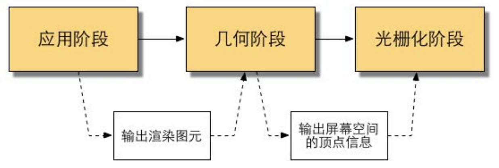
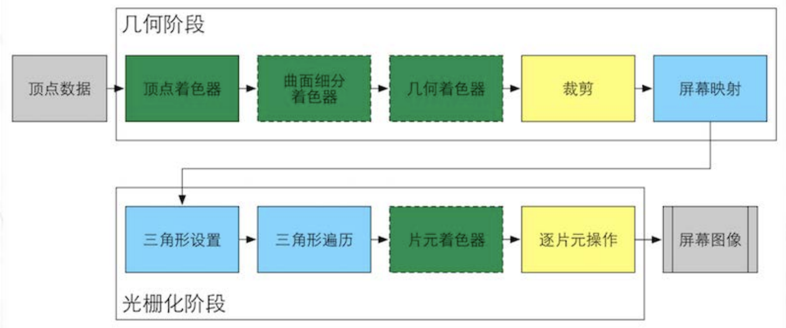
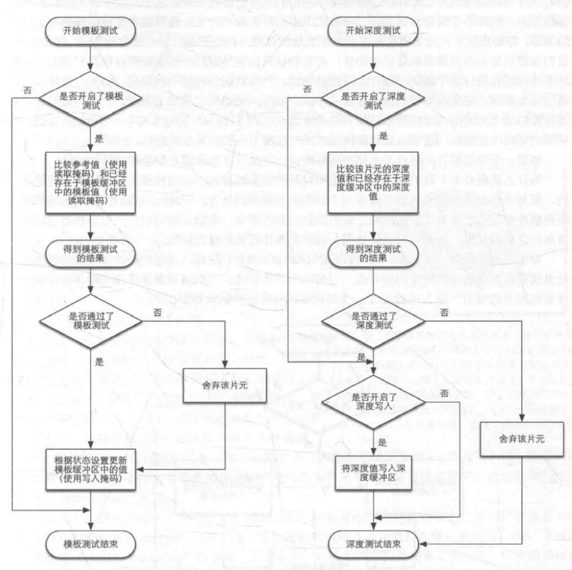
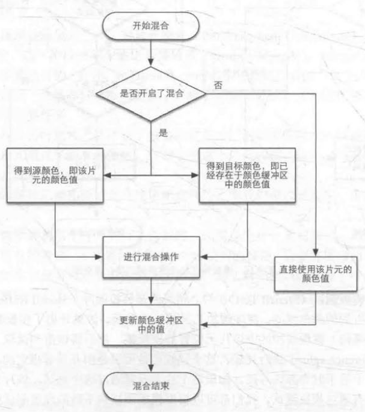
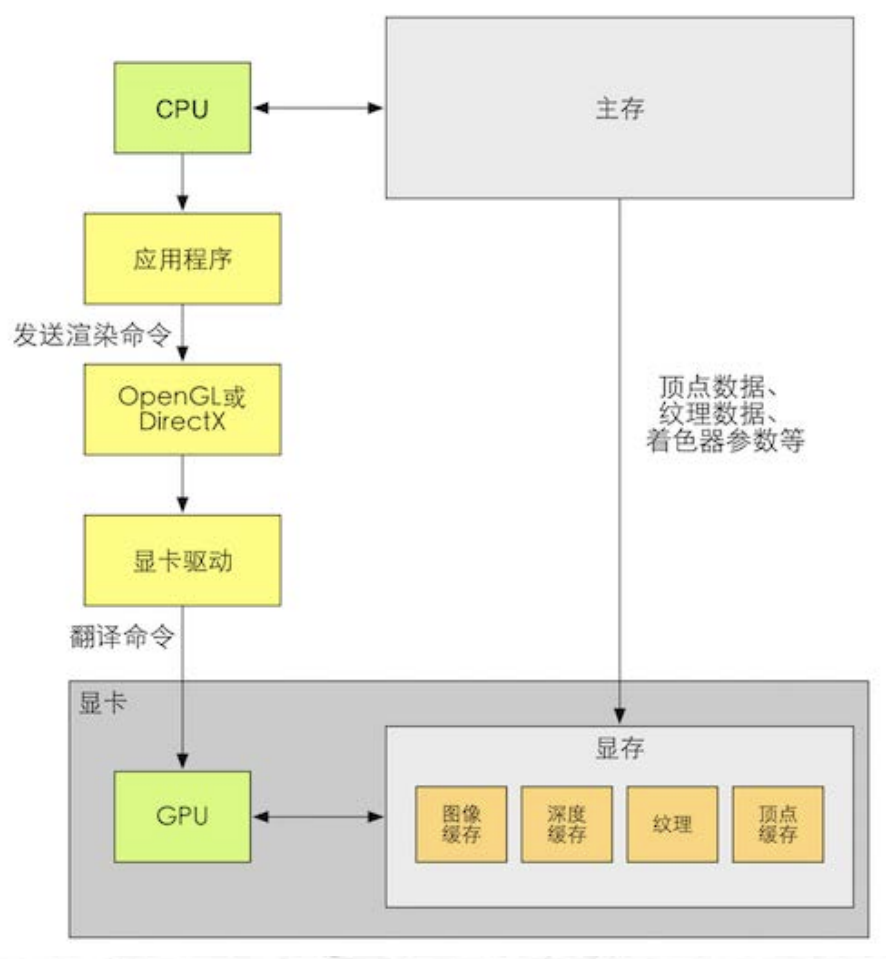

# 渲染管线

## 什么是渲染管线

*渲染管线*（Rendering Pipeline）也称渲染流水线，是GPU内部处理图形信号相互独立的并行处理单元。一个流水线是一系列可以按照固定顺序进行或**并行**的阶段。每个阶段都从它的前一阶段接收输入，然后把输出传给随后的阶段。图形硬件以流水线的方式可以同时处理大量的顶点、几何图元和片元，大大加快了渲染速度。

《Real-Time Rendering, Third Edition》一书中将一个渲染流程分成3个概念阶段：*应用阶段*（Application Stage）、*几何阶段*（Geometry Stage）和*光栅化阶段*（Rasterizer Stage）。3个概念阶段之间的联系如下：

### 应用阶段

应用阶段由CPU发起，**将渲染所需的几何信息即*渲染图元*（Rendering Primitives）输出给GPU**。

应用阶段可分为3个阶段：

1. **准备渲染所需数据**：如摄像机位置、视锥体、模型、光源等，在此过程看进行*粗粒度剔除*（Culling），以减少不可见物体的渲染。
2. **设置渲染状态**：渲染状态，包括但不限于材质、纹理、Shader等，定义了网格是怎么被渲染的。
3. **发出渲染命令**：CPU通过图形应用程序接口向GPU发出渲染命令。

在此阶段，所有渲染所需数据都需要从*硬盘*（Hard Disk Drive，HDD）加载到系统*内存*（Random Access Memory，RAM）中。然后，网格和纹理等数据又将被加载到*显存*（Video Random Access Memory，VRAM）中。这是因为显卡对于显存的访问速度更快，并且大多数显卡没有直接访问RAM的权利。

在准备好渲染数据并设置渲染状态后，CPU需要向GPU发出渲染命令，即**Draw Call**。该命令指向一个需要被渲染的图元（Primitive）列表，而不包含任何材质信息。当给定了一个Draw Call时，GPU会根据该Draw Call指向的顶点数据进行计算并渲染图像。

> *顶点*（Vertex），就是组成3D图形的顶点，由于设计3D模型是基于坐标空间内部设计的，所以顶点信息包含了3D模型在空间内的坐标，此外还包含法线方向、顶点颜色、纹理坐标等信息。
> CPU和GPU通过*命令缓冲区*（Command Buffer）实现并行工作。命令缓冲区包含了一个命令队列，由CPU向其中添加命令，GPU从其中取出命令。添加和取出相互独立。
> 命令缓冲区中的命令有很多中，Draw Call是其中一种，其他命令还有改变渲染状态等。

在发起一个Draw Call前，CPU需要收集、准备数据。当CPU通过图形应用程序接口将Draw Call发送给GPU后，显卡驱动需要翻译命令，然后GPU才能根据命令进行渲染。这样的一个调度过程是**昂贵**的。**由于GPU的渲染效率往往快于CPU提交命令的速度，如果频繁的触发Draw Call，CPU会花费大量时间收集数据、提交命令，造成CPU过载和程序运行瓶颈。**

**批处理**（Batching）就是将许多小的Draw Call合并成一个大的Draw Call，从而减少每次提交Draw Call过程中相同的操作。由于需要在CPU内存中合并网格，而合并过程中是需要消耗时间的，因此批处理技术更适合于静态物体。

对于几何阶段和光栅化阶段，开发者无法拥有绝对的控制权，但顶点可编程能力和片元可编程能力使得GPU管线中某些阶段具有可配置性或可编程性。如下图所示，绿色表示该阶段是完全可编程控制的，黄色表示该阶段是可配置的，蓝色表示该阶段是GPU固定实现的，没有控制权；实线表示该阶段着色器必须由开发者编程实现，虚线表示该阶段着色器是可选的。

### 几何阶段

几何阶段处理所有和要绘制的几何相关的事情，如决定需要绘制的图元，怎么样绘制以及在哪里绘制它们。

几何阶段负责对渲染图元进行逐顶点、逐多边形操作，**把顶点坐标变换到屏幕空间，输出屏幕空间的二维顶点坐标、深度值、着色等信息，并传递给下一阶段。**

#### 顶点着色器

*顶点着色器*（Vertex Shader）是完全可编程的，用于**实现顶点的空间变换、顶点着色等**。

> *着色器*（Shader）是一段运行在GPU上的**程序片段**，用于在GPU管线中控制计算和输出图像。

顶点着色器的输入来自于CPU，其处理单位是顶点，即输入数据中的每个顶点都会调用一次顶点着色器。顶点着色器本身无法创建或销毁任何顶点，而且无法得到顶点与顶点之间的关系。

顶点着色器需要完成的工作主要包括**坐标变换和逐顶点光照**，也可以输出后续阶段所需数据（如顶点颜色等）。

> 坐标转换就是对顶点的坐标进行某种变换。
> 顶点着色器需要将顶点坐标转从模型空间转换到齐次裁剪空间，后续空间转换一般由底层自动完成。
> 顶点着色器可在坐标变换时改变顶点位置，可制作顶点动画，如水面、布料等。

#### 曲面细分着色器

*曲面细分着色器*（Tessellation Shader）是可选的，用于**细分图元，以实现更加细腻的表现和顶点交互、顶点动画等效果**。

#### 几何着色器

*几何着色器*（Geometry Shader）是可选的，用于**执行逐图元（Per-Primitive）的着色操作或者产生更多图元**，如增加、删除、移动顶点，只能在裁剪空间中进行。

#### 裁剪

*裁剪*（Clipping）是可配置的（如使用自定义裁剪平面配置裁剪区域或通过指令控制裁剪三角图元的正面还是背面），目的是**将不在摄像机视野内的顶点裁剪，并剔除某些三角图元的面片**。

裁剪通常会将摄像机视锥空间归一化为单位立方体空间，然后再进行操作。

通常裁剪空间转换为*归一化的设备坐标空间*（Normalized Device Coordinates，NDC）以及进一步转换为屏幕空间是由底层自动完成，因此顶点着色器只需要把顶点转换到齐次裁剪空间即可。

> 在齐次裁剪空间的基础上进行*透视除法*（Perspective Division）或*齐次除法*（Homogeneous Division）得到的坐标即为归一化的设备坐标空间。
> OpenGL（是Unity使用的）中NDC的z分量范围在[-1, l]之间，而DirectX中NDC的z分量范围是[O, 1]。

#### 屏幕映射

*屏幕映射*（Screen Mapping）是不可配置和编程的，负责**将每个图元的坐标转换到*屏幕坐标系***（Screen Coordinates）下。屏幕映射的输入是三维坐标系下的坐标（范围在单位立方体内）。屏幕坐标是二维坐标，与显示画面的分辨率有很大关系。屏幕映射不会对输入的z坐标做任何处理。屏幕坐标系和z坐标构成*窗口坐标系*（Window Coordinates）。

> OpenGL（是Unity使用的）把屏幕左下角当作屏幕坐标系的原点，DirectX将屏幕的左上角当作屏幕坐标系的原点。

屏幕映射得到的屏幕坐标决定了这个顶点对应屏幕上哪个像素以及距离这个像素有多远。

### 光栅化阶段

光栅化阶段生成屏幕上的像素，渲染出最终的图像。

光栅化阶段对前一阶段得到的数据（屏幕坐标系下的顶点位置及相关额外信息，如深度值、法线方向、视角方法、顶点颜色等）进行插值，然后进行逐像素处理，**决定渲染图元中的哪些像素应该被绘制在屏幕上，并计算这些像素的颜色**。

#### 三角形设置

*三角形设置*（Triangle Setup）是不可配置和编程的，主要任务是**计算光栅化一个三角网格所需的信息**。

前一阶段得到的数据都是三角网格的顶点数据，为了得到整个三角网格对像素的覆盖情况，需要计算每条边上的像素坐标。为了能够计算边界像素的坐标信息，需要**得到三角形边界的表示方式**。

#### 三角形遍历

*三角形遍历*（Triangle Traversal）是不可配置和编程的，主要任务是**找到哪些像素被三角网格覆盖**，也称作*扫描变换*（Scan Conversion）。如果被覆盖的话，就会生成一个*片元*（Fragment）。此阶段输出一个片元序列。

> **片元并不是真正意义上的像素，而是包含了许多状态的集合。** 这些状态用于计算每个像素的最终颜色，包括（但不限于）屏幕坐标、深度信息、顶点信息等。

在遍历过程中，根据几何阶段输出的顶点信息，得到该三角网格覆盖的像素位置。对应像素会生成一个片元，而片元的状态是对三个顶点的信息进行插值得到的。

#### 片元着色器

*片元着色器*（Fragment Shader），在DirectX中被称作*像素着色器*（Pixel Shader），是完全可编程的。片元着色器的输入是上一阶段的片元序列，**输出一个或多个颜色值**。

这一过程可以完成很多重要的渲染技术，如纹理采样。

为了在片元着色器中进行*纹理采样*，通常会在顶点着色器中输入每个顶点对应的纹理坐标，然后经过光栅化阶段对三角网格的三个顶点对应的纹理坐标进行插值后，就可以得到其覆盖的片元的纹理坐标了。

虽然片元着色器可以完成很多重要效果，但它仅可以影响单个片元，即当执行片元着色器时，它不可以将自己的任何结果直接发送给它的邻居们，除非片元着色器可以访问到*导数信息* （Graclient，或Derivative）。

#### 逐片元操作

*逐片元操作*（Per-Fragment Operations），在DirectX中被称作*输出合并阶段*（Output-Merger），是可配置的，主要任务有：

- **利用测试（如模板测试、深度测试等）决定每个片元的可见性。**
- **如果一个片元通过了所有测试，就把该片元的颜色和已存储在颜色缓冲区中的颜色进行合并，也叫混合。**

##### 片元测试

片元的测试比较复杂，且不同图形接口的实现细节也不尽相同。以下给出两个基本的测试——模板测试和深度测试的实现过程。

如果开启了**模板测试**（Stencil Test），GPU首先读取（使用读取掩码）模板缓冲区（Stencil Buffer）中该片元的模板值，然后将该值与读取（使用读取掩码）到的参考值（Reference Value）进行比较，这个比较函数是可以由开发者指定的。如果这个片元没有通过模板测试，该片元会被舍弃。不管一个片元有没有通过模板测试，都可以根据模板测试和深度测试的结果修改模板缓冲区，这个修改操作也是由开发者指定的。模板测试通常用于限制渲染区域或其他高级用法（如渲染阴影、轮廓渲染等）。

如果片元通过模板测试，则会进行**深度测试**（Depth Test）。如果开启了深度测试，GPU会把该片元的深度值和已经存在于深度缓冲区（Depth Buffer）的深度值进行比较，这个比较函数也是可以由开发者指定的。通常深度比较函数是小于等于的关系，即如果这个片元的深度值大于等于当前深度缓冲区的值，则舍弃它，因为通常总是渲染离摄像机最近的物体，而被其他物体遮挡的就不需要渲染。如果这个片元没有通过测试，该片元就会被舍弃。与模板测试不同的是，如果片元没有通过深度测试，则它没有权利修改深度缓冲区的值；如果通过测试，开发者可以通过开启/关闭深度写入指定是否要用通过的片元覆盖原有的值。

上述给出的测试顺序并不是唯一的，而且虽然从逻辑上将上述测试是在片元着色器之后进行的，但对于大多数GPU来说，为了降低片元着色器的计算量，通常会在片元着色器之前进行测试以提前知道需要被舍弃的片元，这些片元就不需要再使用片元着色器计算颜色值。在Unity的渲染管线中，深度测试是在片元着色器之前的，这种将深度测试提前执行的技术叫*Early-Z技术*。但是，如果将这些测试提前，其检验结果可能会与片元着色器中的操作冲突。例如，如果在片元着色器中进行了透明度测试而该片元没有通过，则会在着色器中手动调用API舍弃该片元。这就导致GPU无法提前执行各种测试。因此，现代GPU会判断片元着色器中的操作是否和提前测试发生冲突，如果有冲突，就会禁用提前测试。但是，这样也会造成性能上的下降，因为有更多片元需要被处理，即透明度测试会造成性能下降的原因。

##### 片元混合

渲染是一个物体接着一个物体绘制到屏幕上的，而每个像素的颜色信息被存储在颜色缓冲区（Color Buffer）中。因此，当渲染一个物体时，颜色缓冲区中已经存有上个物体渲染之后的颜色结果，那么，应该使用此物体的颜色覆盖之前的，还是进行其他处理？这就是**混合**（Blend）需要解决的问题。

如果片元通过所有测试，则会进行混合。混合是可配置的。开发者可以选择开启/关闭混合功能。如果没有开启混合，则直接使用当前颜色覆盖颜色缓冲区中的值。如果开启了混合，GPU会将源颜色（当前片元的颜色）和目标颜色（颜色缓冲区存在的颜色）通过*混合函数*进行混合（用于制作透明效果）。混合函数通常与*透明通道*相关，如根据透明通道的只进行相加、相减等。

当图元经常计算和测试后，就会显示在屏幕上。**屏幕显示的是颜色缓冲区中的颜色值。** 但是，为了避免看见正在进行光栅化的图元，GPU会使用*双重缓冲*（Double Buffering），即对场景的渲染是发生在*后置缓冲区*（Back Buffer）中的。一旦场景被渲染到了后置缓冲区，GPU会交换后置缓冲区和*前置缓冲区*（Front Buffer）中的内容，由此保证图像总是连续的。

### 固定管线

*固定函数管线*（Fixed-Function Pipeline），简称固定管线，通常是指在较旧的GPU上实现的渲染管线。这种管线只给开发者提供一些配置操作，但开发者没有对各阶段的完全控制权。

固定管线通常提供了一系列接口，这些接口包含了一个*函数入口点* (Function Entry Points) 集合，这些函数入口点会匹配GPU上的一个特定的逻辑功能。开发者们通过这些接口来控制渲染管线。换句话说，固定渲染管线是只可配置的管线。

随着时代的发展，GPU管线越来越朝着更高的灵活性和可控性方向发展，可编程渲染管线应运而生。在GPU发展的过程中，为了继续提供固定管线的接口抽象，一些显卡驱动使用了更加通用的着色架构，即使用可编程的管线来模拟固定管线。这是为了在提供可编程渲染管线的同时，可以让那些已经熟悉了固定管线的开发者们继续使用固定管线进行渲染。但随着GPU的发展，固定管线已经逐渐退出历史舞台。

## 图形应用程序接口

渲染时CPU与GPU直接需要实现通信。如果开发者直接访问GPU是一件非常麻烦的事，不仅需要和寄存器、显存进行交互，还需要考虑到不同型号的GPU。*图形应用程序接口*（Graphic Application Program Interface）是对GPU硬件的抽象，架起了上层应用程序和底层GPU沟通的桥梁。一个应用程序像图形API发送渲染命令，然后图形API向显卡驱动 (Graphics Driver) 发送渲染命令，之后显卡驱动将图形API发送的渲染命令翻译成GPU指令并把纹理等数据转换成GPU支持的格式。

目前，两大图形API即OpenGL和DirectX。

### OpenGL

*OpenGL*（Open Graphics Library）是一个由Khronos定义的跨编程语言、跨平台的专业图形API，是一个功能强大、调用方便的底层图形库。

OpenGL是行业领域中最广泛接纳的2D/3D图形API，自其诞生至今已催生了各种计算机平台及设备上的数千优秀应用程序。OpenGL独立于视窗操作系统或其他操作系统，亦是网络透明的。OpenGL是与硬件无关的软件接口，可以在不同平台如Windows、Unix、Linux、MaxOS之间进行移植。因此，支持OpenGL的软件具有很好的移植性，可以获得非常广泛的应用。

OpenGL的发展一直处于一种较为迟缓的态势，每次版本的提高新增的技术很少，大多只是对其中部分做出修改和完善。1992年7月，SGI公司发布了OpenGL的1.0版本，随后又与微软公司共同开发了Windows NT版本的OpenGL，从而使一些原来必须在高档图形工作站上运行的大型3D图形处理软件也可以在微机上运用。1995年OpenGL的1.1版本面市。该版本比1.0的性能有许多提高，并加入了一些新的功能。其中包括改进打印机支持，在增强元文件中包含OpenGL的调用，顶点数组的新特性，提高顶点位置、法线、颜色、色彩指数、纹理坐标、多边形边缘标识的传输速度，引入了新的纹理特性等等。OpenGL 1.5又新增了“OpenGL Shading Language”，该语言是“OpenGL 2.0”的底核，用于着色对象、顶点着色以及片元着色技术的扩展功能。

### DirectX

*DirectX*（Direct eXtension）是由微软公司创建的多媒体API，由C++编程语言实现，遵循COM，被广泛使用于Microsoft Windows、Microsoft XBOX、Microsoft XBOX 360和Microsoft XBOX ONE电子游戏开发，并且只能支持这些平台。最新版本为Directx 12，创建在最新的Windows 10。DirectX是这样一组技术：旨在使基于Windows的计算机成为运行和显示具有丰富多媒体元素（例如全色图形、视频、3D动画和丰富音频）的应用程序的理想平台。DirectX包括安全和性能更新程序，以及许多涵盖所有技术的新功能。应用程序可以通过使用DirectX API来访问这些新功能。

DirectX加强3D图形和声音效果，并提供设计人员一个共同的硬件驱动标准，让游戏开发者不必为每一品牌的硬件来写不同的驱动程序，也降低了用户安装及设置硬件的复杂度。从字面意义上说，Direct就是直接的意思，而后边的X则代表了很多的意思，从这一点上可以看出DirectX的出现就是为了为众多软件提供直接服务的。

## 着色器编程语言

着色器编程语言的发展方向是设计出在便捷性方面可以和C++/JAVA相比的高级语言，“赋予程序员灵活而方便的编程方式”，并“尽可能的控制渲染过程”，同时“利用图形硬件的并行性，提高算法的效率”。

在可编程管线出现之前，通常使用汇编语言编写着色器代码。

此后，为了更方便的编写着色器代码，出现了更高级（High-Level）的着色语言（Shading Language），常见的有**基于OpenGL的GLSL（OpenGL Shading Language）、基于DirectX的HLSL（High Level Shading Language）以及NVIDIA的CG（C for Graphic）**。这些语言会被编译成与机器无关的汇编语言，即中间语言（Intermediate Language，IL），再交给显卡驱动来翻译成真正的机器语言。

GLSL的优点在于跨平台性，可以在Windows、Linux、Mac甚至移动平台等多种平台上工作。这种跨平台性源于OpenGL没有提供着色器编译器，而是由显卡驱动完成着色器的编译工作，即只要显卡驱动支持对GLSH的编译便可运行，即GLSL是依赖硬件而非操作系统层级的。这种做法的好处在于，由于供应商完全了解自己的硬件构造，他们知道怎样做可以发挥最大作用。但也意味着GLSL的编译结果将取决于硬件供应商，这可能造成编译结果不一致的情况，最终造成渲染效果的差异。

HLSL是由微软控制着色器的编译，但也仅支持微软自己的产品，如Windows、Xbox等，因为在其他平台上没有可以编译HLSL的编译器。

CG是NVIDIA与微软合作开发的跨平台高级着色语言。CG极力保留C语言的大部分语义，并让开发者从硬件细节中解脱出来。CG同时也有一个高级语言的其他好处，如代码的易重用性，可读性得到提高，编译器代码优化。CG是一个可以被OpenGL和DirectX广泛支持的图形处理器编程语言。CG和OpenGL、DirectX并不是同一层次的语言，而是OpenGL和DirectX的上层，即，CG程序是运行在OpenGL和DirectX标准顶点和像素着色的基础上的。由于与微软的合作，导致CG与HLSL非常相像，CG可以无缝移植成HLSL，但可能无法完全发挥出OpenGL的最新特性。
