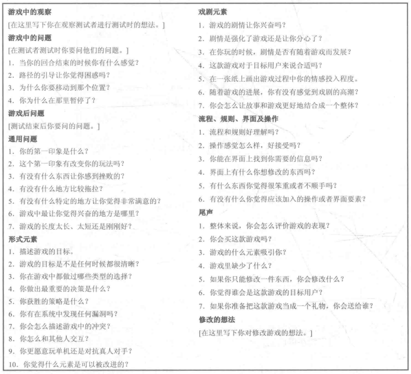

# 游戏设计梦工厂

## 第一篇 游戏设计基础

### 第一章 游戏设计师的角色

游戏设计师需要：

- 把注意力集中在玩家体验上，在开发过程中邀请玩家参与测试。
- 对游戏设计和开发保持热情。
- 坚定执行开发计划，掌握清楚和高效的交流与团队协作技巧。
- 从其他游戏和生活经历中寻找灵感。

游戏设计师通过**以游戏玩法为核心，以玩家体验为标准，在每一个开发阶段都让目标用户测试的迭代设计法**开发游戏：

- 建立玩家体验目标。
- - 设定玩家的体验目标。
- - 尽可能多地想出可以实现的游戏概念或玩法机制。
- - 选出其中比较好的概念和机制。
- - 用一页的篇幅对这些想法进行简单地叙述（概念文档）。
- - 测试概念对潜在玩家的吸引力（可能需要可视化模型）。
- 在对玩家体验目标、核心游戏机制深入理解后，尽早做出游戏原型并对其进行迭代。
- - 创建一个可玩的游戏原型并对其进行游戏测试。
- - 以玩家的体验为目标，测试一个想法或系统的影响（即对游戏性进行测试或分析反馈）。
- - 如果效果表现出来与玩家的体验相违背，那么回到第一步。
- - 如果出来的效果是好的，但是还没达到预期，那么尝试再次修改和测试。
- - 如果新的想法最终能达到预期，那么迭代过程完成。
- - 当原型所展示的游戏玩法能达到目标时，写一个三至六页的叙述，着重对游戏如何玩耍进行叙述。
- 以原型开发阶段积累的经验和遇到的问题为基础，把游戏制作的目标以文档或其他形式记录下来。
- 项目正式进入开发阶段。
- - 确保目标是清晰且可实现的，并规划好各个目标的优先级。
- - 为每个开发目标指定一系列“检查点”。当开发进展到每个检查点后，需要对游戏进行评估，确保开发的目标没有偏离玩家的体验目标。
- - 即使在原型阶段就已经把重要的问题解决了，在开发后期也不要忽略了对游戏核心玩法的关注。
- 在项目准备进入版本测试阶段时，应确保游戏玩法是可靠的，并确认游戏是与目标受众相吻合。
- 创建一个完整的游戏展示，该展示应该包括画面表现和核心玩法。

### 第二章 游戏的结构

正规元素是传统游戏结构中的基础，常见的有：

- **玩家**：游戏都是为玩家设计的。玩家自愿接受游戏的规则和限制。
- **目标**：游戏为玩家指定了明确的目标。玩家对实现游戏中目标的渴望是衡量玩家对游戏有多投入的一个标准。
- **程序**：游戏有具体的指导玩家可以通过什么方式实现目标的内容。程序是游戏规定的玩的行为或方式，创造了在游戏之外几乎不可能发生的互动。
- **规则**：游戏都通过规则定义了游戏的物品和概念，限制了玩家的行为和互动对象。
- **资源**：游戏中由于稀缺性和实用性而拥有价值的物品。资源可以强大玩家，制作新的产品或买卖。
- **冲突**：通常玩家的目标规则、程序的关系限制指引了玩家的行为，创造了另一个与其他行为的区别，即冲突。玩家需要努力解决冲突才能实现目标。
- **边界**：游戏发生在临时世界中，这个世界运用游戏的规则而不是现实世界中的规则。
- **结果**：游戏的结果是不确定的。游戏依赖结果的不确定性来实现每一次玩的戏剧性的紧张感。

> 规则和程序具有权威性，且在游戏描述中没有人和这样的权威有关联。

戏剧元素通过在正规元素中创造戏剧化内容，使玩家在情感上投入，常见的有：

- **挑战**：游戏中的冲突挑战玩家，在玩家解决问题时创造紧张感，并让关卡产生成就感或挫败感。随着游戏的进行，提高挑战会让紧张感逐渐增强。平衡玩家对挑战的情感反应是让玩家持续投入游戏的关键。
- **玩**：玩是在一个限定的结构中的自由行动，即利用游戏系统提供给玩家想象力、幻想、灵感、社交技能或是形式更加自由的互动，来实现游戏空间中的目标，进而在游戏中玩乐，同时投入到它提供的挑战中。
- **前设**：前设最基本的目的是让玩家更容易理解他们选择的处境，同时它还是一个让玩家情感上投入到元素互动中的一个强有力的工具。
- **角色**：角色是体验戏剧故事的替身，可以让玩家更加投入的体验到角色的生活。
- **故事**：故事可以结合其他元素对玩家产生强大的情感影响。与前设不同，故事会随着游戏进程而展开。

**游戏是一个封闭的、正规的系统，让玩家投入于有结构的冲突中，以一种不平等的方式来解决游戏的不确定性。**

## 第三章 使用正规元素

正规元素是游戏的本质，透彻理解它们之间的关系，是游戏设计的基础。

### 游戏的邀请

进入游戏的临时世界的时刻就是**游戏的邀请**。游戏的邀请可以是一个开始键、启动界面或者其他特殊效果。精心设计游戏的邀请，使它符合游戏内涵，并推送给目标受众。

### 玩家

在设计游戏的时候，需要考虑的与玩家相关的东西有：

- 玩家的数量：单人、双人、特定数量或不确定数量等。
- 玩家的角色：成就者、探险家、社交者、杀手（巴图理论）。
- 玩家的交互模式：单人VS游戏系统、多人VS游戏系统（非竞争、社交）、玩家VS玩家（竞争、社交）、单边对抗（二至多人与一人对抗，竞争、社交）、多边对抗（三名及以上玩家直接对抗，竞争、社交）、多人协作（非竞争、社交）、团队对抗（（竞争、社交）。

### 目标

目标定义了玩家在游戏规则内所尽力完成的内容。最佳情况下，目标对玩家来说十分具有挑战性，但仍可实现。除了提供挑战，目标还奠定了游戏的基调。在设计游戏时，应该仔细考虑目标，它不仅影响游戏的正规系统，也影响游戏的戏剧性（如果目标能够完美融入前设或故事中，游戏的戏剧性将被增强）。

目标可分为：

- 掠夺：夺取或摧毁对手的东西（区域、单位、物品等），同时避免被对手掠夺。
- 追捕：抓住对手或躲避对手的追捕。
- 竞速：在物理或概念上比其他玩家先实现目标。
- 排列：按照某种空间构型排列游戏块，或者在不同类的游戏块间创造一种概念性的排列。
- 救援或脱逃：使一个或多个单位达到安全状态。
- 行为禁止：通过不应该做的事来破坏规则。
- 建设：建造、维护、管理对象。带有建设目标的游戏通常将资源管理和贸易作为游戏的核心元素。建设游戏最终的目标是根据玩家的理解所决定的。
- 探索：探索游戏区域，通常与更有竞争性的目标结合。
- 解谜：在游戏结束前解决谜题。
- 益智：获得或使用知识打败其他玩家。

### 操作

操作就是玩家游戏的方法和为了实现游戏目标而采取的行动。

常用的操作类型：

- 开始操作：开始游戏的操作。
- 行动操作：在游戏开始后进行的操作。
- 特殊操作：受限与其他元素或游戏状态的操作。
- 解决操作：将游戏带往结束的操作。

在为游戏定义操作时，需要确保操作容易被玩家记住，确定玩家操作的输入/输出设备等。

### 规则

规则定义游戏的对象和玩家可采取的行为。

游戏中的对象都有一个独特的地位和意义，而不同于现实世界中的对象。在定义游戏的对象和概念时，需要考虑**玩家是如何学习这些对象的本质和特性**。

限制行为的规则可以修复游戏系统的漏洞、对其他元素进行补充、增加平衡性等。

决定结果的规则可以在游戏中制造变数，影响游戏的结果。

在设计规则时，需要时刻考虑规则与玩家之间的关系。太多规则会令玩家难以理解；描述不明确会让玩家迷惑。现实世界的规律可以让某些游戏压缩其规则的复杂性。

### 资源

资源就是资产和有用的东西，可以用于实现某些目标。

管理资源并决定资源的产出方式和时机是游戏设计师的主要职责之一。

游戏中的资源必须同时具有实用性和稀缺性。如果它不具有实用性，则它虽然会很有趣，但本质上毫无用处。如果资源过于丰富，则它将会失去在游戏系统中的价值。

游戏中常见的资源类型：

- 命数：通过以最简单的模式设计：越多越好，且没有任何副作用。
- 单位：有些游戏中玩家可以在同一时间内控制多个单位。
- 生命值：当生命值作为一种资源被使用时，将有助于戏剧性地表现生命和单位的损失。
- 货币：可以进行贸易，是游戏中最有力的资源类型之一。货币是游戏经济系统的关键元素之一。
- 行动：当行动作为资源时，通常是稀缺的，玩家需要仔细规划行动，避免浪费行动机会。
- 能力加强：这种资源可加强玩家的某部分能力或游戏中的变量。能力加强物品通常是稀缺的，可以是临时的、数量有限的或者只在某些状态下可用。
- 物品：玩家在游戏中收集、管理的东西。
- 特殊区域。
- 时间：时间作为资源时具有戏剧化的力量，会为游戏设计在情感上加分。
- 空间：如背包空间、地图大小等。

### 冲突

冲突通过创建规则、国产和情景阻止玩家直接完成目标。

三个景点地游戏冲突来源：

- 障碍：障碍可以是物理上的形式，也可以涉及智力技巧。
- 对手：多人游戏中冲突的主要来源。
- 两难选择：玩家通过选择影响结果。通常玩家会对自己的选择所造成的结果产生更大的情感反应。

### 边界

边界就是将非游戏内容与游戏分开的东西。设计师必须定义游戏的边界，即定义玩家是如何进入和离开这个魔法圈。

边界是将现实生活与游戏事件区分开来的一种方法。

当然，游戏系统与外界元素的相互作用可能是有趣的设计选择。

### 结果

游戏的结果通常是不确定的。这种不确定通常通过可测量且唯一的结果来实现。当然，许多游戏可能不会包含获胜者或游戏结束的状态。

最终结果的结构常与玩家之间的交互模式和目标有关。

## 第四章 运用戏剧元素

戏剧元素给游戏玩法赋予内涵，覆盖并结合游戏系统中的正规元素，把它们变成一个有意义的体验。复杂的戏剧技巧通常被用来解释和增强正规系统中更加抽象的元素，为玩家建立更深的情感连接，并在总体上丰富游戏的体验。

### 挑战

挑战是让玩家完成后感到很满意的任务，是一个需要刚好合适的努力的挑战，从而创造出一种既享受又有成就感的感觉。因此，**挑战因人而异**，还取决于玩家的能力。

**挑战是动态的。** 游戏必须保持挑战性来满足进度快的玩家。

心流理论描述了挑战和能力变化过程中的最优解：变难的挑战和增长的技能精心地平衡在挫败和无聊中间。在心流中，一项活动能平衡一个人的挑战和技能、挫败和无聊，来创造一种成就感和快乐的体验。

可以帮助玩家达到心流状态的元素：

- 一项需要技巧的有挑战性的活动。
- 动作和意识的结合。
- 清晰的目标和反馈。
- 专注于目前正在做的任务。
- 控制的悖论：人们喜欢掌控的感觉，但只有在结果是不确定的情况下，人们才能体验到控制感，而这正意味着人们并没有完全控制它。在游戏设计中，需要思考**怎样给玩家提供有意义的选择，但又不给玩家绝对的控制和保证的结果**。
- 失去自我意识：心流状态下，玩家通常太投入以至于忘记保护自我。
- 时间的变化：在心流状态下的玩家通常感受到不一样的时间流逝速度。
- 体验成为了它自己的结果：当上述元素的大部分被满足时，玩家都开始享受它创造字段体验，并且这种行为变成了自发的。

### 玩

玩家可以被想象成是在一个固定结构中自由行动。对游戏来说，规则的限制和拥有的手段就是固定结构。在这个结构中的玩，就是玩家在规则中的自由——紧凑体验和个人表达的机会。

玩有很多方面：帮助学习技巧和获得知识；学习社会化；帮助解决问题；放松；以不同的角度看事情。玩被认为实现创新和创造了的方式。玩并不是任何一个东西，而是一种思维状态，一种活动的方式。一个玩的方式可以被运用在即使是最严肃或最难的主题上，因为可玩是一种思维状态，而不是一种行为。

Braim Sutton Smith在《Ambiguity of Play》中划分了玩的种类，包括思维上的、实实在在的、社会中的、表演性质的、比赛性质的、风险性质的等。

Roger Caillois在《1958 Man, Play and Games》中将玩划分为4类：竞争类、机会类、带入类、眩晕类，并提出了以规则为基础的玩和自由形式的玩。

不同的玩家对游戏有着不同的需要和诉求，因此可以大致划分为以下几类：

- 竞争型：超越其他玩家。
- 探索型：对世界充满好奇心，热爱在外部世界进行冒险和探索。
- 收集型：热衷于收集物品或知识；喜欢分类、梳理等。
- 成就型：为了不同级别的成就而游戏；上升通道和等级划分对这类玩家有很大的刺激作用。
- 娱乐型：不喜欢严肃认真地玩游戏，仅仅是为了娱乐而娱乐。
- 艺术型：由游戏中的创造了、创意、设计等方面所驱动的玩家。
- 指导型：爱管事情、承担责任、喜欢对游戏进行干预。
- 故事型：喜欢想象和创建自己所居住世界的人。
- 表演型：喜欢表演和配合其他玩家。
- 工匠型：热爱建设、组装，并搞明白一些复杂的事情。

### 前设

为了从情感上把玩家与游戏联系到一起，游戏设计师需要为游戏的交互创建一个戏剧性的前设。

在传统戏剧里，前设通常被建立在一个故事的叙述之上，通过“说明”搭建起时间、地点、人物和彼此之间的关系，而其他重要的故事元素可以在后阶段展开，构建起事件冲突。当这所有的东西被引入后，故事情节就此正式开始。

前设的首要任务是**让游戏的正规系统对玩家来说具有可玩性**。当然，一个好的前设还可以在情感层面吸引玩家。创造一个可以结合正式和传统元素的前设，可以提高玩家体验。

### 角色

角色是故事的媒介，故事通过角色的行为来讲述。观众对一个角色和他追求的目标感同身受，使故事中的事件像发生在自己身上，并随着这些事件的动向直到结局。

角色可以是心理上的、象征性的、代表性的、历史性的等。角色在故事中如何被使用很大程度上取决于故事的类型。

故事主角处身问题中，从而创造了使故事发展的冲突。

角色通过他们在故事中说什么、做什么、什么样子以及别人对他们的评价而被定义。

在塑造角色时，需要思考以下四个问题来确保角色作用：

- 这个角色想要什么？
- 这个角色需要什么？
- 玩家的期待是什么？
- 玩家的恐惧是什么？

角色还可以充当玩家的媒介，在游戏中代表玩家。角色可以和玩家建立情感联接（移情）。媒介和移情必须在游戏的每个有角色的关卡中都被考虑。在创建角色是另一个需要考虑的问题是自由意志与玩家控制的平衡。被玩家控制的角色通常没有自己行动的机会，这限制了角色展示自己个性和内心活动的机会。

### 故事

因为游戏是不确定的，所以故事的结局也是不确定的，即在一开始并不确定，但随着时间的发展，可以猜得到的结局。

在很多游戏中，故事被限制在背景故事中。背景故事设定了故事冲突，并且为角色制造动机，但它的进展却并不受游戏玩法的影响。

有的游戏允许玩家的选择影响游戏结果，通常可以过故事分支实现。

构建世界是对一个虚拟世界进行深度而复杂的设计，通常来说最开始是从地图和历史入手，然后逐渐对种族、语言、神话、政府、政治、经济等方面进行拓展和研究。不断更新世界观不仅让游戏的深度和广度都得到了扩展，并且对推出续作、延续作品生命力也是有益的。

### 情节发展

任何好的故事核心都是冲突，而**冲突同样也是游戏系统的核心**。设计出有意义的冲突不仅可以防止玩家太容易完成目标，而且也能通过营造出一种跌宕起伏的感觉吸引玩家深入到游戏的情感层面。

传统戏剧冲突可以分为：角色之间的冲突、角色与自然的冲突、角色与器械的冲突、角色内在的冲突、角色与社会的冲突、角色与命运的冲突等。游戏中的冲突有：玩家与玩家的冲突、玩家与多个玩家的冲突、队伍与队伍的冲突、玩家与游戏系统的冲突等。思考游戏的冲突可以把游戏的情节和系统更加自然地整合到一起，有目的性的塑造玩家与玩家之间的关系，衍生出更多的互动。

冲突应该随着情节的发展而发展。在大多数故事中，不断升级的冲突制造出更强的紧张感和悬念。游戏中的冲突由于需要玩家自己去发现、亲自执行解决冲突的关键步骤而当最终解决冲突后，玩家会因为亲身参与而产生一种成就感。

## 第五章 活用动态的游戏系统

系统是由一系列互动元素所组成的一组集合体，并赋予目标或理由。游戏是系统。游戏的核心是一系列正规元素，这些元素随着系统开始运转，为玩家产生出一系列动态的体验以使玩家着迷。游戏存在的目的是取悦它的参与者。正规元素和戏剧元素之间如何相互作用构成了游戏最基础的系统，并且决定了游戏的本质与所能给玩家带来的体验。

系统可以说简单的，也可以是复杂的。系统可以精确实现可预期的目标，也可以产生各不相同且无法预期的效果。游戏设计师需要自己判断什么样的系统适合自己的游戏。

系统中最基础的元素有物体、属性、行为和关系。系统中的物体根据它们的属性、行为和关系相互作用，并使系统状态发生变化。这种变化有什么样的表现完全取决于物体的本质与物体之间的互动。

物体是构建系统的基本单位。物体可以是具象的、抽象的或二者皆有的。

属性即品质和特征，用于定义物体。物体的属性组合出一组描述数据，这组数据是判断物体在游戏系统中互动行为的基础。

行为是在某种状态下一个物体可能展开的行动。属性越多，一个物体可展开的行为越多，就越难预测它在系统中会展开什么样的行动。

关系是物体之间的关联。

### 系统动态

当系统中的元素发生改变时，系统一定会变化。

完整的系统大于其每个部分单纯加在一起的总和，即系统中的元素不是单纯的加减。

一个游戏最重要的一方面就是在每一个时间点展现给玩家的可能性。

### 经济系统

想要建立经济系统，游戏必须有可以交易的物品、对象以及交易方式。经济系统可以有或没有货币。游戏中物品的价值可由随意、固定或一系列的变量决定。玩家的交易机会也可以是随意的，或者对时间、数量、价格和对象进行限制的。

在建立经济系统前，因思考：

- 经济规模在游戏中会增加吗？如果是的话，这种增长是由游戏系统控制的吗？
- 如果有货币，货币的供给如何控制？
- 经济系统中的价值是如何确定的，基于市场还是游戏系统定义？
- 交易双方在交易过程中有什么限制？

### 自生成系统

在很多情况下，简单的规则设定如果设置为动态的话，就会产生无法预料的结果，这种系统就是自生成系统。

### 与系统进行互动

游戏设计是为了玩家互动，而且其互动系统的结构完全与互动的本质联系在一起。

在设计互动体验时需要考虑：

- 玩家对系统状态了解多少？
- 玩家可以控制系统的哪些方面？
- 哪种控制是如何构建的？
- 系统给玩家怎样的反馈？
- 这会怎样影响游戏体验？

为了在游戏中做出决策，玩家需要游戏目标及相关信息。游戏中如何构建信息对玩家决策有很大影响。公开信息结构强调玩家全面了解游戏情况信息以及进程，这会增加游戏以计算为基础的策略性；隐藏信息结构中，玩家可能并不了解一些重要信息，这会增加基于社交线索和欺骗的策略性。动态信息结构为基于信息的策略和基于欺骗和计谋的策略之间提供了平衡。

控制系统需要完美匹配游戏体验。直接控制行动可以让玩家简单直接地影响游戏状态。间接控制通常会与玩家的预期有所偏差，在一些系统中提供了有趣的挑战。

在系统中，反馈指一次互动的输出以及对于另一要素的改变之间的直接联系。反馈可以是正面或负面的，可以提高系统的分散度和平衡。

### 调整游戏系统

游戏系统首先需要测试，保证其自身的完整。其次，需要测试系统的公平性和平衡。最后，需要保证游戏进行过程中有意思且具有挑战性。

## 第二篇 设计一款游戏

**本篇主要内容为如何对游戏进行概念化、原型化和游戏性测试。**

## 第三篇 像一名游戏设计师一样工作

**本篇解读了设计师在团队和行业中的角色和位置。**
# 第二篇 设计一款游戏

## 第六章 概念设计

### 获得灵感

优秀的想法来自于大量情感体验的获取，即丰富的生活、自身充满好奇心、有趣的人、环境、想法和事情。创意也产生自现有的游戏和活动。

典型的创意产生步骤为：

- 准备：沉浸在一个话题、一个目标领域或者一组争议话题中的过程。
- 酝酿：创意在头脑中搅拌但是还没有浮现的阶段。
- 评估：评估创意的原创性、价值和决定是否继续进行创作的阶段。
- 展开：是创意设计过程中耗时最长、最艰难的阶段。

### 头脑风暴

头脑风暴的关键技巧是**弄清楚问题的本质**。

头脑风暴练习过程：

1. 阐明问题：练习是可以大声宣读要讨论的题目。
2. 拒绝评论：单人头脑风暴时，不要评价或修改点子，先把所有的想法写下来，最后再去考虑它们的质量；团队头脑风暴时，不要评论或否决他人的想法。
3. 变换方法。
4. 制造轻松的环境。
5. 让别人看到你的想法。
6. 多多益善。
7. 注意时间。

### 其他方法

- 创意列表：把关于一个确定话题的所有东西都写在一个列表上。
- 创意卡片：将简单的想法写在一组卡片上，然后随机组合卡片，得到疯狂的想法。
- 思维导图：以一个核心的想法为中心，将可以关联的创意向四周辐射。
- 意识流法：用极限的速度把所有想法写下来。
- 喊叫法：用录音设备把所有大声喊出的想法记录下来。
- 剪贴法：找一份报纸、杂志、字典等，随机找出文字和图片，当有一定数量的素材后，随机组合并总结出一款游戏的概念。
- 超现实主义游戏：多了解超现实主义和达达主义的艺术家们。
- 研究：对感兴趣的题目进行实践、研究。

### 修改和优化

常见筛选方式：

- 技术可行性。
- 市场机遇。
- 艺术考虑：筛选喜欢、有魅力的创意。
- 预算。

通过筛选将列表中的创意缩小到三个，然后再通过头脑风暴丰富这三个创意，把注意力集中在游戏创造性核心的“X元素”上。X元素分为刀锋和标语两部分。**刀锋需要精确地定位游戏特性。标语需要抓住人心，让玩家知道这是不是他们想要的游戏。** 操作方式是用一两段描述游戏创意的核心，在描述中阐述游戏的X元素，包括刀锋和标语，然后尝试去挖掘创意的趣味点和找到可行的基本玩法。

### 把创意转化成游戏

关注正规元素：

- 游戏中冲突是什么？
- 游戏的规则和流程是什么？
- 玩家需要在什么时间节点进行怎样的行动？
- 游戏中有回合吗？它是怎样运作的？
- 有多少玩家可以参与进来？
- 游戏的时长是多少？
- 暂定的名称是什么？
- 目标受众是谁？
- 需要在什么平台上运行？在这个运行环境下有什么限制和好处？
- ……

在搭建游戏框架时：

- 定义玩家的目标。
- 玩家需要怎么做才能赢得游戏？
- 玩家最重要的动作是什么，这类动作如何执行？
- 把注意力集中在最主要的规则上。
- 整理出一个典型回合的流程。
- 多人游戏有多少玩家可以参与，玩家之间如何交互？

## 第七章 原型

原型在游戏设计中处在核心位置，是以想法为基础，创造一个可运转的模型，然后在这个模型的基础上对想法进行测试，评估想法的可行性并发现需要改进的地方。

原型并不产生想法，它只是验证好的想法、抵制坏的想法。一个好而有效的原型建立在一个可以去验证的想法之上，从中获取切实可行的想法。

### 制作原型的方法

原型可分为实物原型、视觉原型、视频原型、软件原型等。

实物原型可以让设计师更专注与游戏的玩法而不是编程、画面效果等技术方面的问题，实时响应玩家的反馈，低成本。实物原型可以迫使设计师思考并定义设计的元素，想清楚不同元素之间如何相互影响，帮助构建游戏结构，制定出一套游戏运行的系统性方法。

制作原型的法则：

- 经常提出问题：问题可以让设计更具有目的性，并通过测试来验证解决的方法。
- 保持可验证性：尽可能早地把玩家融入设计过程之中，**通过玩家验证实验的结果**。
- 说服和启发：原型应该**具有强大的说服力，有趣且让人觉得惊喜**。
- 快速的工作：尽量减少在引擎、结构或其他与原型的目的关系不大的地方消耗的时间，这些东西无法帮助验证核心设计。**原型的目的就是尽可能块地测试和验证想法。**
- 经济实用的工作：**原型应该是小而美的东西。**
- 小心地拆分问题：将大问题拆分成更容易解决的小问题。

### 核心玩法可视化

当设计元素过多时，可以将游戏的核心玩法和机制从中分离出来，并试着从这里构建游戏。

游戏的核心机制可以定义为**玩家在游戏过程中为了达到游戏的最终目标而重复最多的行为**。

### 构建实物原型

#### 基础

使用材料制作游戏大致的地图或布局，至于一些参数（如地图大小等）可以放在次要地位，游戏中的**基本对象（物理环境、单位、资源等）和关键步骤（使游戏顺利运行的重复行为周期）的设计才是基础阶段的核心**。

试着体验核心玩法，检验该核心概念是否值得继续挖掘。需要注意的是，要尝试在不添加规则的情况下测试游戏，因为此时的目标是**在尽可能少的规则下建立尽可能完善的核心机制**。

#### 结构

在此阶段，**优先考虑什么对游戏来说是最必要的**，可以添加规则而不增加特性功能，优先关注规则再关注特性。

> 规则是关于游戏机制的条款，可以改变游戏的运行方式，如获胜条件、冲突解决、游戏顺序等。
> 特性功能是使得游戏更加丰富的属性，如更多武器、交通工具或探索地图的方式。
> 添加新特性功能时一定会改变既有规则。

#### 细节

在系统中添加必要的规则和程序使其成为一个特性完善的游戏。

- 游戏目标是否是有趣且可达成的？
- 玩家的交互已经是最好的吗？
- 所希望添加的规则或程序是不是核心机制的一部分？

添加细节的一个有效方式是将新规则分离开，对它进行单独测试。如果认为该规则是不可或缺的，则把它加入到游戏中，再考虑其他规则。但尽量避免这样做，不是所有的规则都是不可或缺的。所需的规则越少，构建的结构越清晰。

对于每一条规则，添加它、测试它、删除它然后添加其他规则再进行测试，这样就可以清晰地看出哪些规则是可选的，哪些规则是不可或缺的。如果一个规则被去掉后，仍然可以继续构建游戏，那么无论这个规则有多么吸引人，都应该将它去除，它不应该过早地被包含在这个游戏结构中。

#### 精炼和完善

此时，可以关心上述过程中忽略的内容。

将需要添加的内容按重要性排序，然后逐一引入并测试它们，然后再移除它们。只有通过在一个严格控制、不受其他特性干扰的环境下进行测试，才能真正了解这些特性。

### 改进实物原型

至此，原型已经基本上可以运转，但可能因为平衡性、规则之间的矛盾、节奏过慢或不连贯等导致不能很好的进行游戏。这是，可以回头审视游戏的核心机制，重复构建原型的过程，深入地理解每一天规则或功能是如何适应到这个系统中的。

游戏是一个复杂的系统，特定的元素可能会和其他元素相互作用而产生意想不到的结果。设计师的职责就是系统性地看待这些问题，反复实验，得出解决方案。

## 第八章 软件原型

实物原型可以帮助整合和测试游戏的基本机制。软件原型将设计以软件形式展现出来，可以更直观地测试游戏的基础内容。制作实物原型的经验以及对正式系统的理解，都会在软件原型中展现出来。

构建软件原型的核心目标是**直接在游戏所在平台预测游戏的玩法**。这意味着要初步设计操作方式、把游戏玩法从视觉上表达出来。

### 软件原型的种类

软件原型只采用其功能必需的元素。这些并非最终版游戏，如果花费大力完善它，那就失去了制作原型本身的意义。一般而言，制作软件原型的图像和声音应该是最低标准；甚至其游戏玩法也是不完整的，仅聚焦于尚未解答的问题和必须阐释清楚的部分设计。

#### 游戏机制原型制作

游戏机制就是游戏各个正式系统层面的不同特性。在制作软件原型时，一定要尽可能让它简单，并且集中在某一具体问题上——不要含混地用一个原型来解决所有问题，至少初始阶段不应当如此。后期是可以对多个特性进行整合，但作为新手，最好先从核心机制起步。

游戏玩法原型不一定是一个独立的程序，也可以使用表格来测试游戏机制中的数值运算。这类工具能将
比较复杂的游戏逻辑植入到数据表中，以降序的形式测试游戏机制。

#### 美学原型

美学是指游戏中的视觉、听觉和戏剧性元素，前面反复强调这是在制作实物原型时不需要考虑的。同样，在大多数的软件原型制作过程中也是如此。然而，有时需要打破这种规则，给原型增添少许视觉和听觉的设计，这往往能使游戏机制更清晰。当然，这仅适合在合适的时候增加内容。

此外，有的时候游戏设计中的一些美学问题需要进行早期测试。比如，人物动画怎样才能和战斗系统完美结合？一个新的界面处理怎样和环境相协调？解答这些疑问的简单方法有：脚本、概念艺术、模拟
动画、界面原型和音频草稿。

- 脚本是一系列展现视觉情境的草图，对游戏过场动画以及筹划关卡中潜在的玩法有很大帮助。
- 概念艺术包含绘画以及对角色和环境的素描，从而发掘视觉美学中潜在的外观、调色以及风格。
- 模拟动画是一种从动作上对游戏实际效果的动态模仿。模拟动画并不采用实际的游戏技术，它能够帮助将大部分游戏玩法和艺术美学相结合。
- 界面原型是界面的视觉模拟，可以以静态或者动态的形式展现出来。
- 音频草稿是早期用来奠定游戏基调的音效草案,，为模拟动画和其他原型带来了生命力。

#### 动觉原型

电子游戏界面是由**镜头视角、游戏环境与游戏UI**组成的，这种组合可以方便玩家和系统进行互动。操作方式、视角与游戏界面共同创造出完整的游戏体验，使玩家理解并融入到游戏系统当中。

动觉就是游戏过程的“感觉”，控制是否感觉良好，界面是否能提供充足的反馈等等。游戏玩法和美学在数码原型之前可以先用实物原型和模拟手段进行测试，而动觉部分则必须采用软件原型。

任何电子游戏的设计都离不开好的控制系统。控制系统的模型有时能直接对整款游戏的核心概念产生影响。作为设计师，必须对目标平台的特性和其操作方式的潜力有充分了解，这意味着必须不断对控制系
统进行测试，直到能完美地与游戏玩法融合为止。

当决定好控制系统的运行方式后，创造一个控制界面以确保对一切都了如指掌。在一栏中，列出所有控制器，在另一栏中，列出激活控制系统时需要采取的步骤。控制系统的每次变化都意味着新的游戏状态
出现。此时的目标应该是要**让游戏的控制系统越不费力越好**。

镜头视角主要有以下几种：

- 俯视角：直接向下从某种非自然的角度俯视物体，但能清晰地看到整个地形，适合塔方类游戏。
- 侧身视角：可以让玩家更专注于体验节奏和躲避障碍物。
- 等距视角：可以让玩家纵观全局、轻易获取巨大的信息量。
- 第一人称视角：能制造出玩家对主角的代入感，但限制了对周围环境的了解，允许通过紧张与惊讶的感觉创造戏剧性的情境。
- 第三人称视角：侧身视角的衍生，通常让视角跟随某个人物但不将玩家直接置于该人物的视角，常用于冒险类、运动类及其他需要对人物动作进行更加精细控制的游戏。

理想化的界面应该简单易懂且全新的，但看起来可能是之前用过千百次的。

- 形式服务于功能：界面是来源于游戏玩法，因此永远不要先设计界面，而是让界面随着游戏功能的需求演变。
- 隐喻：视觉界面从根本上是富有隐喻性的，帮助玩家了解神秘计算机世界的图形符号。界面中的隐喻能将内存中枯燥的数据以符合游戏体验的形式展现出来。
- 可视化：通过“自然映射”将信息可视化。
- 特征分类：以视觉特征进行分类。
- 统一性：更换区域或改变屏幕内容时，不要改变功能原先的位置。
- 反馈：通过视觉或听觉对玩家的操作进行反馈，让玩家知道他们的行为有被系统接收到是至关重要的。

#### 技术原型

技术原型通过建立模型来对技术方面会用来制作这款游戏的软件进行验证。这包括图形能力、AI系统、物理引擎或者其他游戏中的功能的原型，也可能是一个生产线原型。这种原型制作是针对制作游戏的工具和工具流进行测试与调整。技术原型不是软件工程，它是一种以快速简单的方式验证想法的过程，并非“实际”编码。

此时的关键在于不能想当然地把原型中的代码直接植入最终游戏。从原型中提取的应当是像算法或者游戏玩法概念这样抽象的东西。

### 制作原型的工具

- 程序语言。
- 游戏引擎。
- 关卡编辑器。

## 第九章 游戏测试

游戏测试并非是让游戏设计师和他/她的团队玩游戏，然后讨论游戏品质——这叫作内部设计审查。游戏测试也不是让QA团队来玩通关，然后严苛地检查游戏中的每一个元素有没有BUG——这叫作QA测试。游戏测试也不是带着几个市场人员坐在单向玻璃后面观察一个样本组玩游戏并讨论游戏，同时还有一个人问他们愿意为这款游戏花多少钱——这个叫作焦点小组测试。同时，游戏测试也不是通过记录用户的鼠标移动、眼球移动、寻路路径等来系统性地分析他会如何与游戏进行交互——这叫可用性测试。**游戏测试是设计师在整个设计流程中都要持续进行的一件事，用以确保游戏能够按照期望的方式运行，是完整的、平衡的、有趣的，并理解玩家会如何体验整个游戏。测试的目标是从玩家那里获得有价值的测试反馈，提升游戏的整体体验。**

游戏设计师再整个设计制作的流程中都需要从玩家的角度触发，关注玩家的需求。随着开发流程的逐步推进，“测试-评估-修改”会越来越频繁，设计上的问题和修改也会越来越细节，因此**当开发接近尾声的时候，不应该进行基础性的修改**。

在早期阶段，最好的测试者就是自己。当游戏原型已经可以允许时，需要寻找一些了解的人进行测试。当游戏有一套清晰的规则时，可以寻找陌生人进行测试。最后，让目标用户进行测试。

在进行游戏测试时，帮助测试者进入游戏，带领他们进行有价值的游戏测试，记录下他们所说的和所做的，分析他们的反应。**相比于告诉他们该怎么思考游戏或解释怎么玩，不如让他们在没有任何解释的情况下玩。**

通常可以制作一份测试脚本，包括：

- 介绍（2到3分钟）：对测试者表示感谢，自我介绍，简单描述测试流程（告诉所有人你愿意接受任何反馈并且希望所有人都能够诚实，希望测试者尊重彼此的观点且允许其他人有机会发言，没有正确或错误的答案，测试者们不允许评价其他人的想法等），说明为什么测试能帮助游戏改进，如果有录音或录像需要告知测试者等。
- 热身讨论（5分钟）：准备几个问题如玩过哪些游戏、喜欢这些游戏的哪些地方等，比较测试者玩的游戏和本游戏的异同等。
- 游戏测试（15到20分钟）：告诉测试者将试玩一款正在开发中的游戏，并让他们在试玩时能够说出自己的想法。
- 讨论游戏体验（15到20分钟）：准备一系列关于整体表现、兴趣水平、挑战水平、难度等级以及对游戏功能的了解的问题。随着设计过程的深入，问题会越来越具体。每次讨论应集中在现阶段面对的最重要的设计问题上。
- 收尾：表示感谢，保留联系方式。

测试方法有：

- 一对一测试。
- 小组测试。
- 反馈表格。
- 面谈。
- 开放讨论。
- 数据。

测试时的小技巧：

- 别去引导。
- 提醒测试者们大声说出想法。
- 定量数据。
- 测试特定的游戏情景。

## 第十章 功能性、完成度和平衡性