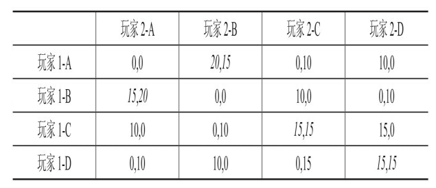
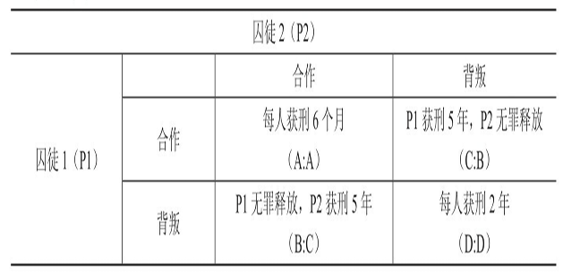
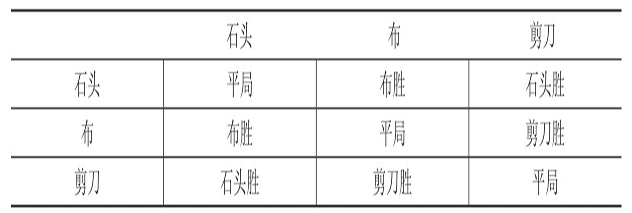

# 游戏设计的100原理

本书涉及的原理是围绕**创新、创作、平衡以及解决问题**这四个主题组织起来的。

在使用本书时，可以**寻求随机灵感、温习零散概念、学习新东西、发现问题所在、解决问题**。

## 第1篇 游戏创新的一般原理

### 原理1 游戏的对称性/非对称性和同步性

*对称性游戏*（Symmetric Gameplay）中，玩家的体验完全一样，属于此类的游戏如《象棋》。*非对称性游戏*（Asymmetric Gameplay）中，玩家的体验并不完全一样，属于此类的游戏有《第五人格》。

游戏中的延迟会导致信息的不对称，因此，*同步性*（Synchronicity）影响玩家体验或决策。同步的游戏指在游戏过程中参与到双方同时发动自己的动作，大多数多人网络游戏都属于此类。非同步的游戏机制是一位玩家先采取行动，然后网络将此行动传达至游戏的另一方，另一玩家再采取相应的行动，多数回合制游戏属于此类。

### 原理2 A最大，鬼万能

“A最大，鬼万能”代表一种组织架构方式，在这种架构方式下，一系列游戏中的对象可以根据其在游戏中的价值或等级重组。

任何一个可以被玩家了解所有元素——特别是元素的价值能够排序——的游戏，都可以让玩家快速做出A大还是K大的判断。利用这个原理，**在游戏进行时中途改变这个大小顺序，或者要求玩家根据目标改变某个元素的价值**，可以为游戏引入多样性和惊喜，避免过多的重复。

**万能**类型的元素可进一步增加游戏的复杂性。

### 原理3 Bartle的玩家分类理论

Richard Bartle（理查德·巴特尔）于1996年发表了一篇题为《牌上的花色——MUD中的玩家》（Hearts, Clubs, Diamonds, Spades: Players Who Suit MUDs），将MUD中玩家的行为分成了4个基本类别。

Bartle用两个坐标分出的4个象限分析这4类玩家。X轴从负到正分别是“玩家”（Players）和“世界”（World），Y轴从负到正分别是“交互于”（Interacting With）和“作用于”（Acting On）。

- 成就型玩家（Archivers，方片）：关注如何在游戏中取胜或达成某些特定的目标。这些目标可能包括游戏固有的成就或者玩家自己制定的目标。成就型玩家倾向于作用于世界。
- 探险型玩家（Explorers，黑桃）：尝试在虚拟世界的系统中寻找一切所能找到的东西，包括探索、收集。探险型玩家倾向于交互于世界。
- 社交型玩家（Socializer，红桃）：享受在游戏过程中与其他玩家的互动。除了社交本能，他们喜欢利用公会和团队的机制进一步强化自己的社会存在感。社交型玩家倾向于交互于玩家。
- 杀手型玩家（Killers，梅花）：喜欢把自己的意愿强加给他人。杀手型玩家又可以分为两类：一类在游戏中杀人是为了显示他们的强大，而另一类的目的是骚扰或激怒其他人，这部分玩家可被称为*破坏者*（Griefers）。杀手型玩家倾向于作用于玩家。

### 原理4 合作与对抗

当与超过一个玩家一起游戏时，有两种可能的玩家类型：合作型和对抗型。通常情况下，游戏在本质上是对抗性或竞技性的。

在合作型游戏中，两个或多个玩家共享一个目标，并且通过共同努力去实现该目标。此时，玩家团队需要对抗的障碍通常是游戏设计中的虚拟世界或是游戏主持者的想象。

对抗型游戏中，一个/组玩家与另一个/组玩家对抗，通常只有一方能够获胜。对抗性的竞争通常是多人游戏的核心，也有单人游戏以最高分作为对抗对象。

在团队竞技体育项目中，合作与对抗同时存在。个别游戏机制和功能可能会起到鼓励或阻止玩家之间的合作或对抗的作用，且有时候以意想不到的方式产生作用。合作型游戏和对抗型游戏具有完全不同的游戏体验。

### 原理5 公平

**游戏对于玩家必须是公平的。** 公平性在投机类游戏中尤其重要。公平性包括但不局限于随机性、游戏难度应当平稳上升等。

Rabin（拉宾）的公平模型基于3个核心规则：

- 对于友好的玩家，其他玩家愿意牺牲自己的物质利益，即如果一个游戏中玩家们表现友好，那么其他玩家更容易表现出利他行为或愿意为友好玩家牺牲一些自己的物质利益。
- 玩家将会愿意损失自己物质利益去惩罚不友好的玩家。
- 前两条规则在物质损失越小的情况下越容易发生。

### 原理6 反馈循环

反馈循环有两种不同的类型。*正反馈游戏*指达成一个目标能够获得奖励，让继续达成目标变得更容易，如角色扮演类游戏中，杀死怪物可以帮助玩家升级，从而更容易杀死怪物。*负反馈游戏*中达成一个目标会让下一个目标更难达成，在足球比赛游戏中，接近对方球门意味着防守方队员的展位区域越小，即进攻方的传球区域也越小。

设计师想要给玩家对他们有意义的奖励，而玩家通常只对能帮助他们取胜的奖励感兴趣——这就是为什么正反馈循环如此流行。但是，在多人游戏中，正反馈循环可能让游戏失去平衡。为了保证玩家依然能感觉到达成目标会得到实质的奖励，可以考虑**将正反馈和负反馈配合**起来，或者找到一个对玩家的实力不造成真正影响的奖励方式如**装饰性奖励**。

负反馈循环需要谨慎使用，因为通常情况下其奖励行为是背离目标的。

### 原理7 Gardner的多元智能理论

1983年，哈佛大学发展心理学教授Howard Gardner（霍华德·加德纳）提出了*多元智能理论*：作为个人，每个人在认知方式上各有长处和短处。其发现人有8种不同的智能，或者说认知方式：

- 数理逻辑认知：通过批判性思维和逻辑来认知的过程，有时也被含糊地称为左脑学习。
- 空间认知：通过想象将物体在空间中的情形视觉化来认知的过程。
- 语言认知：以听觉或书面的方式，通过文字来认知的过程。
- 身体-运动认知：通过身体或者周围的物理世界的移动来认知的过程。
- 音乐认知：通过各种和音乐有关的东西，包括音调、旋律、节奏和音色来认知的过程。
- 人际交往认知：在与其他人的互动中来认知的过程。
- 内省认知：自我反省和认知的过程。
- 自然探索认知：从周围相关的自然环境中认知的过程。

如果设计师**在设计游戏时考虑到不同的智能**，便可让游戏适应无限多的玩家。大多数游戏会利用这8种智能中的两到三个。

### 原理8 Howard的隐匿性游戏设计法则

Howard的*隐匿性游戏设计法则*（Howard's Law of Occult Game Design，隐匿性游戏设计法制，或称霍华德法则）可以表示为公式：秘密的重要性 ∝ 其表面看来的无辜性 X 完整性（Secret Significance ∝ Seeming Innocence X Completeness），即秘密的重要性与其表面看来的无辜性及其完整度直接成比例。

隐匿性游戏设计法则解释了为什么很多有情感或主题目标的游戏设计师喜欢采用复古的格调，使用简单的机制和美术风格。复古风格营造的怀旧氛围让人联想到在游戏早期的历史上，游戏都是很简单的。因此在游戏中出现一些让人意想不到的东西时，往往更有力量。

通常，**一个特定的机制在游戏的叙事和玩法层面包含一个非同寻常的情节转折，来展现游戏出色的叙事设计。** 例如Terry Cavanagh（特里·卡瓦纳）制作的小游戏《勿回头》（Don’t Look Back，也叫《勿回望》或《不要往后看》等）看起来是一个非常简单的平台跳跃类游戏，但是当游戏到了后半段进入地下世界之后，就不许玩家往回看了。这个游戏规则取材于希腊神话中关于英雄Orpheus（俄耳甫斯）的故事，当他下到冥府想救回他的爱妻Eurydice（欧律狄刻）时，冥王告诉他不许回头看，否则爱妻的灵魂将被拉回死亡之地。

以上做法为玩家提供了转折性体验：一个看似普通的游戏背后原来隐藏这具有深意的主题。霍华德法则表明，这样的游戏**刚开始的时候看起来越像是单一维度的、独立的体验，这种转折的力量越大**。

**霍华德法则在游戏的空间、时间、机制设计和经验累积方面都有影响。** 在关卡设计中，密密麻麻的、有许多隐藏通道和门洞相连的迷宫是隐藏秘密最有效的方式。在时间方面，游戏中如果有一些重复发生却又让人不可预料的事件，这些时刻就有着特别强大的力量。隐匿性设计也可以应用于一些隐藏的机制（如事件、区域和人物）。当这样的秘密功能逐渐结合到一起，揭示游戏世界中更大的秘密的时候，它们的作用就发挥到了极致。隐匿性设计和**彩蛋**也有关联。彩蛋是游戏中隐藏的秘密设计。

### 原理9 信息

在一个游戏中的任何一个点上，玩家能接触到的信息数量和性质可以极大地改变其决定。所以，在游戏中的不同点展现出来的信息类型和级别，可以极大地影响游戏的玩法。

和游戏相关的信息可以采取不同的形式以及分类：

- 游戏的结构：包括游戏的设定、规则、环境等。
- 游戏的状态：游戏在任何一个时间点上的状态，包括单位元素所处位置、分数、资源的情况、游戏所处阶段等等。
- 完全信息（Perfect Information）：是游戏中一种最基本和限制最少的信息传达方式。在这类游戏中，所有的玩家都知道关于游戏的每一件事，没有什么是保密的或隐藏的，这类游戏有大富翁、围棋等。
- 不完全信息（Imperfect Information）：如果游戏中一部分信息对某一个或更多的玩家是隐藏的，那么这个游戏是不完全信息游戏。这类游戏利用对信息的掌握和探索作为核心游戏循环。

### 原理10 Koster的游戏理论

Raph Koster（拉夫·科斯特）在2004年出版了《游戏设计快乐之道》（A Theory of Fun for Game Design），正面解决了如何使一个游戏引人入胜并令人快乐的问题，同时也说明了一个游戏没有魅力、不好玩时是如何失败的。

Koster的游戏理论前提是所有游戏都是低风险的学习工具，让每个游戏在某种程度上是**寓教于乐**的。正如动物在玩耍中学习发挥支配地位的行为、如何狩猎等生存技巧一样，人类也在游戏中学习。好玩的学习体验会让大脑释放内啡肽，从而强化学习效果，并给带来愉悦感。正是这种内啡肽循环让玩家一再回去体验游戏。一旦这个游戏不再教给玩家任何东西了，玩家通常会逐渐感到无聊并且放弃玩它。

Koster的游戏理论还提到如何在游戏设计中用到“组块化”概念。“组块化”是一个将复杂的任务分解成能够下意识地完成事情的过程。

Koster在其著作中融合了生物学、心理学、人类学和游戏理论的知识。在体验中，玩家在一个不断变化的过程中参与并接受挑战就是“快乐”，特别是在学习中。玩家成功完成一个挑战——也就是在一个游戏中学会如何达成游戏目标——就是“快乐”的来源。游戏设计的目标就是重组大脑的思维范式。

### 原理11 Lazzaro的4中关键趣味元素

玩家对游戏的热忱来自于玩家最喜欢的那些动作引发情绪体验的方式。游戏机制创造玩家在游戏中的情绪体验，而这些情绪体验又回过头驱动玩家对游戏的热忱。人们玩游戏有以下4种原因：

- 简单趣味（Easy Fun）：玩家对一种新的体验感（**新颖的控制方式，探索和冒险的机会和想象的空间**）到好奇，他被带入到这种体验（好奇心、探索欲和惊喜）中去并且开始上瘾。这些体验本身就很有趣，让玩家容易参与其中而不至太过挑战。**简单趣味是一个吸引好奇的玩家的并且促使他们加入游戏的诱饵。** 当玩家在游戏的核心挑战任务上进展不顺利时，简单趣味给他们提供机会去体验更多其他的情绪。**有趣的失败**是对创新的冒险者的奖励，而且它让游戏世界感觉起来更完整。
- 困难趣味（Hard Fun）：游戏提供了一个可供追求的目标，并将其分解成一个一个可以达成的步骤。目标达成过程中的种种障碍给玩家带来挑战，让他们发展出新的战略和技能。过程中的挫折有望增加玩家的专注力，并且当他们最终获得成功，这种类型的乐趣让他们体会到史诗般胜利的感觉。在这个过程中，**需要平衡游戏的难度和玩家的技巧**。
- 他人趣味（People Fun）：与他人一起游戏带来的社会性情感，比如竞争、合作、沟通和领导等。他人趣味带来的情绪上的感受比其他3种加起来还要多。
- 严肃趣味（Serious Fun）：玩家通过游戏来改变他们自己和他们的世界，比如通过射击游戏来发泄不满、通过脑筋急转弯锻炼智力。玩家从节奏、重复、收集和完成中得到的刺激和放松为他们创造了价值，推动他们参与。所以游戏是一种对他们价值观的表达，而不是在浪费时间。

这4种关键趣味元素主要关注游戏玩家在他们的游戏过程中做得最多的行为。最畅销的游戏通常能**同时满足这4种趣味元素中的至少3个**。通常在一个游戏过程中他们对这4种趣味元素的追求是交替着进行的。由于每一种元素会给他们带来不同的事情去完成和不一样的情绪感受，玩家会发现这样**交替进行会让他们保持新鲜感，并且延长游戏的时间**。

### 原理12 魔法圈

游戏的一大特点是它是一种幻想，是一种独立于真实世界的存在。

20世纪早期历史学家Johan Huizinga（约翰·赫伊津哈）在《游戏的人》（Homo Ludens）中指出，游戏有其单独的活动空间：“竞技场、牌桌、魔法圈、寺庙、舞台、网球场、正义的法庭，诸如此类，从形式和功能上都是一个游戏场。它包含特殊的规矩，如禁止污损、互相隔离、划分禁地、神圣化等。它们都是在我们的‘正常’世界之中，为了一个独立行为而存在的临时世界。”。

Katie Salen（凯蒂·沙伦）和Eric Zimmerman（埃里克·齐默尔曼）在《游戏的规则》（Rules of Play）里谈到了这一段引文中“魔法圈”的概念并将之进一步阐明：当游戏开始，就和现实不一样了。小小的红色塑料挤压出的形状变成“酒店”，树成为“基地”，球门线成为一个需要不顾自己的健康和安全拼命保护的区域。

现在将这个思路用作一个创新的透镜：**想想什么样是人们在真实世界中（由于种种禁忌、由于物理定律或由于缺乏资源）而不能做到，却可以在游戏中冲破这些限制去达成的？**

当“这只是一个游戏”不再只是一个游戏，魔法圈的界限就被丢诸脑后了。此时，魔法圈与现实世界时空的那层薄薄的膜就被突破了。

### 原理13 采取行动

游戏中的博弈，依据博弈各方做决定或采取行动的先后关系，可以被区分为*同步博弈*（Simultaneous Game）或*序贯博弈*（Sequential Game）。

- 同步博弈：博弈者必须考虑其他人会采取什么样的行动，但是不能肯定他们到底会做什么。每个玩家同时也知道博弈中的每个人都面临着同样的问题。同步博弈可能在时间上真正同步的，如石头剪刀布，也可能是博弈者各自在不同的时间进行自己的行动，只是他们在采取的行动时不知道其他博弈
者的决策（这在实际效果上相当于“同步的”）。这类博弈是最容易通过一个*正则形式*（Normal Form）表格来表示“得益”的。同步博弈可以用*纳什均衡*（博弈各方都有一个单一的最佳选择，并且如果基于所有选择可能带来的后果改变战略也不会得到更好的结果）来解决。*囚徒困境*也是一个同步博弈的例子。
- 序贯博弈：每个博弈者能得到更多的信息，即他们能通过其他人刚刚采取的行动，对其下一步行动进行可靠的预测。序贯博弈要求博弈各方每一步都要轮流做出决策，同时他们对于其他人之前做出的决定至少是部分知情的（掌握的可能是不完全信息）。此时，了解第一个行动的优劣、各方行动顺序以及谁已经做出决策是非常重要的。这类博弈的“得益”通常通过*扩展形式*（Extensive Form，基于可用信息的所有组合列举每个玩家在每次机会面前决策时的所有可能性及其结果的得益）或*决策树*（Decision Tree）来表示。序贯博弈通常要用*逆向归纳法*（先确定所期望的结果，然后通过决策树逆向推导出能最终带来这个结果的决策）来解决。

> 逆向归纳法的反向规划过程基于由John von Neumann（约翰·冯·诺伊曼）和Oskar Morganstern（奥斯卡·摩根斯坦）在20世纪中叶引入的*理性人假设*：每个博弈者都朝着为自己带来最佳结果的目标努力。

### 原理14 MDA：游戏的机制、运行和体验

由Marc LeBlanc（马克·勒布朗）、Robin Hunicke（罗宾·亨尼克）和Robert Zubek（罗伯特·扎贝克）认为所有的游戏都可以被分解为机制、运行和体验（Mechanics，Dynamics，and Aesthetics，MDA）。

- 机制是整个系统的规则，定义了这个系统如何处理玩家的输入，以及玩家能看到什么和做什么。
- 运行是玩游戏过程中整个系统的各个参与者的行为。运行状态的发生是机制决定的。运行是对机制在真正运行时效果的展现。
- 游戏的体验是运行时玩家的情感输出。

MDA能帮助回答以下问题：

- 这些机制将创造什么样的玩家行为？
- 这些行为是符合对游戏的期望的吗？
- 如果规则改变，对游戏的运行会有什么样的影响？
- 游戏想要达到什么样的目的？
- 哪些机制和想要达到的目的是契合的，哪些是对立的？

有两种不同的方式来实践MDA。

- 游戏设计师**以定义在游戏中想要达到的体验效果作为设计流程的开始，然后确定要达到这样的体验效果玩家需要参与什么样的游戏运行过程，最终再为这样的运行过程设置游戏的机制**。
- 玩家反向体验MDA的3个要素并且**首先与游戏机制进行互动，这些机制会带来特定的游戏运行，而这又将让玩家产生特定的体验**。

MDA亦有局限性。玩家在游戏中体验到的情绪反应不仅仅是这个游戏的运行所带来的，同时也跟玩家本人，以及他或她的背景情况有关。另外，文化差异和时间段的不同也对这种情绪反应有影响。

### 原理15 记忆和技巧

游戏可分为*记忆游戏*和*技巧游戏*。在记忆游戏中需要用到试错法、记忆识别、本能反应（平台跳跃游戏）以及对游戏本身的掌握。游戏中的记忆也可以被用于提升现实世界中的技能。技巧游戏需要体能或精神上的实力和条件来完成。许多游戏在某种情况下对二者都有涵盖。

记忆游戏会在玩了一段时间之后让玩家感到无聊，因为他一直在玩一样的游戏，用同样的方式，在同样
的区域，使用同样的工具或武器。解决这个问题的方法是在保持游戏机制、故事和结果不变的前提下为游戏**加入一些随机性**，比如在不同级别中让敌人在不同的地方出现，跳跃平台以不同的速度往不同的方向移动，物品掉落的方式和地点不一样。

在技巧游戏中，如果玩家没有达成完成游戏特定部分所需要的技能，他会感到越来越沮丧。当这种情况发生时，游戏设计师可以让游戏给玩家提供一些小提示，通过闪光效果来给玩家指示道路或者提示玩家需要拾取的物品，还可以让一些多余物品隐藏起来。

### 原理16 极小极大与极大极小

与*最小/最大化*（Min/Maxing）不同，*极小极大*（Minimax）是由John von Neumann（约翰·冯·诺伊曼）提出的，指在一个*零和博弈*（Zero Sum Games）中，每个博弈者会选择一个能最大化他们回报的混合策略，由此产生的策略和回报的组合是*帕累托最优*的。在经济博弈论中，极小极大原理常被用来降低机会成本（也就是后悔）。选择极小极大的人是机会主义者或乐观主义者，他们的决策目标是让对手得到最小回报，即**最小化对手的最大收益**。他们选择永远是纳什均衡的。

相反的，*极大极小*（Maximin）应用于*非零和博弈*（Non-zero Sum Games），此时玩家致力于防止最差的后果，想要避免错误决定导致的最坏结果。选择极大极小的人是杞人忧天者或悲观主义者，他们会做出保守的决定来避免自己得到负面的回报，即**最大化自己的最小收益**。

极小极大和极大极小几乎是相同形式的理性自利，博弈者都认为他们做出正确的决定来保证自己的成功。

在数学上，极小极大算法是递归算法，用来在参与人数确定的博弈中做出下一步决定。博弈的每一个参与者的每一个可能状态都被赋予了一个通过位置估算函数计算的值，这个值表示玩家要如何成功才能达到该位置。根据函数，理性的极小极大博弈者将基于对手下一步的可能决策和预设值，做出让该位置上最小值最大化的决策。

极小极大也被应用于没有其他对手，但结果取决于不可预知事件情形下的决策。它帮助人们在自然、偶然的机会，或环境影响下的决策。比如决定要不要投资一个高风险的股票，如果该公司成功了，投资者将获得极可观的收益；如果失败了，这个投资将一败涂地。在这样的情形下，可能出现的结果与有两个参与者的零和博弈类似。

### 原理17 纳什均衡

John Nash（约翰·纳什）在John von Neumann（约翰·冯·诺依曼）和Oskar Morganstern（奥斯卡·摩根斯坦）等人“零和博弈”策略研究的基础上得到了*纳什均衡*。其认为，在任意一个混合策略博弈中有这样一个策略组合，在该策略组合上，任何参与人都有有限的选择；而当所有其他人都不改变策略的时候，没有人会改变自己的策略，因为改变策略会导致该博弈者得到的得益降低，那么这个策略组合就是一个纳什均衡。纳什均衡的结果不一定是该博弈中的帕累托最优结果。

纳什均衡原理可用于预测博弈者在他们最优策略的基础上互动的结果。如果不把另一方的行动考虑进来，纳什均衡就无法预测一个决定将带来的结果。因此，纳什均衡仅在博弈各方都对博弈可能的决策和结果有共识的情况下有效。这时，博弈各方都明白所有人可能的结果及回报，所以能判断出哪个决策是对自己最有利的，哪个决策是对其他人最有利的。

纳什均衡可以通过数学方法，基于*回报矩阵*（Payoff Matrix）得出。不过只有在参与人数不多和可用策略不多的情况下这个矩阵才好用。如果一个单元格中的第一个回报数字和第二个回报数字都分别是该列和该行中最高的，那么这个单元格所描述的情形就是纳什均衡。只要单元格中两个值的顺序没有改变，并且这两个值分别保持在该列和该行中最高，纳什均衡将保持稳定。

当然，错误、复杂性、不信任、风险和非理性行为都可能影响参与人的策略，导致其选择低回报的策略，但他们可能会觉得他们有很充分的理由作出这样的选择。参与人之间的沟通（游戏之外的协议以及可信或不可信的威胁）也会影响选择，特别是在连续玩同样的游戏时。这些沟通可能导致一些*超游戏*的策略的产生，比如以牙还牙。这种情况在两个人连续重复囚徒困境的情境时经常现。

纳什均衡也被用来分析政治和军事冲突（包括冷战时期的军备竞赛）、经济趋势（如货币危机），拥堵地区的交通流向。纳什均衡的应用也被用来支持另一个博弈理论*公地悲剧*。如果博弈在纳什均衡的情况下反复进行，博弈者之间的重复互动会带来形成一个长期策略的基础，并取代任何统计预测的结果。博弈者之间选择的合作性会更大，这在博弈者能够自由沟通的情况下尤其明显。

### 原理18 帕累托最优

许多博弈论都是*零和命题*，即一方的收益来自于另一方的损失。当然，也有在不影响其他方收益的情况下提高自己的收益。

意大利经济学家Vilfredo Pareto（维尔弗雷多·帕累托）在财富和收入分配等领域颇有研究。当有人得到一定数量的货物、金钱、土地等，而且是从一个人手上转移到另一个人手上（比如通过销售），这就是*帕累托交换*（Pareto Shift）。显然，零和交换对整个系统而言并没有优化作用。但是，如果一个交换过程在改进了系统中一个人的状态的情况下没有直接损害系统中其他人的利益，这个变化就是一个*帕累托改进*（Pareto Improvement）。当一个系统达到了没有帕累托改进的余地的状态，它就达到了*帕累托最优*（Pareto Optimality），又称*帕累托效率*（Pareto Efficiency）。这时，系统中的任何一个交换都是零和的，即这个交换将损害系统中至少一方的利益。

帕累托最优不一定是一个公平合理的分配，它也并不意味着这个分配是可能的分配方案中最好的。它只是说明当前的选择已经被扩展到了没有任何人可以在不损害其他人利益的情况下进行改善的地步，或者说所有的资源都被有效地使用了。

*占优策略*并不总是与帕累托最优一致。

在合作的游戏或系统中，帕累托最优是一个理想的目标。在竞争的游戏中如果达到了帕累托最优，则往往意味着僵局或不可避免的冲突。

### 原理19 得益

*得益*（Payoff）指在游戏中一个决定所带来的产出或结果，不管是正面的还是负面的，不管它如何被计量。得益可能是分数、利润或得到其他形式对玩家有激励作用的价值。

不是所有玩家玩游戏都是出于追求同样的回报。

假定游戏中所有玩家都是理性自利的，即每个人的行为都以获得自己的最佳汇报且将其最大化为目的。根据玩家自己的价值体系，每个决定对玩家带来的影响都是合理的。尽管有时玩家会做其自认为对自己团队最好的事，期望它也能为自己带来有利影响，但通常理性自利意味着玩家的决定是只为自己的利益打算，并不考虑对其他玩家带来的影响。

在博弈论中，得益可被分为基数的和序数的。

- *基数得益*（Cardinal Payoffs）：是定量的，有特定的数目，用可计量的货币、点数或其他可用之物做计算单位的。这种回报可以设置在不同层级来区别结果之间的不同关系。基数得益的要点是具体数值，
- *序数得益*（Ordinal Payoffs）：采用得益产生的顺序来描述结果。序数得益是相对的比较值，要点是排序。

在平衡一个游戏的得益时需要注意，在**决策过程中的理性自利（没有与其他玩家之间的可信承诺）通常会给玩家带来最坏的结果**。

### 原理20 囚徒困境

*囚徒困境*（Prisoner's Dilemma）最早由Melvin Dresher（梅尔文·德雷希尔）和Merrill Flood（梅里尔·弗勒德）在1950年提出（其命名者是Albert Tucker（阿尔伯特·杜克））。它在经济学研究（主要是在业务拓展和广告活动中）、军事决策过程（武装升级或裁军都可能引起战争）、心理学（作为成瘾模型的决定性因素）和生物进化理论（研究遗传的或社会的欲望能否克服个人的需要和需求）中都被广泛使用。它提供了一个有用的范例，可以对比理性预期和非理性的行为来判断在数学概率范围之外的潜在动机。

囚徒困境是一个简单的博弈：你会背叛你在犯罪活动中的搭档还是与他合作（来骗过警察）？其核心在于双方在合作还是背叛对方的问题上如何决策，解释了为什么两个博弈者在博弈时会分别作出不是对自己最有利的，却能通过合作达成一个更好结果的选择。它描述了一种在序数得益的同期非零和博弈（通常是对称的）中的相互信任。尽管在博弈中频繁地看到伴随着帕累托最优中的相互合作（甚至在博弈者之间不允许沟通联系的情况下）并且合作行为会得到重奖，这种博弈都假设博弈者是理性自利的。博弈可以按照传统方式进行，如单一决策或重复决策，产生基于过去结果的行为模式。

如果两个博弈者连续完成了多次囚徒困境，并基于对方之前的行为各自形成了一个对对方的看法，这两人都将开始基于对方的行为规划自己的策略。连续玩N（N已知）次游戏时，最合理的决定是每一次都背叛对方。然而在实践中，大多数人都不会超理性到最大得益的做法是：每一次都与对方合作，然后在最后一次背叛对方。假定他们会这样做，这也会让他们推断对方也与他们一样理性，也会做出同样的事情。于是他们在倒数第二轮选择背叛，如此循环往复，回到开头。如果N是未知的，这个做法就不再是游戏的*占优策略*，而是*纳什均衡*。

事实上，人类博弈者发展起来的策略不那么理性，但却更加成功。这些策略中最基本的是“以牙还牙”（Tit-for-Tat）。博弈者在每一轮中都做对方在上一轮做的事，最后开始第一轮的合作。这个博弈理论早期的研究者之一Robert Axelrod（罗伯特·阿克塞尔罗德）提出了博弈者的策略要获得成功的4个必要条件：

- 要友好（Nice）：不要首先背叛，即尽可能的合作。
- 不嫉妒（Non-Envious）：不要试图比对方得到更多，即优化平衡积分。
- 要报复（Retaliating）：当对方背叛你时一定要报复，即不要永远合作。
- 要宽容（Forgiving）：报复之后要改回合作（如果对方不背叛你的话）。

一些非传统方法，如随机背叛（博弈者随机选择是合作还是背叛，这样在面对比较友好的对手时能获得一些小利益）、巴甫洛夫回馈（Pavlovian Reward，博弈者在每一次对手做出与自己上一轮所做的同样的事情时选择合作）、团队合作（使用“最小/最大化”策略，指派团队中某些成员故意输掉，以让其他成员能赢。团队内用类似摩斯密码的密语来交流——就好像是一个合作/背叛的合谋计划），有时能获得比传统方法更多的利益。这样的博弈可以在单人间进行（在不同结果之间平衡，每一个结果都有其好处及其影响）；每组多个博弈者共同进行，每人控制结果的一部分；或甚至在多个组之间进行，它们负责在不同组之间选择合作还是拒绝（或资源的分配）。这有时会造成“公地悲剧”。额外的变量可能会带来非同步博弈、基数得益或自愿的信息透明，并且明显改变博弈的性质。

最近，William Press（威廉姆斯·普雷斯）和Freeman Dyson（弗里曼·戴森）提出了一个被称为*零行列式策略*（Zero-Determinant Strategy），该策略认为一个博弈者可以通过让对方相信他们会做出某个特定选择的方式来控制博弈，该博弈者通过利用假信息来从对方那里获得好处。不过他必须能够判断对方使用的是什么策略。尽管这种方法在一些允许玩家相互沟通的游戏中很常见（比如扑克中的迷惑战术），目前这种二阶分析在囚徒困境中的研究还没有完全完成，这主要是因为在囚徒困境中双方是被禁止沟通的。它已被证明只能提供一个暂时的优势——特别是在对手也知道零行列式策略的情况下。

### 原理21 解谜游戏的设计

设计师Scott Kim（斯科特·金）定义谜题（Puzzle）：“有趣的东西，并且有一个正确的解答。”也就是说，**谜题是有解的。**

设计一个谜题时，要确保：

- **应该有恰到好处的难度**，让玩家感到挑战，又不会因为太过困难而受挫放弃。可以通过面包屑式（Breadcrumbs）引导（**在谜题内或谜题外的提示一步一步引导用户接近答案**）实现这一点。面包屑式的引导将游戏中的线索渐进式地提供给玩家，一步一步地降低难度，接近玩家对困难的容忍度。
- **应该需要一个聪明、智慧的解决方法**，而不是通过简单的蛮力就能解决。
- 谜题的产生可以是随机的，但当玩家开始解答它时，它**必须是确定的**。
- 必须**让玩家知道目标是什么，他们需要进行怎样的操作来达成这个目标**。通过模糊化规则来增加解谜的难度是不公平的。

### 原理22 石头剪刀布

石头剪刀布也被称为“Roshamabo”，是一种只需要通过手势参与的、同步的、半随机的零和博弈。游戏采用3种手势，其中每一种都与另外两种相互制约，制约关系如下：

这个博弈有着完美的平衡，形成一个循环的制约关系：石头>剪刀>布>石头。这种循环的制约关系已被应用于其他游戏中，以防止*占优策略*的演进，保证游戏过程中**各种类型的元素保持同等的价值**。有些游戏甚至会把互相制约的关系链中的物品从3个增加到5个甚至以上，或创造网状而非链状的制约关系，以带来更复杂和多变的战略组合。

### 原理23 7种通用情感

游戏设计师往往致力于**唤起玩家的情感**，花费很大的精力去研究*兴趣曲线*，以及**设法保持玩家对游戏的注意力**。

情感是非常个人化的体验。不同文化中成长起来的人会因为不同的原因感觉到不同的情感，人们表达情感的方式也不一样。

科学家们通过研究面部表情并且进行跨文化的比较，发现有7种通用的情感表达分别是惊讶（Surprise）、轻蔑（Contempt）、愤怒（Anger）、喜悦（Joy）、恐惧（Fear）、悲伤（Sadness）、厌恶（Disgust）。

这7种通用情感由美国军方心理专家，加州大学旧金山分校心理学教授Paul Ekman（保罗·艾克曼）最先提出。他发现，情感总是无意识的、稍纵即逝，但可以很容易地通过面部变化看出来。这是情感和情绪的一个显著区别，后者持续的时间更长，并且可以被隐藏和掩饰。

游戏经常**利用游戏中角色表现出这些通用情感**，由于图形化的处理比直接观察面部表情更为直接，这种表现能够达到更好的沟通效果。

### 原理24 斯金纳箱

**预测玩家的行为**是游戏设计师最基本的需求，这使得心理学领域对他们有巨大的吸引力和实用价值。其中一个被过分广泛使用的理论流派——*行为主义*，是在20世纪中期由B.F. Skinner（伯尔赫斯·弗雷德里克·斯金纳）实施并推广的。

> 斯金纳验证行为主义者理论的方式之一是把老鼠关在笼子里，并针对它们不同的行为给予不同的食物奖励，然后检测这些做法的效果。斯金纳做了如下尝试：
>
> - 老鼠每次按下杠杆，就给它食物作为奖励；
> - 老鼠每X次按下杠杆，就给它食物作为奖励；
> - 在老鼠每隔N分钟后第一次按下杠杆时给它奖励；
> - 当老鼠每第X（X是随机的）次按下杠杆时给它奖励；
> - 在老鼠每隔N（N是随机的）分钟后第一次按下杠杆时给它奖励。
>
> 实验结果表明老鼠对几种不同的奖励周期有十分明确的回应方式。有一些奖励周期引起老鼠狂热地一次又一次按下杠杆，以期得到更多食物；有一些则相对温和，造成老鼠按杆的机会相对较少。
> 如果要让老鼠尽可能多按杆，最好的奖励周期是以变化比率的形式，也就是使用随机变化的参数。在给老鼠加强“多按就会多得”印象的同时，又让它们摸不清楚到底按多少下才能得到食物。

一些游戏设计师认为玩家与游戏的交互等同于价值，因此，**最能引导玩家与游戏产生更多交互的方式就是以随机的周期给用户奖励**。

> RPG游戏很好地利用了这一理论。如果玩家杀死一个骷髅，有时候会得到魔法宝石。而玩家不知道什么时候会有宝石掉落。玩家不知道什么时候他们能捡到掉落的宝石，却理解杀死越多的骷髅就有越多的机会得到更好的宝物，所以他们会去疯狂地杀骷髅。

玩家真的只是箱子里的老鼠能够被设计师操纵于股掌吗？如果是这样的话，我们还有何必要去挖空心思构想如何把游戏做得更有趣呢？设计师照着以上原则去做，只需要提供足够有吸引力的奖励来诱使玩家去完成我们希望他们做的行动不就好了吗？

然而，只要运用得当，**行为主义理论可以推动玩家参与**。或许在玩家获胜时用获得一定数量金币来替代获得固定数量金币（**可变奖励vs固定奖励**）。或许可以奖励玩家与系统的互动机会，来替代按照玩家游戏的一定时间或是可变时间段给予他们奖励（**基于比例vs基于时间间隔**）。

研究人员Ran Kivetz（瑞恩·科维茨），Oleg Urminsky（奥列格·乌明斯基）和郑毓煌（音译）发现，*当人们越接近自己的目标的时候，他们就越有动力
去完成它*。这种现象被称为*目标的梯度效应*（Goal-Gradient Effect）

**这可以用于展示进度奖励时，进度条不从0开始， 而是从上一阶段的末尾继续。此外，如果发现玩家在游戏中的某一点逐渐失去兴趣，可向他们展示继续游戏将得到的奖励。**

### 原理25 社会关系

在游戏设计中社会关系对增加玩家的兴趣、参与和满意度是非常有效的。

以英国人类学家Robin Dunbar（罗宾·邓巴）命名的*邓巴数理论*说*任何一个人的社交网络大概由150个连接（也就是社会关系）构成*。邓巴数理论背后，是最大化“网络外部效应”或网络效应的概念，即指你能从你的社交网络中的每一个个体中得到的好处，包括互相帮助、互相访问或通过其他手段帮助彼此。

数学社会学的领域中加入了*强社会关系*、*弱社会关系*、*正面社会关系*和*负面社会关系*的概念。数学社会学家们能通过搜集非常有限的相关的社会关系得到的信息来预测社会关系的本质。举例来说，数学社会家们能通过A和B分别与C的关系的性质，对A和B是否是朋友作出非常可靠的推测。他们还能得出某个人的150个社会关系如何与另一个人的150个社会关系产生重叠、相交和联系。数学社会学甚至能够证明Kevin Bacon（凯文·培根）游戏中*六度分割*对所有人都是适用。

**让玩家与其社交网络中的社会关系互动将吸引玩家始终对游戏保持兴趣**。社交机制可以是主动的、被动的，也可以介于两者之间。**排行榜促进竞争，互赠礼品促进合作。** 它们都在玩家和他们的朋友之间建立起正反馈循环，从而加强了游戏的影响力，反过来又可以提高游戏的粘性，减少玩家流失。*害怕错过*的心理现象可以解释个体为何寻求能帮助他们被纳入团体的经验。

应该考虑如何**通过竞争或者合作来激活游戏中的社会关系**，从而帮助游戏设计。设计师需要评估他们的**设计是否能与好友请求、游戏评分的提示、礼物互赠循环、高分的竞争、非同步的玩家之间的竞赛或者更为传统的玩家对战系列赛或合作游戏的模式等机制相得益彰**。

目标受众的偏好和他们的舒适区都会影响与社会关系相关的设计的一般方法。

### 原理26 公地悲剧

*公地悲剧*（Tragedy of the Commons）指如果一项资源是可供所有人使用的，那么该资源最终一定会被耗尽，而这对所有人都是有害的，长期的损失远大于短期内获取该资源得到的好处。但是由于没有一个人认为自己该对这个损失负责，他们往往不会承认自己的责任，也不会减少自己对该资源的使用。

> 公地悲剧最早由Garrett Hardin（加勒特·哈丁）在20世纪60年代提出。该理论是他从自古希腊到19世纪一系列的土地哲学家基础上发展起来的。他使用了一个小镇上任何人都可以使用的公共放牧区为例。牛的主人们都会先使用这块土地，因为这是免费的，并且这让他们可以买更多的牛在自己的地盘上放牧。当公共资源被过度放牧（正如在波士顿公园确实发生过的一样），牛的主人不得不把他们的牛挪回自己的地盘，这时由于他们之前使用公共放牧区时购买的额外的牛，他们自己的土地也被过度放牧了。
> 哈丁还指出，在世界共同资源的开发利用中，个体会寻求最大化他们个人对于这些资源的消费。而那些希望能拯救全人类，治愈所有的疾病，消除所有人类的苦难，保证普世权利，为所有人提供平等机会的人会试图增加能用到这些资源的人的数量，这实际上也是在最大化人类对于这些资源的消费。

公地悲剧的假定条件是在有限的系统内对资源的使用是增长的（也就是说，使用这个资源的人口是增长的，而资源本身不会增加）。尽管看起来很相似，公地悲剧并非基于特定的经济或政治系统，甚至也不是基于企业的贪婪。

公地悲剧表达了一个人艰难的选择：努力争取物质利益，并由此导致自己和他人的长期损失——寄希望于短期的物质利益能弥补长期损失——或者为了所有人的利益与大家合作来节约资源，但是这样做的风险是，如果有其他人有更好的个人资源，或者有其他人谎称合作实则过度使用公共资源，这个人就吃亏了。

在游戏中，玩家的策略或游戏的机制都有可能导致公地悲剧。固定顺序的游戏有可能让第一个行动的玩家有机会捞一大把，而同步博弈的游戏可能会导致所有的玩家都试着能捞就捞——因为他们认为其他玩家也会这么做——这样就平等地降低了所有玩家的可用资源。在这两种情况下，都**应该有某种协议（或一些特殊的规则来奖励使用资源较少的玩家）来预防玩家们用完所有可用资源**。

对于公地悲剧有两种常见的，并且是相反的解决方案，但是它们都不能理想地解决这个问题。

- 资源平等的再分配（共产主义）意味着无法有效利用资源的人依然能得到它，这样有很大一部分被浪费掉或很快被用完。
- 垄断资源（政府控制）则意味着资源的利用效率远低于腐败、法律法规和特殊利益集团对资源的征用。

很多游戏的设计都是围绕着有趣的，困难的抉择，公地悲剧恰恰就是这样一个情况：没有一个明显的、简单的解决方案，玩家会遇到更多的挑战，并有机会去探索不被太多人注意的区域。

### 原理27 信息透明

许多游戏是围绕着发现隐藏信息的过程而展开的。它们将人类对学习的喜爱带入下一个境界：人类对于**挖掘他人秘密**的喜爱。在这些游戏中，探索和试验都是核心游戏循环的组成部分。

游戏理论将这些信息不透明的游戏归类为*不完全信息*（Imperfect Information）游戏”。这样的信息透明度（或信息透明度的缺乏），应用于各种类型的游戏信息，包括游戏的结构和游戏的状态，如战争迷雾（Fog of War）。

在不完全信息游戏的分类下，游戏状态的透明程度还可细分：

- 完整信息（Complete Infomation）游戏：这类游戏中玩家能够接触到关于游戏环境和规则的所有信息，但不能看到其他玩家的行动状态。如纸牌，玩家知道游戏中使用的是数量有限的一套牌，其他玩家每人手上都有从这套牌中得到
的一定数量的牌，但不知道在游戏过程中具体哪一张牌在谁手上。
- 不完整信息（Incomplete Infomation）游戏：玩家没有依据对未知进行假设。

一种理解完整信息和不完整信息的差异的方式是认为在完整信息的游戏中是可能去“计算卡牌”的。一个玩家知道在游戏中用到的所有卡牌，如果他足够有毅力，他就能算出一张特定的卡牌在对手那里的概率。

**信息透明可以是自愿的或非自愿的。**

- 非自愿信息透明：规则规定玩家有时必须向另一名玩家展示某些信息。
- 自愿信息透明：这样的规则通常是为了鼓励玩家虚张声势、双重间谍的行为，并且建立一个互相不信任的氛围。

### 原理28 VandenBerghe的大五人格游戏理论

理解人们的心理是游戏设计的基础。在许多方面，游戏的功能性目标就是激发起玩家采取行动的意愿——这需要设计师了解人类大脑的运作方式了。

*大五人格理论*（Big 5），又称*人格的海洋*（O.C.E.A.N），包含大量可靠的研究数据，并被证明足够具有预测性。大五人格理论认为人类的行为主要是由5类动机驱动的，且每一类人格特质都能被细分为6个子维度，这描述了更加具体的内在驱动。

- 对体验的开放性（Openness to Experience）：这一点将那些有创造力、有想象力的人与更务实、更循规蹈矩的人区分开来。
- 尽责性（Conscientiousness）：如何控制和缓和自己的冲动情绪。
- 外倾性（Extraversion）：这一点将那些追求刺激和在他人面前的存在感的人与不这么做的人区分开来。
- 随和性（Agreeableness）：如何处理与社会和谐的规则相关的问题。
- 神经质或情绪稳定性（Neuroticism）：是否选择经历（或不经历）负面情绪的倾向。

游戏设计师Jason VandenBerghe（杰森·范登伯格）在一些主要的游戏行业会议上针对这个概念发表演说，指出游戏设计师如何将玩家在这30个子维度中的得分和他们对游戏的偏好关联起来。这些关联在整个大五人格理论体系中都存在。这向我们指出一条让我们不舒服却不可回避的真理：*我们抱着同样的目的生活和游戏*。

### 原理29 志愿者困境

*志愿者困境*（Volunteer's Dilemma）中，一个人面临的选择是，是否牺牲自己的一小部分利益来让群体中的所有人受益，同时这个人自己不能得到任何额外的好处。而如果这个人不牺牲，并且也没有任何一个其他人这么做，则所有人都要面临严重的利益损害。当然，这个选择是，自己牺牲一小部分时间、经历、钱等等，或是承担等着其他人来做的风险。

在互联网合作游戏中，一些玩家可能会选择不参与一些危险的、但是对团队来说是必须的任务，而是去做更多对自己有好处的任务。他们会假设为了团队的生存和胜利，团队会去承担完成那些危险任务的责任。如果这个策略成功，他们会受到鼓励而继续这样的行为——并且可能会有更多的玩家选择这种对自己来说没有风险的做法——这样也就把越来越多的责任转嫁到了仍然愿意执行危险任务的团队成员身上。显然，如果这个趋势继续下去，整个团队都会完蛋。

## 第2篇 游戏创作的一般原理

### 原理30 80/20法则

*80/20法则*由Vilfredo Pareto（维尔弗雷多·帕累托）于1906年提出，也被称为*帕累托法则*，其主要内容为80%的价值是由20%的控制因素产生或驱动的。80/20法则帮助人们集中精力在投资回报比最高的功能上，以及帮助避免有害的功能过剩。

在游戏中，则表现为80%的游戏体验过程只由20%的功能产生。因此，开发人员需要认识到这一点，并**将更多时间花在完善这些核心功能和修复它们的漏洞上**。此外，通常游戏的开始阶段在游戏开发过程中应该投入相当精力，或许需要达到80/20的比例，因为此阶段将被重复的次数远远多于结尾阶段。

### 原理31 头脑风暴的方法

从情节点的设计到独到的游戏机制的设置，*头脑风暴*（Brainstorming）在游戏创意和设计中的每一个环节都能帮助游戏设计师的工作。

- 自由思考法：创造一个开放的讨论环境，允许思想的自由流动，并且没有一定要产生特定结果的压力。当不需要一个特定结构的创意时，适用此方法。**可以写下一个或多个词作为创意的开始并以此为出发点，添加更多词或创意并将其连接到发生点**，此方法通常用在游戏开发的开始阶段。
- 结构思考法：随着游戏设计过程的进行，需要结构性的头脑风暴。**使用流程图创建有序的结构创意和树形图创建分层次的创意结构。**
- 身体表现法：暴利用肢体的动作来协助创意的过程，它对于设计复杂的角色运动或者（随着动作控制的诞生）新的控制机制非常有帮助。

### 原理32 消费者剩余

在2008年左右，游戏行业商业模式从消费者走进商店，花60美元买一个游戏，然后玩到厌倦的旧商业模式转变成了游戏本身变得非常便宜（甚至是免费的），而玩家付钱购买游戏中那些持续性或消耗性的道具的新商业模式。

> 假设50000个想玩一个新游戏的人平均分为5类：
>
> - A是经济困难的大学生，喜欢游戏但基本上不会付钱。
> - B喜欢这个游戏，可能花1块钱。
> - C喜欢这个游戏，最多愿意花30块。
> - D非常喜欢这个游戏，愿意花最多60块。
> - E是狂热粉丝，愿意为这个游戏花500块。
>
> 对游戏开发商来说，理想的情况是，他们能满足每一个群体的需要，并且让他们都为这个游戏付出他们所愿意付出的最多的钱。10000个B将每人付1块，10000个C将每人付30块，10000个D将每人付60块，而10000个E将每人付500块。传统商业模式却做不到这一点。如果游戏的售价被设定在60块，D和E们会去购买它，但A， B和C们不会。如果游戏的售价被设定在1块，B，C，D，E们都会去买它，但是对游戏开发商来说，他们白白损失了一大笔钱。E们本来愿意付500块，为什么只让他们付了1块？这个中间的差额就叫*消费者剩余*。

免费增值（Free-to-Play，F2P）模式给游戏开发商带来的好处是所有的人都有机会参与到游戏中来，并且能够根据他们愿意支付的金额来为游戏付钱。当游戏免费对所有人开放时，开发商通过售卖游戏中的道具和特权来诱使玩家付出他们所愿意为这个游戏付出的最多的钱，从而获利。通过获取这其中的消费者剩余，游戏开发商将在激烈的市场竞争中最大程度获取经济利益。

### 原理33 核心游戏循环

重复是游戏的一个基本特征。游戏设计师需要把大目标分解成小目标，让玩家在愉悦的心情下不得不去完成。

核心游戏循环是游戏设计的核心，通常由一系列动词组成——越具体的动词越好，比如驾驶、射击、潜入等。**优秀的核心游戏循环应该能被短短几句话清晰地描述，并且能清楚地说明整个游戏体验最有趣最吸引人的部分。核心游戏循环中的“循环”一词，包含玩家的行动，该行动的结果，玩家对结果的反应，以及游戏要求玩家重复该行动以获取进度。**

一些设计精良的系统，而不仅仅是一些零散的机制，也能作为重复游戏的基础。这些系统化的游戏机制可以贯穿整个游戏，被重复、被延展，并且始终吸引玩家的参与。

在游戏设计中不得不拥抱“重复”的概念，并且想办法让这些重复的过程始终有趣、吸引人，并且有回报。

核心游戏循环应该包含具有以下特点的动作：

- 易于理解。
- 易于操作。
- 令人享受。
- 能够提供直接的反馈。
- 具有能适应不同场景的灵活性。
- 具有扩展性，能够加入额外的动作。
- 能够与其他动作结合。
- 能够进化以支持其他的游戏循环。

### 原理34 定义问题

在开始游戏设计创意的过程中，定义问题是其中第一步，也很有可能是对整个创意过程影响最大的环节之一。如果纠缠在一个欠考虑或者结构不当的问题上，设计师会觉得选错了起点去达成设计目标、解决错误的问题，或者干不必要的工作。开始**将好奇结构化成一个问题陈述的形式来帮助追求一个理想的解决方案**。有效的问题陈述对解决问题而言都是很有用的。

多数有效的问题陈述采用的格式都是由几个通用因素组成：

- 确定一个合适的范围内一个特定的焦点。
- 提供一个可量化的结果（可衡量的最终目标）。
- 确保问题陈述可用于清楚的沟通。

在设计问题陈述时应该具体问题具体分析，根据当时的情况和偏好，使用最有效的方式来进行。

### 原理35 委员会设计

开发游戏是一个需要精心策划和深思熟虑的过程，它将理论与实践相结合，同时需要创新。要平衡游戏开发中的实际问题和创造性的开拓精神，这对一个人/团队来说是非常困难的。这种紧张感以及团队成员之间针对最终游戏体验的互相妥协与让步，都是*委员会设计*（Design by Committee）的核心。

一个人不可能在所有领域都成为专家。于是，每个人能与他人沟通，并且信任其他人，这样大家才能建立起合作关系，去制作一个整体大于部分的、连贯统一的体验。

深入研究某一领域并且成为专家的代价是牺牲其他领域和好奇心。因此团队里每个人都是各自领域的专家，并且每个人都能针对这个项目发挥恰到好处的作用，大家的合作天衣无缝。

游戏开发团队集合了各种有热情、有创意、有自主性的人，他们也有着各不相同的动机和本能。如果游戏是一个群体想象的结果，那么这个群体越多样化，就越有潜力创造出一个独特的、不千篇一律的、能打动更广泛受众群体的设计。然而，这也可能导致游戏因缺乏足够的一致性和统一性而成为一个奇怪的东拼西凑之作。委员会设计可以是创造性的福音，却是组织和实施方面的噩梦。

在游戏开发行业，科学的开发流程，如瀑布式开发（Waterfall）或敏捷开发（Agile），都能提高一致性、开发日程的可靠性和开发计划的规划。

很多团队都需要一个领导。安排可靠、有经验的管理人员来带团队能有效地组织游戏开发过程。

共同的愿景有助于提升游戏的“主题”，遏制委员会设计带来的混乱，激励、团结、确立大家对结果的预期，帮助回答团队成员的问题。

### 原理36 环境叙事

一个故事的设定能向受众传达重要的概念和信息。在一个有着强大设定的故事里，这个游戏中的世界本身就和游戏中的任何一个角色同样重要。

**环境叙事（如墙上的涂鸦、街道上的广播、NPC的谈话等）可以代替冗长的过场动画或大块文字来让玩家了解故事。**

这一原理也可用于**支撑角色性格的发展**。角色的行为和对话都在很大程度上帮助玩家了解其行事的动机和他们的能力，而看看他们生活的地方能帮助玩家对他们得到更多了解。

### 原理37 体验设计

*体验设计*（Experience Design）指在制作游戏的过程中除了简单地把游戏规则组合起来之外，还应该创造了引人入胜的体验。**以体验为核心**的游戏开发会让游戏作为媒介的特性逐渐成型。游戏的独特来自于它能给玩家带来的一些独特游戏体验的因素，如非线性、更大的选择自由、参与感。

设计师需要**从头到尾地设计整体体验，能够越多地游戏中的元素与目标、游戏的主题和设计一致化**，产品就能做得越好。

设计师必须**精心设计游戏的每一个独立的部分**。

总结成简单的规则就是：**关注你的玩家**。

### 原理38 心流

*心流*（Flow）描述一种内在的动机达到顶峰的状态，在这种状态下，人的意识超越了身体上的感知，进入一种狂喜状态。Mihaly Csikszentmihalyi（米哈伊·奇克森特米哈伊）在他的同名著作中描述了心流的原理。其特征是享受这个行为的过程，充分参与到其中，将所有精力都集中在这个焦点上并且充分沉浸其中。在心流中，时间会膨胀并显得完全不相干，当前这个行为本身占据了行为人所有的注意力。

心流的关键在于**关注度集中在一点上，并且这个挑战的难度和技能水平相匹配**。

- **游戏的美感（令人愉悦的图形、引人入胜的故事，以及吸引注意力的主题）可以用来提升心流。** 不过美感可以在开始的时候吸引玩家，却不能将他们留住太久。要进入游戏丰富的核心体验，玩家必须通过初级阶段，来到练习阶段。
- 练习阶段中手头的任务依然有点超出玩家的技能水平，但**游戏的挑战**和美感已经有效地把玩家吸引进来了。玩家可能会在练习阶段花费大量的时间，游戏的美感、运行、机制会支持他们这个阶段的学习，直到他们完全掌握达成心流体验所需要的技能。
- 最后，当玩家完全掌握了所需的技能，心流会让他们继续下去。挫败和无聊之间的良好平衡已经实现。

### 原理39 4种创意方法

心理学教授Arne Dietrich（阿尔内·迪特里希）认为，每一个人都能以他们自己的方式发挥创造性，并且从某种意义上说创造力是一个能被学习的技巧。他的理论认为创造力可以是：

- 自发的认知的
- 自发的情感的
- 有意识的认知的
- 有意识的情感的

有些形式的创造力是非常自发地发生的，而有些形式的创造力是从已经掌握的技能的基础上建立和发展起来的。

游戏从本质上就是创造性的。为了获得和保持玩家的注意力，游戏除了自身具有的特点，还必须要有吸引人的元素、体验流程和可玩性。这些元素都应用到不同程度的创造性。

- 故事游戏或是特别强调美术的游戏，需要自发性的创造力，这样的创造力自然而然地来自于幻觉、梦境或者是白日梦。
- 设计一个良好的体验流程主要用到有意识的创造，以及关于这个游戏的知识——主题、机制、内容，并有能力去实践和尝试。

有意识的创造是一种有意将思维聚焦在现有知识上的行为，是可以被改变的、被试验的。而自发的创造可以在与项目无关的短暂的休息时间被激发的。

### 原理40 游戏体裁

*体裁*（Genre）指艺术中不同类型的有特定形式、内容、技艺或类似特征的活动。游戏的体裁（genres）是广泛和多样的，用于从交互形式上而不是视觉或艺术处理的差异上来区分游戏。游戏体裁不是固定的模板。

### 原理41 游戏的核心

游戏的核心（Pillar）是一种高屋建瓴的、以动作为核心的概念或者目标，在游戏开发的过程中起到指导原则的作用。在构思一个新游戏的时候，**确定游戏的核心通常是第一要务**。一旦游戏核心被确立，将它们揉进一个句子中就成为了一个能够用于向发行商和公众介绍游戏的简介。需要注意：

- 游戏的核心要跟玩家在游戏中需要进行的动作密切相关。
- 严格控制游戏核心的数量。
- 在开发的初始阶段定义核心能够减少很多麻烦，让开发过程更高效，并简化设计过程。
- 合适的核心能够在开发团队开始工作之前帮助其勾画出大致的需求。
- 清晰的核心能够让团队评估他们在创新和借鉴方面的工作量。

可以通过以下方法生成游戏的核心：

- 在头脑风暴中问关于“如果……会怎样”的问题。
- 如果把一种体裁中最好的元素和另一种体裁中最好的元素结合起来会怎样？
- 如果把另一个游戏中失败的机制改造一下会怎样？
- 如果将当前的游戏玩法延伸，允许一些新的行为会怎样？
- 如果将其他媒介的体验复制到游戏中会怎样？

### 原理42 游戏中的约定俗成

游戏中的约定俗成（Trope）指一些被广泛应用在各种游戏中并且被公众认为是常态，甚至是标准的观念，如空格键跳跃、F键互动等。

对设计师而言，游戏中约定俗称的东西可能是朋友，也可能是敌人。

### 原理43 格式塔

由Christian von Ehrenfels（艾伦费尔斯）、Kurt Koffka（考夫卡）、Wolfgang Kohler
（科勒）和Max Wertheimer（韦特默）在20世纪初期提出的**格式塔原理**（Gestalt Pinciple）
表明整体大于部分之和。其基本思想是，尽管每一样东西都有价值，当把这些东西以某种特定的方式叠加到一起，它们将产生更大的价值。

该原理还包含一系列规则：

- 闭合化/具象化：会看到完整的物体，即使它的一部分是缺失的。
- 连续性：倾向于把小的部分看成连续的。
- 相似性：把任何有相似性的对象组合在一起。
- 接近性/共同命运：把互相靠近或一起运动的对象组合在一起。
- 对称性：基于一个对象与其他对象的关系、它的识别性以及平衡来将对象组合在一起。
- 不变性：能认出变形的或移动了的对象。
- 图形/背景分离：一次能注意到一个图像而不是多个。当前景和背景相互关联时只能注意到其中的一个。

一个游戏中包含很多独立的元素，它们必须结合在一起同时起作用，才能形成一个完整的游戏，构成有趣的游戏体验。游戏中的每个部分都能被分解成很多部分：用户界面、玩家、敌人、非玩家角色（Non-Playable Character，NPC）、关卡、机制、排行榜等。游戏的每一部分不光要能独立运作，还必须与其他部分紧密合作来创造一个功能完整的游戏。

在游戏的开发过程中，有太多小细节会让开发者停滞不前，但只要他们**保持对全局的关注**，他们总能继续下去。同时，游戏中的每一个**美术细节都必须有统一的感觉、艺术风格和整体外观**，这样才能与游戏中的其他一切更好地搭配。

### 原理44 补充规则

所有的游戏都需要规则。规则是所有游戏的核心，它奠定了游戏的机制、设定、游戏说明，以及核心游戏循环。游戏的规则是通过程序来强制执行的。玩家通常会严肃地对待这些规则并且觉得只要是他们能在游戏做到的事情就是规则允许的。所以如果他们发现一个漏洞能让他们凭空得到数千个金币，他们会开足马力去这么做并且通常不会觉得他们犯规了。

*补充规则*（House Rules）通常不是白纸黑字写下来的，它们是非正式的，游戏的参与者在一些特定情况下会给游戏加上一些特殊的规则。这些规则通常都是由玩家自己发明的，跟设计师没有任何关系。补充规则通常是在程序本身包含的规则之外加入更多的规则。

*指导原则*（Guidelines）更不正式。指导原则有时候是被写在规则手册上的。它们通常来自游戏的开发者而不是参与者。

建议（Suggestions）既可以来自参与者也可以来自开发者。即使它们不被遵守，也不太有人会在意。策略指导、提示和技巧、攻略和视频都可以被认为是建议。

游戏设计师在规则方面创新的最直观的方式就是，在可能的情况下将指导原则和建议包括进去，甚至写进游戏的程序中，这样体现了在游戏这样连续的情境中，从必须遵守的硬性规则到不确定的和可选的规则的可能性。补充规则是一种在实际的游戏过程中对游戏进行试验，以及对“平衡和调试”有指导作用的一种非常好的方式。

### 原理45 迭代

*迭代*（Iteration）是对一个行为不断进行重复，并且将前一次的结果作为基础来进行下一轮重复的过程。每一次迭代，都在前一次的基础上慢慢增加和改进了一些东西，通过渐进式的演化把正在构建的东西一步一步变成现实，由光秃秃的骨头到有血有肉的整体。

迭代是游戏设计中的一个重要原理，它让游戏变得更加完善、反应灵敏，最重要的是无障碍。

### 原理46 魔杖

幻想的游戏方式让玩家可以以一个安全的方式体验想象的世界并表达他们的恐惧、愤怒等情感并与之抗争，这个想象的世界是包容的而且没有危险，是一种以无害的方式化解攻击性的工具。

这种幻想性游戏的一个核心要素就是它没有后果。通过这样的游戏中的实践，玩家愿意去面对真实生活中的各种挑战并得到他们想要的。游戏中的道具事实上都是魔杖，可以让他们不费吹灰之力地击倒敌人，于是他们由此感觉到能够充满自信地处理任何事情。魔杖中包含的这个神奇力量就是给人鼓励。

### 原理47 超游戏思维

*超游戏思维*（Metagaming）指玩家并不关心如何满足游戏开发商的想法，他们只关注自己怎样玩得开心并且会用他们能做到的任何方式来这么做。在超游戏思维下，玩家通常会发展他们自己原创的复杂的一套补充规则和指导原则，他们利用游戏中的环境和事物，但却不是以开发者原本预期的方式。这样的一些准则通常是（但不总是）游戏设计师脑子里设想的方式的变种。

与其将超游戏思维领域留给玩家自由发挥，一些游戏开发者宁愿试着参与进来，如成就系统、彩蛋。如果游戏开发者能**坦然接受玩家的超游戏思维**，他们可能会从中发现现有代码的新的利用方式，或者一个新的目标市场。而如果玩家的独创受到承认而不是惩罚，他们通常会变为这个游戏的死忠粉丝。

### 原理48 对象、属性、状态

把复杂的事情分解成基本的部分是一个更好地了解它们的好方式。因此，游戏可以归结为一种体验，它包含：一个可以游戏的空间；一个（或两个）交互对象；一个（或两个）玩家提供输入。这个由3类基本单位组成的生态系统为所有互动游戏提供了基础。

设计师将他们的大部分时间花在定义游戏中的空间和交互对象上，而这些也就是游戏中的“对象”（Objects）。对象就是游戏中像是玩家角色、各种物件、可移动的物体等等。从根本上说，对象是游戏的组成部分，通常它们都是名词：箱子、敌人、门、钥匙、燃料，和游戏中其他可以交互的一切。这些名词都可以用细节描述，而这些程序中对对象赋予的可变或可操控的变量，就是它们的“属性”（Attributes）。对象还可以被“状态”（States）来定义。状态是表达属性的方式。对象状态的改变可能来自于玩家与其发生的交互、它们互相之间的交互、游戏设计师定义的其他对象的动作，如定时器。

### 原理49 吸引注意力的方法

- 性永远有卖点。游戏中的女性角色都被设计得超级性感，来让玩家将注意力集中到某样具体的事物上。
- 大多数人对面部有反应。
- 食物正是另一种获取注意力的方式。
- 利用动态。
- 让受众惊奇的元素也有助于吸引玩家注意力。

### 原理50 纸上原型

*原型*（Prototyping）是一个产品设计的方法。在将大量的时间和金钱花在开发一个产品之前，在还没有充分了解它、知道它是否会取得成功，甚至是否值得开发出来的时候，通过开发原型，开发人员可以节省资金和资源，同时对该产品得到足够的认识，并得到足够的数据来决定它是否值得被开发出来。

*纸上原型*（Paper Prototyping）就是原型开发的一个方法，也是最简单、最快速、通常也是最便宜的办法。纸上原型的目标是将一个想法尽可能细节化，用尽可能快速的、便宜的方式表现出来。

纸上原型可能是不专业和无条理的，并且如果纸上的表达没有意义或者没能恰当表达想法，也可能成为设计的阻碍。不过有方法来规避这些缺点：可以更有创意，为纸上原型加入尽可能多的细节，这将让它看起来更专业。例如，使用不同颜色、不同质地和厚度的纸来区分不同的想法、菜单、窗口、背景，和原型中的其他部分；采用不同风格的文字、绘图和不同颜色的墨水也能提高原型的质量……同时遵循基本的图形设计原则，如色彩理论、三分法、网格系统等。当原型开始变得没有条理，找一些方法来使其保持清爽，如建立清晰的文件夹结构来继续工作，想一想设计的流程，以及利用更多的纸上原型来创建一个演示板用以展示原型。

### 原理51 三选一：快速、便宜、优质

开发者在每一个项目中都需要在快速、便宜和优质中做出平衡。在项目的不同阶段可能需要强调的不同的方面。

需要确定项目的范围，拒绝功能的扩张，可以保证在不花费过多时间的情况下保证项目的完成质量。高质量的工作总是不便宜的。

原型作为一个推进产品开发的方法，通常需要牺牲优质，保证快速、便宜。在正式开发阶段，通常追求快速和优质，对于不那么重要的功能可以牺牲一些质量，以便能快速完成。

### 原理52 游戏测试

游戏测试（Play Testing）对游戏进行质量把关（Quality Assurance）确保游戏与玩家之间的沟通是有效的，游戏完成了设计中它应当完成的事情，不会让玩家感到疑惑或是挫折，并且确保玩家得到高质量的体验。

测试的方法有：

- 一次性测试（Kleenex Test）：一个受试者只能参与一次测试。这种测试用于验证那些需要让玩家理解的概念和机制，玩家第一次看到游戏（或其中某些部分）时的反应，以及这个游戏是否很好地向玩家传达了现在正发生什么以及如何继续。
- 黑盒测试（Black Box Test）：受试者对游戏的运作方式完全没有概念，他们只是拿到游戏，开始玩，看看它是如何进行的。这种测试用于发现系统中的漏洞，展示了玩家事实上是怎样去玩这个游戏的。**黑盒测试应该被及早安排，以排除游戏制作过程中的种种假设。到了游戏制作的后期阶段黑盒测试应该持续进行，以确保每一次改动都符合玩家实际的行为形态。**
- 白盒测试（White Box Test）：受试者对游戏中某些特定情形下应该发生什么有一些了解，并且可以根据测试脚本来确定游戏是按照开发者的意图来进行的。这种测试用于发现大部分漏洞和问题。
- 回归测试（Regression Test）：确保修复漏洞的过程没有影响到其他地方。
- 负载测试（Load Test）：通过一定数量的测试人员或玩家同时进入游戏，目的是确保代码和服务器能支撑大量数据包的同时加载和处理。

### 原理53 解决问题的障碍

游戏可以被看作是一系列玩家需要去解决的复杂问题。当玩家在游戏中必须做出决定的时候，把自己当成主人公，控制故事的发展，根据手头的问题做出决定，根据周围的事物以及和问题相关的因素得出结论。

大部分需要问题都很简单且容易解决，但会有一些问题玩家解决不了。这些问题可以导致：设
计师在此处添加提示、玩家向自己的朋友寻求帮助、玩家跳过游戏的这一部分、玩家永远不再玩这个游戏了。

无法解决的问题通常由以下原因导致：

- 功能固着（Function Fixedness）：玩家在尝试了好几次之后理解了如何解决一个问题，但当这个问题经过一些小调整后他们就不知道该如何解决了。玩家为了搞清楚这一点，必须改变他们的思维方式。
- 无关信息：玩家必须认识到哪些信息是跟手边的问题相关的，然后忽略掉其他无关的。**游戏需要提供恰到好处的信息量让玩家在保持沉浸感的同时又不至于被无关信息干扰。**
- 假设：**设计师不应该假设任何事情。** 不正确的假设会让问题看起来不可解，而实际上它只是一个跟最初假设完全不同的问题。
- 心理定势（Mental Set）：指有能力从以往经验中学习，并且具有常识的状态，而不是仅仅具有“书本智慧”或是只懂得通过一种途径来做事。

### 原理54 原型

由一个想法开始，产品通常都要经历纸上草图的阶段，然后在多次“迭代”后形成优雅的设计。一个完整的产品开发流水线还包括测试、市场、广告、量产，然后分发到市场。

在设计的任何阶段——从想法的产生一直到游戏发行到玩家手中，测试（Testing）和原型（Prototyping）都是非常有价值的工具。

原型开发是指为测试或迭代一个想法而创建一个有代表性的模型的过程。它在将一个想法、机制或功能完全开发出来之前，为检查一个新设计的可行性和可信度，以及它的可用性、独特性、市场需求情况，和未知因素提供了机会，这就降低了开发的风险。大多数情况下，原型越接近完整的功能就越有用。原型甚至可以被作为一个游戏协作开发形式（Game-Jam Style）中头脑风暴的工具。

在原型测试中得到的数据可以被分成很多类别，比如需要去除的、需要添加的、现有设计中的问题、测试中得到的新想法、新功能点、现有问题的可能的解决方案、可能的产品设计改进等。

### 原理55 风险评估

风险评估（Rist Assessment）是一个游戏设计中用不可知因素来考验玩家选择的基本原理。人类会规避风险。人们寻求避免不确定的情况，特别是当他们不能确定利益的情况下。因此，风险评估帮助判断哪一种选择在导致最小的失败或者伤害的风险的前提下能带来最大的利益。风险评估可看成一种成本效益分析（Cost-Benefit Analysis）。

**引人入胜的设计通过经常迫使玩家做决定来把风险评估直接融入到游戏过程和实时交互中。** 如果风险评估促使玩家去做选择，这就成了一种利益最大化或风险最小化的练习。而且，当玩家做出正确的选择时他们通常会收到令人满意的奖励，通常是能够得到什么或至少防止了损失。

Jesse Schell（杰西·谢尔）在《游戏设计的艺术》（The Art Game Design ：A Book of Lenses）中谈到了**三角形式**（Triangularity）的风险评估。三角形式意味着根据挑战的难度为玩家提供带来不同的风险和回报的路径。这样的设计**至少提供两种选择：一种是低风险的，或者挑战难度相对较小，同时回报也较小；另一种风险较高，或者挑战难度相对更大，但有更大的回报。设计师可以通过视觉指示让这个三角形式清晰易见，比如路标或者烘托气氛的效果，也可以使其隐蔽，这样玩家必须通过尝试和犯错来意识到它。**

需要注意的是，**玩家获得的奖励必须是有意义的，并且不能与他们的期望相去太远。**

另外，开发者们也需要权衡游戏开发中的风险。风险评估是一个周期性的过程，在这个过程中需要考虑到游戏的热度，作为衡量项目的健康状况和突出的威胁、以及指导迭代的依据。里程碑（Milestones）、截止期限（Deadlines）和规划会通常是回顾整个开发过程和实施风险评估的好时机。

### 原理56 供需关系

设计游戏时，非常重要的一项工作就是仔细规划游戏中道具的供需关系，而这涵盖了一个广泛的范畴。不同层次的供需关系模拟了一个自由市场，对玩家来说感觉也很自然。游戏中的经济体系都需要通过游戏测试和实验来验证并找到最佳平衡。

- 某些物品/武器/法术/宠物应该非常容易得到，尽管它们对游戏是非常必要的，但价值不大。
- 有一些道具应该更难得到，相对更值钱且更有用。这些道具的数量应该比前者少，但是也不至于太难获取。
- 一些数量很少的珍稀道具应该很难得到并且非常值钱。

当供需关系被调整得恰到好处的时候，游戏会处在一个稳定的平衡状态，让人觉得身临其境、富于挑战而又引人入胜。如果供给和需求中的任何一方失去控制，玩家通常会觉得受挫并退出。

### 原理57 协同效应

*协同效应*是指当两个或两个以上的元素相结合，产生新的比现有的任何一个元素所具备的都更强大的效果。在游戏中，许多独立的东西产生的结果合到一起，从而产生一些大于它们本身能提供的结果的可能性。协同效应能提高效率和生产率。

在游戏里，玩家会根据自己的想法，通过一些游戏机制和系统的组合，产生新的物品或小窍门。协同效应的发现让玩家逐步感受到自己对环境的掌控。这反过来鼓励他们进一步去试验和发现，寻求完全的掌控感带来的快乐。

- 允许玩家通过巧妙地组合游戏机制发现新技巧。
- 允许玩家使用超游戏思维。
- 锻造系统：将已有的物品混合在一起，生成新的、更具价值或用处的物品。

### 原理58 主题

主题是游戏设计所要传达的中心思想，让玩家能看到游戏在提供娱乐和让他们学到技能之外的价值的一部分，也可以作为一个有用的工具来指导整个设计流程。

- 在设计过程中时刻考虑到主题，使每一个决定都有一个明确的指引。
- 一个有效的主题需要尽可能的明确，有目标性。
- 主题是独立于游戏体裁、设定，或一些约定俗成的观念）的。
- 主题关系到游戏的叙事，特别是游戏主角的故事框架（该角色身上从游戏开始到结束所发生的改变）。

### 原理59 时间和金钱

游戏允许玩家用金钱来交换时间和需要通过时间才能取得进展，能够增加游戏受众群体。

### 原理60 以用户为中心的设计

*以用户为中心的设计*（User-Centered Design，UCD）指的是在整个设计产出的过程中都贯穿着对用户的需求、限制和期望的考量。这种设计方法要求在设计过程中广泛应用可用性测试，在早期就要去理解用户的行动并预测他们的行为。设计师需要分析和预测用户将如何使用一个产品，然后在实际用户中测试来验证这个预测。

以用户为中心的设计建立在对用户、任务和环境清楚了解的基础上。国际标准化组织（International Organization for Standardization，ISO）定义了UCD的6个核心要素：

- 用户参与整个产品的设计和研发过程。
- 以用户为中心的评估来驱动设计并细化设计，这是一个迭代的过程。
- 设计满足完整的用户体验。
- 设计团队必须有多学科的技能和观点。

UCD中有许多需要回答的问题：

- 用户是谁？是中年家庭妇女还是25岁的男性发烧友？
- 用户试图完成什么样的任务和目标？这些任务和目标清楚吗？
- 用户的经验水平如何？他们的经验水平相对于这个新游戏而言如何？
- 玩家需要哪些功能，他们将如何访问这些功能？
- 要玩这个游戏玩家需要什么信息，需要以什么形式得到这些信息？
- 玩家玩这个游戏的极端环境会是什么样的？玩家是在做别的事情的时候同时玩这个游戏，还是专心地玩这个游戏？
- 游戏的输入方式是什么？是说话、手势、触摸，还是方向？
- 游戏的目的是什么？游戏的文化和背景设定是什么？这些如何与用户产生关联？

设计师必须考虑设计对玩家而言的可见性、可识别性、易达性，以及游戏中使用的语言。

在UCD中有很多可用的工具。其中3个主要工具分别是“人物角色”（Persona），“场景”（Scenarios）和“用例”（Use Cases）。人物角色是玩家在真实世界中的形象，是一个虚构的身份。场景是对于人物角色的设定，是当玩家玩游戏时他身边的世界看起来是什么样子。最后，用例是对玩家，或者说这个人物角色可能的行动和结果的分解。

### 原理61 路径指示

*路径寻找*（Wayfinding）是一个人定位自己的位置与世界之间的关系，以及从当前位置转移到期望的目的地的过程。人类本能地通过空间感知（Spatial Awareness）、上下文线索（Context Clues）、地标、结构良好的路径和光来寻找路径。成功的路径指示机制让用户觉得他们征服了这个世界。

游戏中设计好的路径指示的基本方法有如下几种：

- 地标（Landmarks）：）可以是游戏世界中任何具有独特外观的建筑或地质特征。太多地标会让导航变得混乱，为了保证地标的价值，要保证地标的数量不要过多并且能为游戏世界中更大的目标服务。
- 标志性建筑（Weenies）：能让人眼前一亮的建筑或地质性的地标，通常比较大，定义了土地的范围或区域。
- “产道”（Brith Canals）：是一个线性的、幽闭的空间，首先是漏斗形的，然后收缩，最后将玩家释放到一个空旷的空间。产道从空间上直接把玩家带到需要的地方，清楚地勾画出游戏的区域，可以被视为安全带或作战区。产道的动态给玩家带来紧张感和期待感，通常最终会让玩家感觉到放松或是产生敬畏。
- 结构良好的路径（Well-Structured Paths）：一个以美观的方式，从任意方向都能传达清晰的起点、路线以及终点的导航路线，可以通过场景中实体的空间（比如一条铺好的路）或是负空间（森林中被清理出的一条道路）来定义。路径可以引导玩家在游戏空间中移动，让玩家在游戏世界和故事线中对自己的进程有感知。
- 光：一种将游戏的气氛和意境（感受、情绪、温度、方向并带来意义）传达给玩家的方法。类似飞蛾扑火，玩家本能地寻找最亮的区域，于是这些区域就自然成了他们应该去的方向。

## 第3篇 游戏平衡的一般原理

### 原理62 成瘾途径

人们热衷于能给他们带来奖励的行为。愉悦感为他们的行为提供正增强效应，所以他们会重复这些让他们愉悦的行为。人类为获得愉悦感而展现出来的行为通常与他们生存的需求息息相关：吃、社交和性。这些行为刺激大脑中上瘾的传导途径，因为这些行为会被大脑认为是奖励。奖励有自然的也有人工的。

自然奖励包括玩家从学习新行为和克服游戏带来的挑战所得到的多巴胺的释放。人工奖励包括掉落的战利品和游戏提供的其他“物质的”奖励，如升级、徽章、成就等。

消除成瘾性的方法：

- 有限的能量限制玩家在游戏中花费的时间。
- 随着玩家停留时间的增加，减少其获得的奖励。

### 原理63 注意与感知

感知（Perception）是一个解读、识别、组织从而理解感官从周围环境中获得信息的过程。这个过程包括对神经系统中感觉器官的刺激以及大脑对这些信息的解读。感知在很大程度上是被动的。人们无法选择解除感觉器官对信息的接收，但可以选择不去注意它。

注意（Attention）更加具有选择性。这种选择性接受或忽略信息输入的行为是一种认知行为。

设计游戏时的目标是抓住玩家的注意力，让他们随时把关注的重点放在游戏上。游戏中包含视觉和听觉线索（有时甚至还有触觉反馈）来向玩家传达信息，以及引导他们的注意力。

- 在设计界面时必须考虑到*无意视盲*（Inattentional Blindness，当界面上充斥过多信息时，玩家会忽视掉某些元素）现象。一次展示太多信息会导致无意视盲，应该**把各种需要玩家注意的元素随着时间的推移逐渐展示。**
- 需要平衡玩家的注意力。一定要选择哪些信息输入是玩家在游戏过程中能够注意到的，不要一次给玩家提供过多的感官输入（除非特意激起某种特定的情绪状态）。
