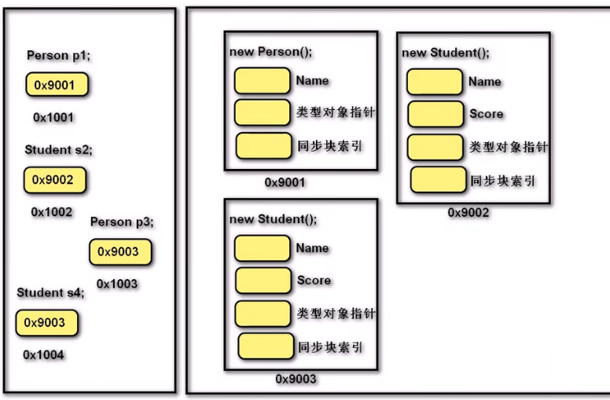
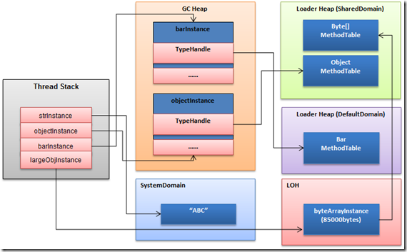
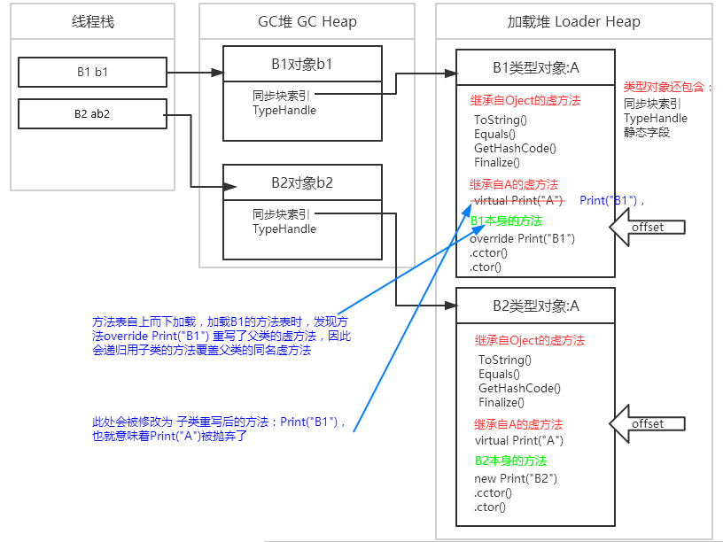

# 封装

**封装指导如何设计一个类。从数据角度讲，将一些基本数据类型复合成一个自定义类型（符合人类思考方式，便于操作数据）；从方法角度讲，向类外提供功能，隐藏实现的细节；从设计角度讲，分而治之，封装变化，高内聚，低耦合。**

**封装可以松散耦合，降低了程序各部分之间的依赖性；简化编程，使用者不必了解具体的实现细节，只需要调用对外提供的功能；增强安全性，以特定的访问权限来使用类成员，保护成员不被意外修改。**

广义封装：从整个项目的设计角度出发。狭义封装：通过访问修饰符控制类成员的访问权限。

对于狭义封装，类中的字段属于类的特征，通常私有化；方法属于类的行为，通常公开化。对字段的私有化虽然禁止了恶意访问和赋值，但也阻止了正常的访问或赋值需求，因此需要提供一组间接访问、修改类中私有化字段的方法。

# 继承

**继承是通过使用派生完成的。** 在子类（也称派生类）声明时于类名称后面追加冒号`:`和需要继承的类名来指定父类（亦称基类、超类）。

类完全支持继承。可将多个类中共有的部分提取出来，作为父类。所有类都继承`object`类。

**子类继承父类时，会继承父类除构造函数以及析构函数以外所有实例成员，拥有父类的所有特征和行为。继承不包含实例。子类可以添加新成员，拥有自己独特的特征和行为，但无法删除继承成员的定义。**

- 父类的私有成员无法直接访问，但实际已继承，可以通过反射等操作获取相关内容。
- 父类的构造方法不能继承，但当实例化子类时先进入子类构造方法，然后调用父类的构造方法（默认会隐式调用无参构造方法，可使用`base()`显示调用父类含参构造方法），父类的字段交由父类构造函数去初始化，最后再调用子类构造方法，子类字段由子类自己的构造函数初始化。

> **相当于在实例化子类之前会先实例化一个父类，子类中有一个隐藏引用指向该父类实例，因此子类可以继承父类中全部内容。**

**使用`base`关键字可以在子类中调用父类的成员；使用`this`关键字调用自己的成员。**

``` csharp
// 显示调用父类无参构造方法
public Son() : base() { }
```

**继承是单继承，即单根性，但因父类可能继承自其他类而具有传递性，即类可以间接继承多个类。**

**继承是复用现有类的功能并在其基础上对功能、概念进行扩展的一种手段。继承统一概念，并以层次化的方式管理类。继承隐含了“is a”的关系，即子类应该是从属父类范畴，具有较高耦合度：父类改变时，无需通知子类。**

## 转型

**根据里氏替换原则，父类引用可引用任意子类实例，即子类可隐式转换成任意父类（向上转型）。**

``` csharp
// 常规写法
Father father = new Son();
// 变形写法
Son son = new Son();
father = (Father)son;
```

父类转换为子类时需要强制转换（**向下转型**），且前提是父类引用要先指向子类对象。可以使用`is`和`as`运算符进行类型检查和转换。

``` csharp
Father father = new Son();
Son son = (Son)father;// 成功

Father f = new Father();
Son s = (Son)f;// 报错
```

引用类型决定可以访问的成员。

``` csharp
// 父类型引用 指向 父类型对象，只能访问父类成员
Father f1 = new Father();
// 子类型引用 指向 子类型对象，即可访问父类成员也可访问子类成员
Son s2 = new Son();
// 父类型引用 指向 子类型对象，受类型制约只能访问父类成员
Father f3 = new Son();
// 如果需要访问子类成员，需要将引用类型向下转型
Son s4 = f3 as Son;
// 不存在子类型引用 指向 父类型对象
```

> 可以简单的理解为子类对象中隐式包含了一个父类对象，当父类引用要先指向子类对象时是指向子类中的父类对象，因此只能访问父类的成员。



## 装/拆箱

`object`是所有类型的基类，是一个类（引用类型）。**`object`是万物之父**。

**装箱是将值类型转换为`object`类型或此值类型实现的任何接口类型。** 装箱是隐式的。装箱时会在堆中申请内存，内存大小为该值类型的大小加上额外固定空间（引用类型的标配：TypeHandle和同步索引块）；然后将该值类型的值拷贝至新分配的内存中；最后返回新引用对象的地址。

**拆箱指将`object`类型转化为值类型或接口类型转化为实现该接口的值类型。** 拆箱是显式的。拆箱时先检查对象实例是否有效，即是否为`null`，装箱类型与拆箱类型是否一致等；然后是指针返回，即获取装箱对象中值类型字段值的地址；最后，将上述指针指向的值拷贝到栈上，即在栈上创建一个新对象。

以上，**只有值类型可以装箱。箱子就是一个存放了值类型字段、存储在托管堆上的引用对象实例。拆的就是装箱后的引用对象。只有值类型才有装箱、拆箱两个状态，而引用类型一直都在箱子里。**

装/拆箱的基础是`object`是万物之父。有拆必有装，有装必有拆。由于值类型和引用类型在内存分配的不同，**装/拆箱势必存在内存的分配、对象的创建和数据的拷贝等操作**。通常来说，装箱的性能开销更大，因为装箱需要创建一个新的引用类型对象实例，而引用对象的分配更复杂，成本更高。

尽量避免隐式装箱，实在需要装箱时使用显式装箱或使用泛型。

# 多态

继承将相关概念的共性进行抽象并提供了一种复用的方式；**多态在共性的基础上体现了类型及行为的个性化，即一个行为有多个不同的实现。**

**多态让对象具有多选择，即父类同一种动作或者行为（父类引用调用同一个方法）在不同子类上有不同的实现。**

**三个条件实现多态：父类引用、子类对象、方法覆盖。** 变量不存在重写覆盖。静态方法没有多态性。实现手段：**重写虚方法、抽象方法和接口（依赖抽象）**。

父类方法、属性、索引器或事件声明时使用`virtual`修饰的为**虚成员**（不能与`static`、`abstract`、`private`或`override`⼀起使用）。子类使用`override`表明**重写**父类同名成员，可以在重写成员中使用`base`关键字调用父类被重写的虚成员。在子类里面重写成员之后，指向子类对象的父类引用不管在哪里调用都是调⽤重写之后的成员。

如果签名相同的方法在父类和子类中都进行了声明，但是该方法没有分别声明为`virtual`和`override`，子类就会**隐藏**父类方法。在子类的方法前使用`new`关键字，表示显示隐藏父类相同名字的方法，仅使用子类方法。通常用于覆盖继承而来的父类方法而执行子类的方法。

``` csharp
class Shape
{
    // virtual允许子类重写
    public virtual float GetArea(float bottom, float height)
    {
        return bottom * height;
    }
}
class Rectangle : Shape
{
    // override重写父类中的虚方法
    public override float GetArea(float width, float height)
    {
        return width * height;
    }
}
class Circle : Shape
{
    // new表示隐藏父类中同名方法，仅使用子类的方法
    public new float GetArea(float radius)
    {
        return Math.PI * radius* radius;
    }
}
```

重写和隐藏，即动态（晚期）绑定和静态（早期）绑定。绑定是指类型与关联的方法的调用关系，即一个类型能够调用哪些方法。静态绑定指调用关系是在运行之前即编译期间确定的，而动态绑定则指调用关系在运行期间确定。静态绑定因在编译期确定，不占用运行时间，调用速度比动态绑定快，但动态绑定更加灵活。

重载和隐藏不属于多态。重载的本质是多个方法，因此不属于多态。隐藏是调用子类执行子类方法、调用父类执行父类方法，本质仍是两个不同的方法，并且调用子类增加了耦合度（没有依赖抽象）。重写则是只调用父类方法，但因为父类方法的方法句柄被修改而指向了子类方法，从而能根据子类的不同而表现出不同的行为。

多态性可以应用于数组、传参、返回值，使其具有多种性质。

``` csharp
Father fatherS = new Son();
Father fatherF = new Father();
// 多态用于数组
Father[] arr = new Father[2];
arr[0] = fatherS;
arr[1] = fatherF;
foreach (Father item in arr)
    item.Show();
// Output:
// This is Son
// This is Father

// 多态用于传参
public void Fun(Father f) {}
Fun(fatherS);
Fun(fatherF);

// 多态用于返回值
public Father Fun()
{
    return fatherS;// return fatherF
}
```

## 类型对象

创建后的实例对象，是一个存储在内存上（在线程栈或托管堆上）的一个对象，那可以创造实例的类型在内存中又是一个什么样的存在呢？它就是**类型对象**（Type Object）。任何对象都有`GetType()`方法（基类`System.Object`提供的）。该方法返回一个对象的类型（为引用类型），类型上面包含了对象内部的详细信息（类型的所有元数据信息），如字段、属性、方法、基类、事件等等（通过反射可以获取）。

``` csharp
int a = 123; // int类型实例a
int b = 200; // int类型实例b
Type atype = a.GetType(); // 对象实例a的类型
Type btype = typeof(int); // 对象实例b的类型
Console.WriteLine(object.Equals(atype, btype)); // Output: True
Console.WriteLine(object.ReferenceEquals(atype, btype)); // Output: True
```

在上面的代码中两个不同的`int`变量的类型对象是同一个，说明`int`在内存中有唯一一个（类似静态的）`Systen.Int32`类型对象实例。

每一个类型在内存中都会有一个唯一的类型对象。类型对象存储在内存中一个独立的区域，叫**加载堆**（Load Heap），加载堆是在进程创建时创建的，不受GC管制，因此类型对象一经创建就不会被释放，其生命周期从AppDomain创建到结束。类型中的静态字段就是存储在这里的（加载堆上的类型对象），所以静态字段是全局的，而且不会释放。每个引用对象都包含两个附加成员：TypeHandle类型对象指针和同步索引块，其中TypeHandle就指向该对象对应的类型对象。类型对象的加载由class loader负责，在第一次使用前加载。



## 多态的原理

类型对象内部的主要的结构是怎么样的呢？类型对象也是引用类型，因此也包含TypeHandle和同步索引块。此外，类型对象还包含静态变量、**方法表**等。方法表包含了类型内部的所有方法入口；方法表中的方法入口（方法表槽）还有很多其他的信息，比如会关联方法的IL代码以及对应的本地机器码等。

方法调用时（此处只关注方法调用，忽略方法的继承等因素）：通过TypeHandel找到对应类型对象，然后找到方法表槽，然后是对应的IL代码，第一次执行时，JIT编译器需要把IL代码编译为本地机器码，第一次执行完成后机器码会保留，下一次执行就不需要JIT编译了。这也是为什么说.NET程序启动需要预热的原因。

``` csharp
public class A
{
    public virtual void Print() { Console.WriteLine("A"); }
}
public class B1 : A
{
    public override void Print() { Console.WriteLine("B1"); }
}
public class B2 : A
{
    public new void Print() { Console.WriteLine("B2"); }
}
```

上面的代码中，定义两个简单的类，一个基类A，B1和B2继承自A，然后使用不同的方式改变了父类方法的行为。当定义了`B1 b1 = new B1();`、`B2 b2 = new B2();`两个变量后，内存结构示意图如下：



方法表加载时：

1. 父类在前子类在后的的顺序加载。首先加载的是固定的4个来自`System.Object`的虚方法：`ToString()`、`Equals()`、`GetHashCode()`和`Finalize()`。
2. 然后自上而下加载父类的方法，所有类型的加载都会递归到`System.Object`类。
3. 加载自己的方法。**当发现有覆写父类虚方法会覆盖同名的父方法**。
4. 最后是构造方法：静态构造函数`.cctor()`，对象构造函数`.ctor()`。

隐藏仅在子类加载时加载了子类的方法而不修改继承自父类的方法，因此通过子类引用调用执行子类的方法，通过父类引用执行调用父类方法。

因此在加载`B1`类型对象时，当加载`override B1.Print(“B1”)`时，发现覆写`override`父类方法，于是会覆盖父类的同名虚方法`Print(“A”)`，即`B1`中`Print`只有一个实现版本。加载`B2`类型对象时，`new`关键字表示要隐藏基类的虚方法，此时`B2`中的`Print(“B2”)`就不是虚方法了，而是`B2`中的新方法了，即在`B2`类型对象中`Print`有2个实现版本。

``` csharp
B1 b1 = new B1();
B2 b2 = new B2();
b1.Print(); // Output: B1
b2.Print(); // Output: B2

A ab1 = new B1();
A ab2 = new B2();
ab1.Print(); // Output: B1
ab2.Print(); // Output: A
```

以上代码即表示*子类引用指向子类对象*和*父类引用指向子类对象*。此时，对象的创建不受影响，即b1与ab1、b2与ab2在内存结构上是一致的。其区别在于引用指针的类型不同，决定了实际调用的方法。

对于虚方法的调用，在IL中都是使用指令`callvirt`。`callvirt`使用虚拟调度，即根据引用类型的动态类型来调度方法，`callvirt`指令根据引用变量指向的对象类型来调用方法，在运行时动态绑定，主要用于调用虚方法。

不同的类型指针在虚拟方法表中有不同的附加信息作为标志来区别其访问的地址区域，称为**offset**。不同类型的指针只能在其特定地址区域内进行执行。编译器在方法调用时还有一个原则：**执行就近原则**，即对于同名字段或者方法，编译器是按照其顺序查找来引用的，也就是首先访问离它创建最近的字段或者方法。

因此，执行`b1.Print(); b2.Print();`时，引用指针类型的offset指向子类，按照就近查找执行原则，正常输出“B1 B2”。而当执行`ab1.Print(); ab2.Print();`时，引用类型为父类，引用指针类型的offset指向父类，按照就近查找执行原则，正常输出“B1 A”。