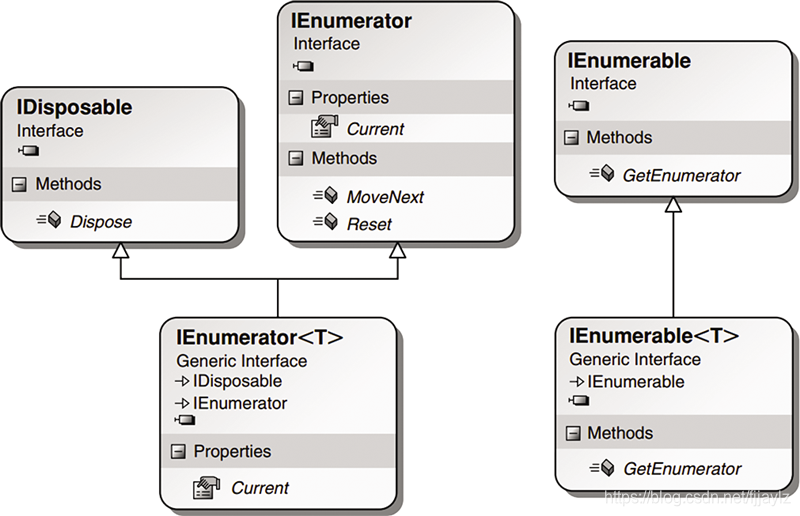
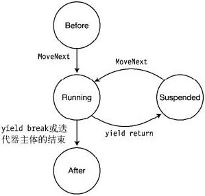

迭代器（Iterator，又称光标Cursor）模式，是程序设计的软件设计模式。迭代器模式提供一个方法顺序访问一个聚合对象中的各个元素而不暴露其内部标识。在表现效果上看，是可以在容器对象上遍历访问的接口，设计人员无需关心容器对象的内存分配的实现细节。

# 可枚举类型和枚举器

**可枚举类型**是指实现了`IEnumerable`接口的类型，`IEnumerable`接口只包含一个名为`GetEnumerator`的方法，该方法返回一个枚举器`IEnumerator`。

``` csharp
interface IEnumerable
{
    IEnumerator GetEnumerator();
}
```

> **注意**：只要在类中实现了`GetEnumerator()`方法，该类就是一个可枚举类型，并非一定要实现IEnumerable接口。

**枚举器**是指实现了`IEnumerator`接口的类型。`IEnumerator`接口定义了三部分：`Current`、`MoveNext`、`Reset`，其中：

- `Current`返回枚举器集合中当前位置的元素.
- `MoveNext`枚举`Current`到下一个元素并返回是否可以继续枚举.
- `Reset`将`Current`重置为初始位置，即第一个元素之前。

``` csharp
interface IEnumerator
{
    object Current { get; }

    bool MoveNext();

    void Reset();
}
```



`Current`的值在以下情况下未定义（为空）：

- 首次创建枚举器实例时，`Current`位于第一个元素之前（即初始位置为-1），在读取其值之前必须先调用一次`MoveNext`。
- 当枚举到达集合末尾时，`MoveNext`返回`false`，且`Current`将会为空。
- 调用`Reset`会将`Current`重置为第一个元素之前。
- 在枚举过程中修改集合（添加、修改、删除元素等操作），`Current`、`MoveNext`、`Reset`都将变成未定义。

如果不调用`MoveNext`或`Reset`，`Current`始终返回同一元素。当到达集合末尾时，如果不调用`Reset`，`MoveNext`将始终返回`false`。如果没有实现`Reset`，只能创建新的枚举器实例才能重置。

枚举器只能读取集合中的数据，而不能在枚举过程中修改集合。然而，枚举器对集合没有独占访问权，因此该过程本质上是**非线程安全**的，即在枚举过程中，其他线程仍然可以修改集合从而引发异常。

泛型IEnumerable&lt;T&gt;和IEnumerator&lt;T&gt;支持对泛型集合的枚举，节省类型转换操作。

``` csharp
interface IEnumerable<out T> : IEnumerable
{
    new IEnumerator<T> GetEnumerator();
}

interface IEnumerator<out T> : IDisposable, IEnumerator
{
    new T Current { get; }
}
```

通过操作枚举器，可以遍历可枚举集合。

``` csharp
IEnumerator enumerator = collection.GetEnumerator();
while (enumerator.MoveNext())
{
    var item = enumerator.Current;
    // 行为
}
```

可枚举类型可以使用`foreach`遍历。`foreach`隐藏了枚举的复杂操作，因此建议使用`foreach`而不是直接操作枚举器。

``` csharp
// 其中collection必须是可枚举类型
foreach (var item in collection)
{
    ...
}
```

`foreach`语句会被编译为类似的如下结构：

``` csharp
IEnumerator enumerator = collection.GetEnumerator();
try
{
    while (enumerator.MoveNext())
    {
        var item = enumerator.Current;
        ...
    }
}
finally
{
    ...
}
```

# 迭代器

返回值为`IEnumerable`、`IEnumerator`、`IEnumerable<T>`、`IEnumerator<T>`的方法会自动生成一个迭代器（概念同枚举器），简化枚举器的实现。在迭代器中使用`yield`关键字以提供下一个值或结束迭代。`yield`语句有两种形式：

- `yield return`：提供迭代器的下一个值。
- `yield break`：显示结束迭代（迭代器会在到达末尾时自动结束）。

``` csharp
// 左闭右开的数字迭代器：基于枚举器和可枚举类型
class NumberIterator
{
    private int start, end;
    public NumberIterator(int start, int end)
    {
        this.start = start;
        this.end = endl;
    }

    // 实现
    public IEnumerator<int> GetEnumerator()
    {
        return IteratorMethod();
        //return IteratorMethod2().GetEnumerator();
    }

    // 基于枚举器
    public IEnumerator<int> IteratorMethod()
    {
        for (int i = start; i < end; i++)
        {
            yield return i;
        }
    }
    // 基于可枚举类型
    public IEnumerable<int> IteratorMethod2()
    {
        for (int i = start; i < end; i++)
        {
            yield return i;
        }
    }
}

// 迭代
NumberIterator numberIterator = new NumberIterator(1, 20);
foreach (int item in numberIterator)
{
    Console.Write(item);
}
foreach (int item in numberIterator.IteratorMethod2())
{
    Console.Write(item);
}
```

正如前面的示例所示，当开始迭代时，迭代器将被执行，直到到达第一个`yield return`语句。然后，迭代器的执行被挂起，调用者获得第一个迭代的值并处理它。在随后的每次迭代中，迭代器从上次迭代暂停的地方继续执行，直到下一个`yield return`语句。当控制到达迭代器或`yield break`语句的末尾时，迭代完成。

``` csharp
// 可枚举类型扩展
public static class EnumerableExtension
{
    public static void Foreach<T>(this IEnumerable<T> collection,   Action<T> action)
    {
        if (action == null) return;

        IEnumerator<T> enumerator = collection.GetEnumerator();
        while (enumerator.MoveNext())
        {
            action.Invoke(enumerator.Current);
        }
    }
}

// 数字迭代器：左闭右开
class NumberIterator
{
    // 实现
    public static IEnumerable<int> GetEnumerator(int start, int end)
    {
        for (int i = start; i < end; i++)
        {
            yield return i;
        }
    }
}

// 迭代
IEnumerator<int> numberIterator = NumberIterator.GetEnumerator(1, 20);
numberIterator.Foreach(item => Console.Write(item));
```

在以下情况下无法使用`yield`关键字：

- 在`in`、`ref`或者`out`修饰参数的方法中。
- 在Lambda表达式或匿名方法中。
- 使用`unsafe`关键字的方法中。

在后台，由编译器生成的枚举器类是包含4个状态的状态机。

- Before：首次调用`MoveNext`的初始状态。
- Running：调用`MoveNext`后进入这个状态，在这个状态中，枚举器检测并设置下一项和位置。在遇到`yield return`、`yield break`或在迭代器结束时，退出状态。
- Suspended：状态机等待下次调用`MoveNext`的状态。
- After：没有更多项可以枚举。

