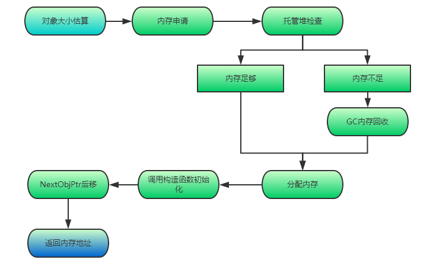

# 存储

C#程序在CLR上运行时，内存从逻辑上划分为堆、栈。栈通常保存代码执行的步骤，而堆上存放的多是对象、数据等。

方法执行在栈中，所有局部变量存储在栈中。值类型的数据存在栈中，引用类型的数据存储在堆中，字符串的数据存储在静态存储区中。

**栈**（Stack）空间⼩，但读取速度快。把数据放入栈顶称入栈（Push），从栈顶删除称出栈（Pop）。数据只能从栈的顶端插⼊和删除（后进先出，Last In First Out，LIFO）。内存中的线程栈，是基于线程的，也就是说一个线程会包含一个线程栈，由操作系统管理（.Net框架）。线程栈中的值类型在对象作用域结束后会被清理，效率高。

**堆**（Heap）是⼀块内存区域，空间⼤，但读取速度慢。堆中数据能够以任意顺序存⼊和移除。托管堆是进程初始化后在进程地址空间上划分的，存储.NET运行过程中的对象。托管堆是基于进程的，由CLR管理。当堆中满了之后，CLR会通过垃圾回收器（Garbage Collector，GC）自动清理堆中垃圾。

# 对象生命周期与创建

一个对象的生命周期有：`new`创建对象并分配内存、对象初始化、对象操作和使用、（非托管）资源清理、回收。

其中重要的一个环节是对象的创建。大部分对象创建使用`new`关键字（`string`有`ldstr`指令）。引用对象分配在托管堆上。托管堆中的对象是顺序存放的。托管堆维护一个指针NextObjPtr，它指向下一个对象在堆中的分配位置。



以以下代码为例：

``` csharp
public class User
{
    public int Age { get; set; }
    public string Name { get; set; }

    public string _Name = "123" + "abc";
    public List<string> _Names;
}
```

对象大小估算，共44字节：属性`Age`为`int`类型，4字节。属性`Name`为空的`string`，引用类型，4字节。字段`_Name`为`string`类型且进行常量初始化，编译器会对其优化；一个字符2字节，该字符串占2X6+8（引用类型标准配置，其中TypeHandle地址占4字节，同步索引块占4字节）共20字节，所以此字段总内存大小为字符串对象20字节加指向该对象的栈变量4字节共24字节。字段`_Names`为空的引用类型，4字节。类`User`为引用类型，其附加成员TypeHandle地址占4字节和同步索引块占4字节。

内存申请：申请44字节的内存块，从指针NextObjPtr开始验证空间是否足够，若不够则触发GC。

内存分配：从指针NextObjPtr处开始划分44字节内存块。

对象初始化：先初始化对象附加成员，再调用构造函数对对象成员初始化，值类型默认初始为0，引用类型默认为`null`。

托管堆指针后移：指针NextObjPtr后移44字节。

返回内存地址：返回对象的内存地址给引用变量。

# 垃圾回收

GC是在遍历托管堆上动态分配的所有对象，通过识别对象是否被引用来确定哪些是垃圾、哪些仍被使用。所谓**垃圾就是没有被任何变量、对象引用的内容**。垃圾需要被回收释放。

栈（Stack）上内存是由系统自动管理的。值类型在栈中分配内存，有其自己的生命周期，会自动分配与释放。引用类型都是存在托管堆上的，所以引用类型的分配和释放都通过GC机制管理。

GC有很多算法，如**引用计数**（Reference Counting）、**标记清除**（Mark Sweep）、**标记整理**（Mark Compact）、**复制集合**（Copy Collection）等。

托管堆分垃圾回收堆（GC Heap）和加载堆（Loader Heap）。GC主要管辖GC堆。为了提高内存管理效率，GC堆分为多个部分，主要有0/1/2代内存、大对象堆（LOH）。其中LOH存放大于85000字节（83 KB）的大对象，属于Gen 2。此区域不会轻易被回收，即使回收也不会被压缩（对象太大，移动复制的成本太高。）

代是垃圾回收机制使用的一种算法即**分代算法**，为了提高程序的性能。分代算法假设：新对象的生命周期都比较短，老对象生命周期会更长；对部分内存进行回收比对全内存回收操作快；新创建对象之间的关联程度通常较强、是连续的，关联程度强有利于提高CPU cache的命中率。

C#采用**三代标记清除压缩算法**，将内存分为Gen 0、Gen 1、Gen 2。Gen 0存储从未被标记为回收的新分配对象（大对象除外），Gen 1存储上一次GC没有被回收的对象，Gen 2存储一次以上GC后仍未被回收的对象。当Gen 0内存不够时出发Gen 0的GC，GC后将Gen 0上的对象搬迁至Gen 1。依次递进。具体回收过程为：

1. **标记对象**。先假设所有对象都是垃圾，根据应用程序根指针Root遍历堆上所有引用对象，生成**可达对象图**。将还在使用的对象标记后为可达对象（在该对象同步索引块中开启一个标识位），不可达对象就认为是垃圾。
> 根指针Root保存了当前所有需要使用的对象引用，它其实只是一个统称，意思就是这些对象当前还在使用，主要包含：静态对象/静态字段的引用；线程栈引用（局部变量、方法参数、栈帧）；任何引用对象的CPU寄存器；根引用对象中引用的对象；GC Handle table；Freachable队列。
2. **清除**。针对所有不可达对象进行清除操作：挂起执行托管代码线程，释放未标记对象。普通对象直接回收内存，实现了终结器的对象（实现了析构函数的对象）需要单独回收处理。清除之后，内存会变得不连续。
3. **搬迁对象压缩托管堆**。将可达对象搬迁至下一代内存（会整理内存），修改引用地址。

大部分情况，GC只需要回收Gen 0即可，可显著提高GC效率，而且GC使用启发式内存优化算法，自动优化内存负载，自动调整各代的内存大小。需要注意，在GC时，所有线程都要被挂起。

GC过程非常消耗性能，因此不能随意手动调用GC，应选择合适时机（如切换场景）进行GC。

# 非托管资源释放

.NET中提供释放非托管资源的方式主要是：`Finalize()`和`Dispose()`。

常用的大多是Dispose模式，主要实现方式就是实现`IDisposable`接口。`Dispose()`需要手动调用，在.NET中有两中调用方式。

``` csharp
public class SomeType : IDisposable
{
    public MemoryStream _MemoryStream;
    public void Dispose()
    {
        if (_MemoryStream != null) _MemoryStream.Dispose();
    }
}

//方式1：显示接口调用
SomeType st1 = new SomeType();
//do sth
st1.Dispose();

//方式2：using()语法调用，自动执行Dispose接口
using (var st2 = new SomeType())
{
    //do sth
}
```

显示调用`Dispose()`的缺点显而易见，如果调用前出现异常或者忘了调用接口，则会造成资源得不到释放，当然这一点可以使用`try…finally`避免。一般建议使用第二种实现方式，可以保证无论如何`Dispose()`都可以得到调用，原理其实很简单，从`using()`的IL代码可以发现，因为`using`只是一种语法形式，本质上还是`try…finally`的结构。

Finalize方法来自`System.Object`中受保护的虚方法`Finalize()`，无法被子类显示重写，也无法显示调用。其作用就是用来释放非托管资源，由GC来执行回收，因此可以保证非托管资源可以被释放。所有实现了析构函数（终结器）的对象，会被GC特殊照顾。GC的终结队列跟踪所有实现了`Finalize()`方法的对象。

- 当CLR在托管堆上分配对象时，GC检查该对象是否实现了自定义的`Finalize`方法。如果是，对象会被标记为可终结的，同时这个对象的指针被保存在名为终结队列的内部队列中。终结队列是一个由GC维护的表，它指向每一个在从堆上删除之前必须被终结的对象。
- 当GC执行并且检测到一个不被使用的对象时，需要进一步检查终结队列来查询该对象类型是否含有`Finalize`方法，如果没有则将该对象视为垃圾，如果存在则将该对象的引用移动到另外一张Freachable列表，此时**对象会被复活一次**。
- CLR将有一个单独的高优先级线程负责处理Freachable列表，就是依次调用其中每个对象的`Finalize`方法，然后删除引用，这时对象实例就被视为不再被使用，对象再次变成垃圾。
- 下一个GC执行时，将释放已经被调用`Finalize`方法的那些对象实例。

Finalize方法可以确保托管资源会被释放，但需要很多额外的工作（比如终结对象特殊管理），而且GC需要执行两次才会真正释放资源，但不需要显示调用。