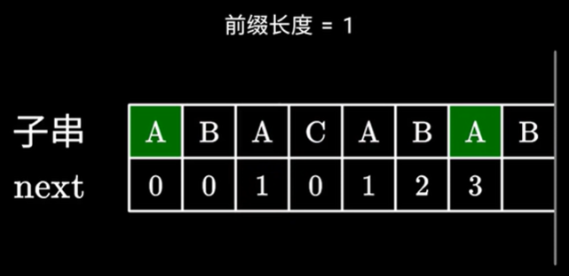

# LC0028找出字符串中第一个匹配项的下标

难度：中等
数据结构：字符串
算法：暴力枚举、KMP

## 题目

给定两个字符串haystack和needle。请在字符串haystack中找出字符串needle的第一个匹配项的下标（下标从0开始）。如果needle不是haystack的一部分，则返回-1。

示例：

> 输入：haystack = "sadbutsad", needle = "sad"
> 输出：0
> 解释："sad"在下标0和6处匹配。第一个匹配项的下标是0。

提示：

- 1 <= haystack.length, needle.length <= 10^4^
- haystack和needle由小写英文字母组成

## 题解

### 暴力枚举

从头遍历字符串haystack，在每个位置检查是否匹配字符串needle。

``` csharp
public int StrStr(string haystack, string needle)
{
    if (string.IsNullOrEmpty(haystack) || string.IsNullOrEmpty(needle))
    {
        return -1;
    }

    int rel = -1;
    int n = haystack.Length, m = needle.Length;
    bool hasMatched;
    int tempI;
    for (int i = 0; i <= n - m; i++)
    {
        hasMatched = true;
        tempI = i;
        for (int j = 0; j < m; j++, tempI++)
        {
            if (haystack[tempI] != needle[j])
            {
                hasMatched = false;
                break;
            }
        }

        if (hasMatched)
        {
            rel = i;
            break;
        }
    }

    return rel;
}
```

时间复杂度：时间复杂度为O(nm)，其中n为字符串haystack的长度，m为字符串needle的长度。

空间复杂度：空间复杂度为O(1)。

### KMP

Knuth-Morris-Pratt算法，简称KMP算法，由Donald Knuth、James H. Morris和Vaughan Pratt三人于1977年联合发表。

KMP算法的基本思路是：在暴力枚举过程中，当发现某一个字符不匹配的时候，由于已经知道之前遍历过的字符，可以利用这些信息避免主串中指针的回退步骤，即不希望主串的遍历指针递减而让它始终递增。

基本原理是：此前**匹配过的主串字符和模式串字符相同**，如何移动模式串而尽可能减少匹配？答案是找出模式串中匹配过的子串的相同前缀与后缀，将**模式串中匹配过的子串的前缀移动到后缀位置**即可，此时可以确保**模式串中匹配过的子串的前缀也是已经匹配过的**！！！这个模式串的移动位置即next数组。因此，只要有了next数组，就可以快速地计算出模式串在主串中的每一次出现。


next数组即为前缀函数，即next[i]为字符串s在[0, i]范围内**最长**的、**相同**真前缀和真后缀的长度。

> 前缀：字符串从第一个字符开始往后不定个数的子串。
> 后缀：字符串从第后一个字符开始往前不定个数的子串。
> 真前缀（前缀真子串）：不包含自身的前缀。
> 真后缀（后缀真子串）：不包含自身的后缀。

在求解next数组遍历字符串s，当前最长的相同真前缀和真后缀的长度l已知，判断到第i个字符时会有两种情况：

- 能够组成更长的相同真前缀和真后缀：next[i] = l + 1。


- 无法组成更长的相同真前缀和真后缀：此时可以注意到，上一步的真前缀与真后缀相同，因此在上一步的真前缀中寻找相同真前缀和真后缀即可。根据之前的计算修正l，重复判断即可。




``` csharp
public int StrStr(string haystack, string needle)
{
    if (string.IsNullOrEmpty(haystack) || string.IsNullOrEmpt(needle))
    {
        return -1;
    }

    int[] next = BuildNext(needle);
    int n = haystack.Length, m = needle.Length;
    for (int i = 0, j = 0; i < n;)
    {
        // 字符匹配成功
        if (haystack[i] == needle[j])
        {
            i++;
            j++;
        }
        // 字符匹配失败
        else if (j > 0)
        {
            j = next[j - 1];
        }
        // 第一个字符就匹配失败
        else
        {
            i++;
        }
        
        if (j == m)
        {
            return i - j;
        }
        
        // 模式串剩余部分超出主串剩余部分，匹配失败
        if (m - j > n - i)
        {
            break;
        }
    }

    return -1;
}

private int[] BuildNext(string needle)
{
    int n = needle.Length, prefixLength = 0;
    int[] next = new int[n];
    next[0] = prefixLength;
    for (int i = 1; i < n;)
    {
        if (needle[prefixLength] == needle[i])
        {
            prefixLength++;
            next[i] = prefixLength;
            i++;
        }
        else
        {
            if (prefixLength == 0)
            {
                next[i] = prefixLength;
                i++;
            }
            else
            {
                prefixLength = next[prefixLength - 1];
            }
        }
    }

    return next;
}
```

时间复杂度：时间复杂度为O(n + m)，其中n为字符串haystack的长度，m为字符串needle的长度。

空间复杂度：需要存储字符串needle的next数组，空间复杂度为O(m)。