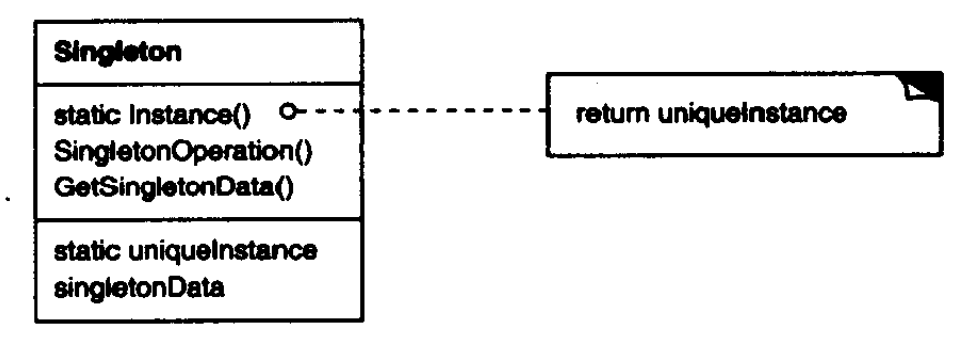

# 单例模式

单例（Singleton）模式保证一个类只能有一个实例，并提供该实例的全局访问点。

为了保证一个类只能有一个实例且该实例易于被访问，最好的让类自身负责保存它的唯一实例，且通过截取创建该类新对象的请求来保证没有其他实例可以被创建，并提供一个访问该实例的方法（懒加载）。

构建单例通常需要在类内部声明一个**同类型的静态私有字段**，提供公开静态属性以访问该字段。为了禁止外部实例化该类，将**构造函数私有化**。

单例模式结构如下：



**适用于**：

- 类只能有一个全局访问的实例时（如管理器等）。
- 创建一个对象需要消耗的资源过多，如要访问I/O和数据库等资源。

**优点**：

- 访问易控制。
- 是对全局变量的一种改进，避免了存储唯一实例的全局变量污染命名空间。
- 避免多次在内存中加载、创建和销毁对象，避免对资源的多重占用，减少资源的耗费。

**缺点**：

- 单例一般没有接口，扩展困难。
- 对测试不利。在并行开发环境中，如果单例模式没有完成，是不能进行测试的。
- 单例与单一职责原则有冲突。
- 在高并发情况下，需要处理线程同步问题。

``` csharp
public class Singleton
{
    private static Singleton instance = new Singleton();
    public static Singleton Instance { get { return instance; } }
    
    private Singleton() { }
}
```

> 注意：如果不提供访问方法而仅使用全局或静态的变量，然后依赖自身的初始化是不够的：
> - 不能保证该变量仅有一个实例被声明。
> - 该变量实例化时无法使用其他信息。
> - 不能保证该变量的实例化时机。
> - 不管是否使用该单例，该变量都将被创建。

# 饿汉式单例

饿汉式单例是线程安全的，因为CLR会自动处理线程安全问题。

``` csharp
public class HungrySingleton
{
    private static HungrySingleton instance = new HungrySingleton();
    public static HungrySingleton Instance { get { return instance; } }
    
    private HungrySingleton() { }
}
```

> 实测.Net 6.0（C# 10）中饿汉式单例仍然是懒加载（不会在加载类时实例化）。

# 懒汉式单例

在类被使用时实例化单例，即延迟实例化。

``` csharp
public class LazySingleton
{
    private static LazySingleton instance;
    public static LazySingleton Instance
    {
        get
        {
            if (instance == null)
            {
                instance = new LazySingleton();
            }
            return instance;
        }
    }
    
    private LazySingleton() { }
}
```

然而，懒汉式单例在多线程并发下会有非线程安全问题。

解决方法：双重检测加锁（DCL）懒汉式单例

``` csharp
public class DCLSingleton
{
    private static readonly object locker = new object();

    private static DCLSingleton instance;
    public static DCLSingleton Instance
    {
        get
        {
            if (instance == null)
            {
                lock (locker)
                {
                    if (instance == null)
                    {
                        instance = new DCLSingleton();
                    }
                }
            }
            return instance;
        }
    }
    
    private DCLSingleton() { }
}
```

`new`操作可分为：

1. 分配内存空间；
2. 执行构造方法，初始化对象；
3. 将对象指向分配的内存空间。

由于`new`不是一个原子性操作，可能会发生**指令重排**。当线程A进入时，可能按132顺序执行，当执行到3时线程B进入，由于对象已经分配内存空间，线程B不认为单例为空，但实际上单例还未完成构造。

# 静态内部类单例

``` csharp
public class InnerClassSingleton
{
    private static class SingletonHolder
    {
        internal static InnerClassSingleton instance = new InnerClassSingleton();

        static SingletonHolder() { }
    }

    public static InnerClassSingleton Instance
    {
        get
        {
            return SingletonHolder.instance;
        }
    }
}
```

# 反射破坏单例

由于单例的构造函数是私有化的，因此可以使用反射创建单例，此时会破坏单例的单一性。

``` csharp
public class Singleton
{
    private static Singleton instance;
    public static Singleton Instance
    {
        get
        {
            if (instance == null)
            {
                instance = new Singleton();
            }
            return instance;
        }
    }
    
    private Singleton() { }
}

// 通过反射创建单例的实例
Singleton otherInstance = (Singleton)Activator.CreateInstance(typeof(Singleton), true);
```

可以在私有的构造函数中加锁去判断是否妄图创建单例实例。

``` csharp
public class Singleton
{
    private static readonly object locker = new object();

    private static Singleton instance;
    public static Singleton Instance
    {
        get
        {
            if (instance == null)
            {
                instance = new Singleton();
            }
            return instance;
        }
    }
    
    private Singleton()
    {
        lock (locker)
        {
            if (instance != null)
            {
                throw new Exception("不要试图使用反射破坏单例！");
            }
        }
    }
}
```

此时，外界不通过公共的Instance获取单例时，则内部的instance永远为空，外部可以仍然可以使用反射破坏单例，此时可以使用一个隐藏变量来标记是否执行过私有构造。

``` csharp
public class Singleton
{
    private static readonly object locker = new object();
    private static bool guess = false;

    private static Singleton instance;
    public static Singleton Instance
    {
        get
        {
            if (instance == null)
            {
                instance = new Singleton();
            }
            return instance;
        }
    }
    
    private Singleton()
    {
        lock (locker)
        {
            if (guess == false)
            {
                guess = true;
            }
            else
            {
                throw new Exception("不要试图使用反射破坏单例！");
            }
        }
    }
}
```

隐藏的标记位可以通过反射被篡改。

``` csharp
Type type = typeof(Singleton);
FieldInfo fieldInfo = type.GetField("guess", BindingFlags.Static | BindingFlaNonPublic);
fieldInfo.SetValue(null, false);
```

# 枚举单例

枚举类型是线程安全并且可以防止反射破坏实例，因此可以使用但元素枚举实现单例。

在Java中可以为枚举添加方法，而在C#中只能通过扩展方法为枚举添加行为，所以C#枚举单例会多一个静态类，可能会因为静态而带来内存占用的问题。

``` csharp
public enum EnumSingleton
{
    Instance
}

public static class EnumSingletonExtension
{
    // 数据和行为
}
```

# 泛型单例

对于要实现的单例，只需要继承泛型单例即可，可以简化代码。

``` csharp
public class Singleton<T> where T : Singleton<T>
{
    private static T instance;

    private static readonly object locker = new object();

    public static T Instance
    {
        get
        {
            if (instance == null)
            {
                lock (locker)
                {
                    if (instance == null)
                    {
                        instance = (T)Activator.CreateInstance(typeof(T), true);
                        instance.InitSingleton();
                    }
                }
            }
            return instance;
        }
    }

    protected virtual void InitSingleton() {}
}
```