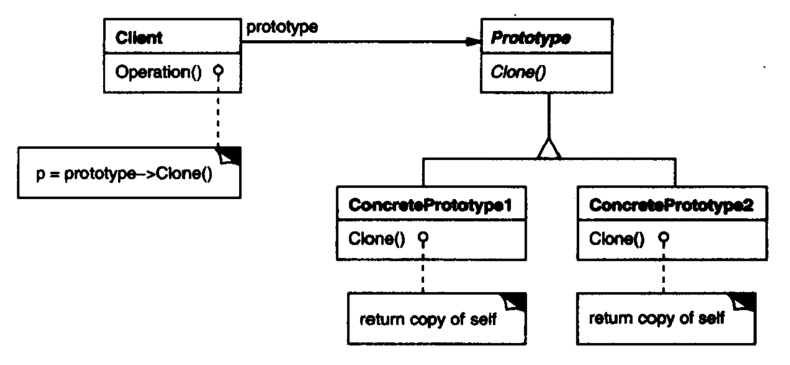

# 原型模式

原型（Prototype）模式将用原型实例指定创建对象的种类，并且通过拷贝原型创建新对象。

原型模式结构如下：



其中：

- Prototype定义了克隆自身接口的抽象，是抽象的原型。
- ConcretePrototype是实现了Prototype，可以进行克隆自身的操作，是一个具体的原型。

**适用于**：

- 在运行时指定要实例化的类时。
- 克隆比手动实例化更方便、有效的时候。

**优点**：

- 可以在运行时创建和删除原型，更为灵活。
- 有效减少其他类，如工厂类等。

**缺点**：

- 原型类必须实现克隆ICloneable操作。
- 类内部存在循环引用或有大量引用类型属性时会难以实现深拷贝。
- 原型的初始化。

## 案例

``` csharp
public class Video : ICloneable
{
    public string Name;

    public DateTime CreateTime;

    // 浅拷贝
    public object Clone()
    {
        return base.MemberwiseClone();
    }
}

// 测试
Video v1 = new Video("英雄联盟", DateTime.Now);
Video v2 = (Video) v1.Clone();
```

> C#中`object.MemberwiseClone()`是浅拷贝操作，即创建新对象，并拷贝原型的字段值到新对象。如果字段是值类型则执行该字段的逐位复制；如果字段是引用类型，则复制引用，即二者指向同一个引用对象，此时修改新对象该字段会改变原型。
> 可以通过以下方式实现深拷贝：
> - 通过构造函数创建并初始化新对象，这要求构造函数需要传入对象所需参数。
> - 调用`object.MemberwiseClone()`创建浅拷贝副本，然后克隆引用类型字段或属性。
> - 序列化原型，然后反序列化为对象。
> - 使用带有递归的反射执行深拷贝。