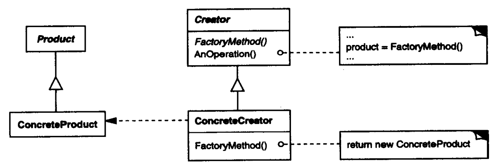

# 工厂模式

工厂方法（Factory Method）模式定义一个用于创建对象的接口，让实现类决定实例化哪一个类，将一个类的实例化延迟到其实现类中。

工厂方法模式用于创建对象，实现了**创建者和调用者的分离**。本质是创建对象时不使用`new`，而是用工厂方法代替，从而对创建对象进行统一管理和控制，将调用者和实现类解耦。

工厂方法模式结构如下：



其中：

- Product是对产品的抽象。
- ConcreteProduct是具体产品对象。
- Creator是对工厂的抽象，声明工厂方法，该方法返回一个Produce对象。
- ConcreteCreator是工厂的实现，重定义抽象的工厂方法并返回一个ConcreteProduct对象。

**适用于**：

- 创建同族产品类实例。
- 统一创建的对象。

**优点**：

- 统一的动态创建同族产品类实例，分离了创建和使用，实现解耦。
- 对增加同族产品具有良好扩展性。

**缺点**：

- 无法创建不同族产品类实例。

## 案例

生产鼠标。

普通生产流程：脚本直接引用具体类，耦合度高。

``` csharp
public interface IMouse { }

public class DellMouse : IMouse
{
    public DellMouse() { Console.WriteLine("生产了一个戴尔鼠标"); }
}
public class HpMouse : IMouse
{
    public HpMouse() { Console.WriteLine("生产了一个惠普鼠标"); }
}

// 测试
DellMouse dellMouse = new DellMouse();
HpMouse hpMouse = new HpMouse();
```

引入工厂方法模式：

``` csharp
public interface IMouseFactory
{
    public T CreateProduct<T>() where T : IMouse, new;
}

public class MouseFactory : IMouseFactory
{
    public T CreateProduct<T>() where T : IMouse, new
    {
        Type type = typeof(T);
        T product = null;
        try
        {
            product = (T)Activator.CreateInstance(type);
        }
        catch(Exception e)
        {
            // 异常处理
        }
        return product;
    }
}

// 测试
MouseFactory factory = new MouseFactory();
DellMouse dellMouse = factory.CreateProduct<DellMouse>();
HpMouse hpMouse = factory.CreateProduct<HpMouse>();
```

## 简单工厂

简单工厂（Simple Factory）又叫静态工厂方法（Static Factory Method），是对工厂方法模式的简化。一个族类产品生产只需要一个工厂类，提供生产产品的功能，不需要将其实例化出来，因此可以使用静态方法实现，此时无需抽象工厂接口。

``` csharp
public static class StaticMouseFactory
{
    public static T CreateProduct<T>() where T : IMouse, new
    {
        Type type = typeof(T);
        T product = null;
        try
        {
            product = (T)Activator.CreateInstance(type);
        }
        catch(Exception e)
        {
            // 异常处理
        }
        return product;
    }
}

// 测试
DellMouse dell = StaticMouseFactory.CreateProduct<DellMouse>();
```

## 多工厂

在复杂项目中，不同产品类的初始化不同时，可以为每个产品实现工厂类，每个工厂类独立负责创建对应的产品对象并实现特定的初始化操作。

**优点**：

- 结构简单，职责清晰。

**缺点**：

- 添加新同族产品类时，需要添加特定的工厂实现类，维护时需要考虑两个类之间的关系，增加了扩展难度。

``` csharp
public interface IMouseFactory
{
    public IMouse CreateProduct();
}

public static class DellFactory : IMouseFactory
{
    public IMouse CreateProduct() { return new DellMouse(); }
}
public class HpFactory : IMouseFactory
{
    public IMouse CreateProduct() { return new DellMouse(); }
}

// 测试
IMouse mouse = new HpFactory().CreateProduct();
```