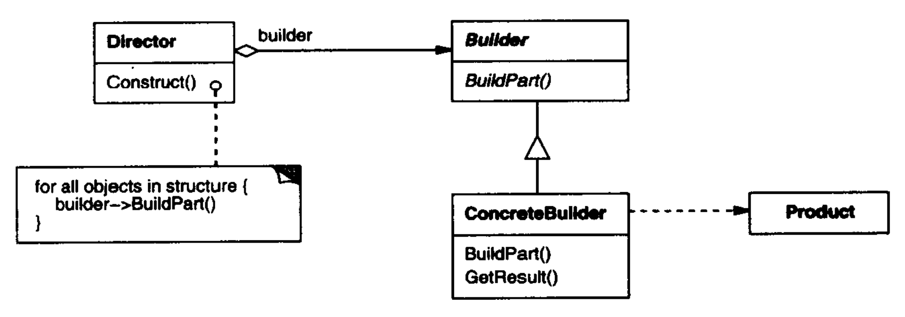

# 建造者模式

建造者（Builder）模式将**复杂对象**的创建和表示分离，使得同样的构建过程可以创建不同的表示。

抽象工厂模式结构如下：



其中：

- Product是被构建的复杂具体产品。
- Builder是建造者的抽象，为创建一个Product对象的各个部件指定抽象接口。
- ConcreteBuilder实现Builder以构建和装配Product。
- Director使用Builder的对象，用于指导Builder如何构建产品，从而控制所得产品的内部结构。

**适用于**：

- 创建的产品具有复杂的内部结构，但具有较多共性。
- 隔离复杂对象的创建和使用，并使得相同创建方式可以创建不同产品。
- 适用于构造具有较多零件（属性）的产品。

**优点**：

- 分离了创建和表示，使调用者不必知道产品内部组成的细节，实现类解耦。
- 将创建步骤分解在不同方法中，使创建过程更加清晰。
- 具体的建造者之间是独立的，有利于系统的扩展，增加新的建造者无需修改原有类库，符合开闭原则。
- 方便细化建造过程。

**缺点**：

- 建造者生产的产品一般具有较多共同点，组成部分相似，因此使用范围受限。
- 如果产品内部变化复杂，可能会导致需要定义较多具体建造者实现变化，导致系统庞大。

> 与抽象工厂相比，建造者着重于一步一步构造完整的复杂对象（建造者是生产加组装），而抽象工厂着重于多个系列的产品对象（抽象工厂只生产）。另外，建造者在最后一步返回产品，而抽象工厂立即返回产品。

## 案例

使用建造者模式创建Houer产品。

``` csharp
public class House
{
    public string PartA;
    public string PartB;
    public string PartC;
    public string PartD;
}

public interface IBuilder
{
    void BuildA(); // 地基
    void BuildB(); // 墙壁
    void BuildC(); // 线路
    void BuildD(); // 粉刷
    House GetHouse();
}

public class Worker : IBuilder
{
    private House house;

    private bool reset = true;

    private void Create()
    {
        if (reset)
        {
            house = new House();
            reset = false;
        }
    }

    public void BuildA()
    {
        Create();
        house.PartA = "地基";
    }

    public void BuildB()
    {
        Create();
        house.PartB = "墙壁";
    }

    public void BuildC()
    {
        Create();
        house.PartC = "线路";
    }

    public void BuildD()
    {
        Create();
        house.PartD = "粉刷";
    }

    public House GetHouse()
    {
        reset = true;
        return house;
    }
}

public class HouseDirector1
{
    public House GetHouse(IBuilder builder)
    {
        if (builder == null)
        {
            return default;
        }

        builder.BuildA();
        builder.BuildB();
        builder.BuildC();
        builder.BuildD();
        return builder.GetHouse();
    }
}

public class HouseDirector2
{
    public House GetHouse(IBuilder builder)
    {
        if (builder == null)
        {
            return default;
        }

        builder.BuildD();
        builder.BuildB();
        builder.BuildA();
        builder.BuildC();
        return builder.GetHouse();
    }
}
```

## 优化

有时可以将Director和Builder结合简化系统结构。

还可以通过静态内部类实现零件的无序装配构造，更加灵活，更加符合定义。

比如：肯德基套餐，服务员（具体建造者）可以按照固定套餐组成产品，也可以由客户随意搭配任意几种零件组成一款产品，后者将Director的角色交由客户操作，使得产品的创建更加简单灵活。

``` csharp
public class Product
{
    public string A = "汉堡";
    public string B = "可乐";
    public string C = "薯条";
    public string D = "蛋挞";

    public void SetA(string a)
    {
        A = a;
    }
    public void SetB(string b)
    {
        B = b;
    }
    public void SetC(string c)
    {
        C = c;
    }
    public void SetD(string d)
    {
        D = d;
    }
}

public interface IBuilder
{
    IBuilder BuildA(); // 鸡肉卷
    IBuilder BuildB(); // 雪碧
    IBuilder BuildC(); // 吮指原味鸡
    IBuilder BuildD(); // 热辣鸡块
    Product GetProduct();
}

public class Worker : IBuilder
{
    private Product product;

    private bool reset = true;

    private void Create()
    {
        if (reset)
        {
            product = new Product();
            reset = false;
        }
    }

    public Worker BuildA()
    {
        Create();
        product.A = "鸡肉卷";
        return this;
    }

    public Worker BuildB()
    {
        Create();
        product.B = "雪碧";
        return this;
    }

    public Worker BuildC()
    {
        Create();
        product.C = "吮指原味鸡";
        return this;
    }

    public Worker BuildD()
    {
        Create();
        product.D = "热辣鸡块";
        return this;
    }

    public Product GetProduct()
    {
        reset = true;
        return product;
    }
}

// 测试
Worker waiter = new Worker();
Product default = waiter.GetProduct(); // 默认套餐

Product my = waiter.BuildA().BuildC().GetProduct(); // 客户选择的自定义套餐
```