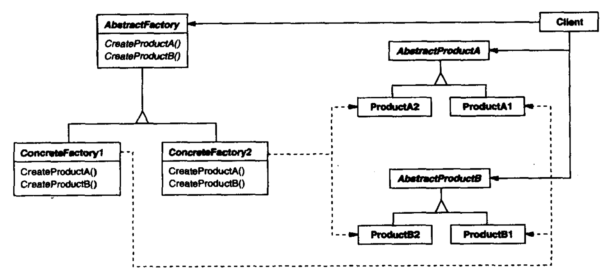

# 抽象工厂

抽象工厂（Abstract Factory）模式提供了一个创建一系列相关或相互依赖对象的接口，而无需指定它们具体的类，解决了工厂模式新增不同族类的问题。其中，显示定义为产品的称为产品族，隐式定义为工厂的为工厂族。

抽象工厂模式结构如下：



其中：

- AbastractProduct是对不同产品族产品的抽象。
- Product是被相应工厂创建的具体产品。
- AbstractFactory是对工厂的抽象，声明了一系列生产不同产品族产品的方法。
- ConcreteFactory是工厂的实现。

**适用于**：

- 应用层不依赖其产品类实例如何被创建、实现的细节时。
- 创建（不）同族产品类实例。
- 提供一个产品类的库，所有的产品以同样接口出现，从而使得客户端不依赖于具体的实现。

**优点**：

- 分离了创建者和调用者，无需关心创建的细节。
- 易扩展工厂族。
- 产品族内的约束为非公开状态。例如，生产一个戴尔鼠标时生产两个惠普鼠标，这样的生产约束对高层模块是透明的，是在工厂族内实现的。

**缺点**：

- 规定了所有可能被创建的同族产品类型，扩展产品族变得更加困难，此时每个工厂都需要修改。
- 增加了系统的抽象性和繁琐程度。

## 案例

生产戴尔和惠普的鼠标和键盘，其中鼠标和键盘是产品族，戴尔和惠普为工厂族（也可以称戴尔和惠普为产品族，鼠标和键盘为工厂族）。

``` csharp
// 鼠标产品族
public interface IMouse { }

public class DellMouse : IMouse { }

public class HpMouse : IMouse { }

// 键盘产品族
public interface IKeyboard { }

public class DellKeyboard : IKeyboard { }

public class HpKeyboard : IKeyboard { }

// 抽象工厂
public interface IFactory
{
    public IMouse CreateMouse();
    public IKeyboard CreateKeyboard();
}

public interface DellFactory : IFactory
{
    public IMouse CreateMouse()
    {
        return new DellMouse();
    }

    public IKeyboard CreateKeyboard()
    {
        return new DellKeyboard();
    }
}

public interface HpFactory : IFactory
{
    public IMouse CreateMouse()
    {
        return new HpMouse();
    }

    public IKeyboard CreateKeyboard()
    {
        return new HpKeyboard();
    }
}

// 测试
IFactory dellFactory = new DellFactory();
DellMouse dellMouse = dellFactory.CreateMouse();
DellKeyboard = dellKeyboard = dellFactory.CreateKeyboard();
```