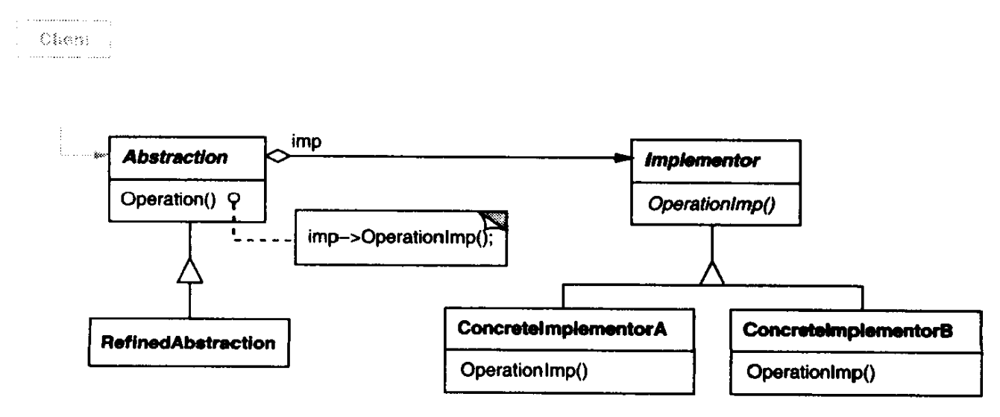

# 桥接模式

桥接（Bridge）模式，也叫桥梁模式，可以将抽象部分与其实现部分分离，使二者都可以独立地变化。

桥接模式通常需要抽象化角色Abstraction和实现化角色Implementor，其中**抽象化角色定义该角色的行为，并保存一个实现化角色的引用。实现化角色实现了角色的行为，即抽象角色引用实现角色，抽象角色的部分实现由实现角色完成。**

桥接模式结构如下：



其中：

- Abstraction即抽象化角色，定义该角色的行为，提示保存一个对实现化角色的引用。
- Implementor是实现化角色的抽象，定义角色必须的行为和属性。Implementor和Abstraction可以不同。一般地，Implementor仅定义基本操作，Abstraction则定义这些基本操作的高层操作。
- ConcreteImplementor实现Implementor并定义了具体实现。
- RefinedAbstraction是Abstraction的实现，引用了具体实现化角色，并对Abstraction行为进行修正。

**适用于**：

- 不希望或不适用继承的场景。
- 类的抽象和实现都应该可以通过生成子类的方法进行扩充。
- 对类抽象的实现部分的修改不能影响其他客户时。

**优点**：

- 分离抽象及其实现部分，有助于降低对实现部分编译的依赖性，同时也有助于系统结构分层。
- 增加了扩展性。
- 提高实现细节的透明度。

## 案例

工厂生产产品，然后出售、赚钱。

``` csharp
/// <summary>
/// 工厂抽象类
/// </summary>
public abstract class Factory
{
    public abstract void Produce();
    public abstract void Sell();
    public void EarnMoney()
    {
        Produce();
        Sell();
    }
}

/// <summary>
/// 衣服工厂
/// </summary>
public class ClothFactory : Factory
{
    public void Produce(); { }
    public void Sell() { }
    public void EarnMoney()
    {
        base.EarnMoney();
    }
}
```

上述代码中，`ClothFactory`类生成商品固定，难以扩展。使用接口`IProduction`分离产品生产的实现可以有效降低耦合。

``` csharp
/// <summary>
/// 产品接口
/// </summary>
public interface IProduction
{
    public void BeProduced();
    public void BeSelled();
}

public class Cloth : IProduction
{
    public void BeProduced() { }
    public void BeSelled() { }
}

/// <summary>
/// 工厂抽象类
/// </summary>
public abstract class Factory
{
    private IProduction production;
    public Factory(IProduction production)
    {
        this.production = production;
    }

    public void EarnMoney()
    {
        production.BeProduced();
        production.BeSelled();
    }
}

/// <summary>
/// 衣服工厂
/// </summary>
public class ClothFactory : Factory
{
    public ClothFactory(Cloth cloth) : base(cloth) { }

    public void EarnMoney()
    {
        base.EarnMoney();
    }
}
```