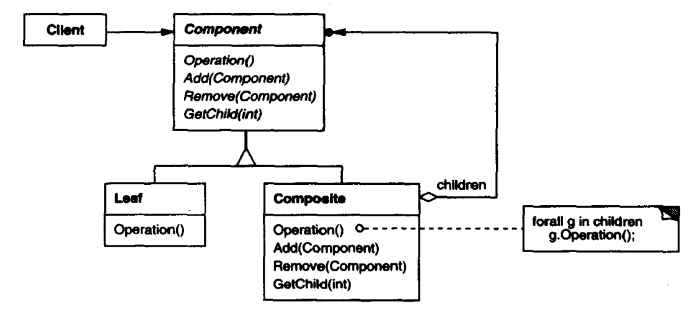

# 组合模式

组合（Composite）模式，也叫合成模式，有时也叫部分-整体（Part-Whole）模式，主要用来描述部分与整体的关系，将对象组合成树形结构以表示“部分-整体”的层次关系，使得用户**对单个对象和组合对象的使用具有一致性**。

组合模式结构如下：



其中：

- Component是单个对象与组合对象的抽象，定义了二者共有的行为。组合中的对象声明接口。
- Leaf是对单个对象的抽象。
- Composite是对组合对象的抽象，用于组合组合对象和单个对象以实现树形结构。

**适用于**：

- 表示部分-整体层次关系，如树形菜单、文件等。
- 忽略单个对象与组合对象的不同，统一使用所有对象。

**优点**：

- 高层模块调用简单，简化客户端代码。所有对象都是Component，而不需要关心是单个对象还是组合对象。
- 增加了扩展性，添加对象更容易，组合对象仍可以被组合。

**缺点**：

- 容易增加新对象使得难以限制组合对象。
- 客户端创建对象时需要使用具体实现类，违背了依赖倒置原则，限制了接口使用范围。

## 案例

公司的人事管理：从最高层往下一层一层的管理，可以抽象出最高管理（无上属领导，有下管人员）、中层管理（有上属领导，有下管人员）、工作人员（有上属领导，无下管人员）。

三种人员分别定义`Root`、`Branch`、`Leaf`类，之间无联系。

``` csharp
public interface IRoot
{
    public int GetID();
    public void Add(IBranch branch);
    public void Add(ILeaf leaf);
    public ArrayList GetSubordinate();
}

public interface IBranch
{
    public int GetID();
    public void Add(IBranch branch);
    public void Add(ILeaf leaf);
    public ArrayList GetSubordinate();
}

public interface ILeaf
{
    public int GetID();
}
```

然后提取公共部分，封装之。

``` csharp
public abstract class Corp
{
    private int id;

    public int GetID();
}

public abstract class Branch : Corp
{
    public void Add(Corp corp);
    public ArrayList GetSubordinate();
}

public abstract class Leaf : Corp
{
}
```

## 扩展

上述案例所述组合模式中，Composite与Leaf的行为分开定义，而不是定义在Component中，这种属于**安全模式**，即对于Leaf是安全的。将Composite的方法定义在Component中则是**透明模式**，这种模式能够尽可能使用户无需关心其使用的是Composite还是Leaf，但许多Composite的行为对Leaf是无意义的，需要在Leaf中使用缺省的实现。

另外，为了方便逆序遍历，可以在Component中定义父对象的引用，使得Leaf和Composite都可以管理自己的父对象。

有时为了方便管理子对象，可以在Component中定义子对象列表，并声明操作子对象的方法。这种操作通常对Leaf是无意义的，因此会导致空间浪费。只有在结构中对象数量较少时值得使用此方法。

有时需要按顺序指定子对象或顺序访问子对象，需要仔细地设计对子对象的访问和管理接口。