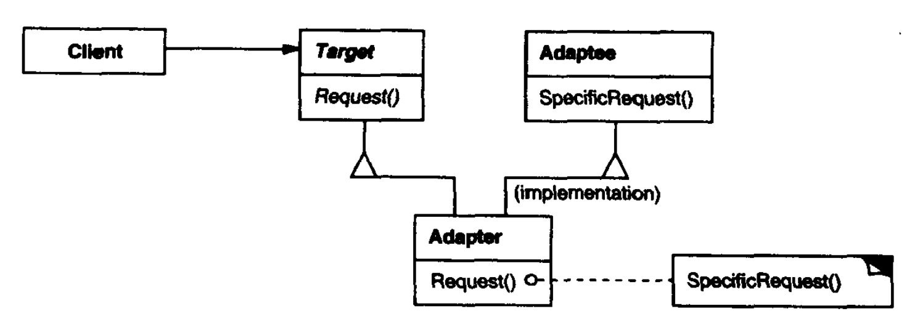
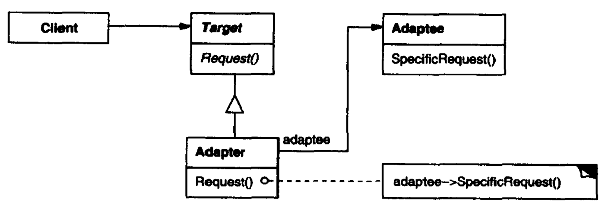

# 适配器模式

适配器（Adapter）模式将一个类的接口转换为客户希望的另一个接口，使得原本由于接口不兼容而不能一起工作的类可以一起工作。适配器可以通过类继承或对象聚合来实现。

类适配器模式通过继承或实现接口进行匹配，其结构如下：



对象适配器模式依赖对象组合，其结构如下：



其中：

- Target是用户的接口。
- Adeptee是需要适配的接口。
- Adapter是将用户的接口适配到Adeptee的适配器。

**适用于**：

- 使用现有类时，这些类的接口不符合需求甚至没有需要的接口时。
- 想创建可复用的类，且该类可以与其他不相关的类或不可预见的类协同工作。
- 对一些已经存在的子类，不可能对每一个都进行子类化以匹配它们的接口，此时可以适配其父类接口。

**优点**：

- 适配器模式可以让两个没有任何关系的类一起运行。
- 增加了类的透明性。
- 提高了类的复用度。
- 灵活性高。

## 案例

不能插网线的电脑通过网线转USB适配器上网。

``` csharp
/// <summary>
/// 源接口Adaptee
/// </summary>
public class Network
{
    public void LinkNet() { }
}

/// <summary>
/// 客户端类
/// </summary>
public class Computer
{
    public void Net(INetToUSB apdapter)
    {
        apdapter.HandleRequest();
    }
}

/// <summary>
/// 期望接口Target
/// </summary>
public interface IUSB
{
    public void LinkUSB();
}

/// <summary>
/// 适配器接口
/// </summary>
public interface INetToUSB
{
    void HandleRequest();
}

// 类适配器：通过继承实现
public class Adapter1 : Network, INetToUSB
{
    public void HandleRequest()
    {
        base.LinkNet();
    }
}

// 对象适配器：通过聚合实现
public class Adapter2 : INetToUSB
{
    private Network apdaptee;

    public Adapter2(Network apdaptee)
    {
        this.apdaptee = apdaptee;
    }

    public void HandleRequest()
    {
        apdaptee.LinkNet();
    }
}
```

类适配器对于不支持多重继承的语言一次最多只能适配一个被适配类，而对象适配器可以把多个不同的被适配类适配到同一目标，并且可以适配被适配类的子类，适用里氏替换原则。