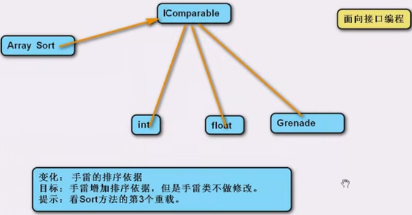

## 面对对象

为了让编程更加清晰，把程序中的功能进⾏模块化划分，每个模块提供特定的功能，⽽且每个模块都是孤⽴的，这种**模块化编程**提供了⾮常⼤的多样性，⼤⼤增加了重⽤代码的机会。

**面向过程编程（Procedure oriented program，POP）是一种以过程为中心的编程思想，分析出解决问题所需要的步骤，然后用函数把步骤实现，使用时调用相应函数。其程序是由算法和数据结构组成，关心解决问题的步骤。**

**面向对象编程（Object oriented program，OOP）是一种对现实世界理解和抽象的编程方法，把相关的数据和方法组织为一个整体看待，从更高层次来进行程序开发，更贴近事物的自然运行模式。其程序由对象和交互组成，关心谁在解决什么问题（谁在做什么：识别对象、分配职责、建立交互）。**

简单来说⾯向对象编程就是结构化编程，对程序中的变量结构划分，让编程更清晰。在面向对象编程中，**万物皆对象，用程序来抽象（形容）对象，用面向对象的思想来编程**。面向对象编程可以提高代码复用率，提高开发效率，增强程序的可拓展性，显示清晰的逻辑关系。

类是一个抽象的概念，对象是类的具体实例。不同类具有不同的行为。同类型的多个对象，虽行为相同，但拥有不同的数据。

先有类还是先有对象？从设计角度讲，先有对象，再从对象抽象出类。从编码角度讲，先有类，类是对象的模板，再实例化对象。

**面对对象三大特性：封装、继承、多态。**

**面对对象主要思想：分而治之、封装变化、高内聚、低耦合。**

**面对对象四大关系：依赖、关联、聚合、组合。**

**面对对象七大原则：开闭原则、单一职责、里氏替换、依赖倒置、迪米特法则、接口隔离、组合复用。**

## 主要思想

**分为治之**：将一个大的需求分解为许多类，每个类处理一个独立的模块，便于分工和复用，可扩展性强。

**封装变化**：变化的地方独立封装，避免影响其他模块。

**高内聚**：类中各个方法都在完成一项任务（单个职责的类）。复杂的实现封装在内部，对外提供简单的调用。

**低耦合**：类与类的关联性依赖度要低（每个类独立）。让一个模块的改变，尽少影响其他模块。

最高的内聚莫过于类中仅包含一个方法，将会导致高内聚高耦合。最低的耦合莫过于类中包含所有方法，将会导致低耦合低内聚。

优势：高复用性、高扩展性、高维护性、高移植性。

## 四大关系

对象之间的关系可分为纵向和横向，其中纵向有继承、实现，横向中关系性由弱到强有依赖、关联、聚合、组合。

**依赖（Dependence）是一个类“使用”到了另一个类，但这种使用是临时的、较弱的关系，是一种相对松散的耦合。** 通常情况下，A类依赖B类，意味着A类的某些功能靠B类实现，即B类型作为A类型中的方法参数或局部变量，并不是A类的成员，变化仅影响一个方法。

**关联（Association）是一个类“使用”到了另一个类，但这种使用是长期的、较强的关系。** 通常情况下，A类与B类关联，意味着B类是A类的一部分，即A类中包含B类型成员，变化影响一个类。关联中包括单向、双向和自关联。

**聚合（Aggregation）是关联的一种特例，也表示一个对象与另一个对象有关联，但对象之间是整体与部分的关系，且整体和部分可以分开，如汽车与发动机。** 通常情况下，A类与B类聚合，意味着B类是A类的一部分，即A类中包含B类型成员，且通过构造方法或普通方法为成员赋值，对象是在外部创建并传递进来。

**组合（Composition）也表示一个对象与另一个对象有关联，对象之间仍是整体与部分的关系，但整体和部分不可以分开且部分的生命周期受到整体的影响，耦合性最强，如人和手。** 通常情况下，A类与B类组合，意味着B类是A类的一部分，即A类中包含B类型成员，且在A类内部直接创建并为成员赋值，对象是在内部创建并无需传递。

## 七大原则

### 开闭原则

**开（放封）闭原则（Open-Closed Principle，OCP）指对扩展开放，对修改关闭，即变化是通过扩展实现的，而不是通过修改已有代码实现的。开闭原则是目标，是总的指导思想。** 实现对修改封闭，关键在于抽象化。对一个事物抽象化，实质上是对一个事物进行概括、归纳、总结，将其本质特征抽象地用一个类来表示，这样类才会相对稳定，无需更改。扩展开放一般是通过继承和多态来实现，如此一来，可以保持父类的原样，只需在子类中添加些所需的新功能。

### 单一职责

**单一职责原则（Single Resposibility Principle，SRP）的核心思想：一个类只做好一件事情。** 通常意义下的单一职责，指的是类、接口或方法只有一种单一功能，不要为其设计过多的功能，交杂不清的功能会使代码杂乱，提高程序开发的难度和系统出错的概率，降低系统的可维护性。

单一职责原则可以：

- 明确定义职责，降低复杂性。
- 提高可读性和可维护性。
- 降低变化的影响，提高系统的扩展性和健壮性。

单一职责原则可以看作是高内聚、低耦合在面向对象原则上的引申。职责过多，容易导致职责依赖，提高耦合度，降低内聚性。但是，过度强调单一职责，会带来类、接口或方法的数量增加、耦合过重的问题，并且人为的增加了设计的复杂性。因此，**单一职责原则仅适用于基础类，不适用基于基础类构造复杂的聚合类。**

### 里氏替换

**里氏替换原则（Liskov Substitution Principle，LSP）指父类出现的地方可以被子类替换，在替换后依然保持原功能。** 里氏替换指导继承的设计，即继承后的重写：

- 子类要拥有父类的所有功能，即必须完全实现父类的方法。
- 子类可以拥有自己的行为。
- 覆盖或实现父类方法时可以通过重载使得传入参数被放大、输出结果被缩小。因此，里氏替换强调子类在重写父类方法时，尽量选择扩展重写，防止改变父类功能而引发异常。

### 依赖倒置

**依赖倒置原则（Dependecy Inversion Principle，DIP）的核心思想是依赖抽象。高层模块不依赖于底层模块，二者都依赖于抽象；抽象不依赖于具体，具体依赖于抽象。** 依赖倒置原则是对传统过程性设计方法的“倒转”，是高层次模块复用及其可维护性的有效规范。*抽象是稳定的，实现是多变的*。

依赖倒置原则可以：

- 减少类间的耦合性。
- 提高系统的稳定性。
- 降低并行开发引起的风险。
- 提高可读性和可维护性。

抽象语义的三种实现：

- **抽象类**是一个概念上的抽象；抽象类可以包含普通成员和抽象成员。
- **接口**是一组行为的抽象；接口只能包含抽象成员。
- **委托**是一类行为的抽象；委托只能传递同一类的方法。

依赖一定存在于类与类、模块与模块之间。类与类之间产生依赖时，依赖倒置原则的理解可以描述如下：依赖就是刚开始时具体细节间互相依赖，将实现的细节变成抽象类，降低类间耦合度。然后有了抽象类，继承自它的实现类也要依赖它。那倒置两字咋理解呢? 一般情况是先关注细节，然后根据细节抽象出来一些概括的方法，所以按常理一般抽象要依赖于细节的，而现在是是倒过来了，确定一个抽象类后，那些细节的实现得以抽象出来的方法为基准，并在子类中实现，从而变成了细节依赖于抽象。

当两个模块之间存在紧密的耦合关系时，最好的方法就是分离接口和实现：在依赖之间定义一个抽象的接口，供高层模块调用，底层模块实现接口的定义，从而有效控制耦合关系，达到依赖于抽象的设计目的。

**依赖于抽象就是不对实现编程，而对接口编程。** 面向接口编程时仅操作抽象，而无需关注具体类型，便于灵活切换一系列功能，实现并行开发。



依赖于抽象是一个通用原则，而有些时候依赖于细节是在所难免的，需要根据具体情况在在抽象与具体之间进行取舍。

案例1：人可以通过坐火车和汽车回家，代码如下：

``` csharp
class People
{
    public void GoHome(string type)
    {
        switch (type)
        {
            case "火车":
                Console.WriteLine("坐火车"); // 模拟功能
                break;
            case "汽车":
                Console.WriteLine("坐汽车"); // 模拟功能
                break;
            // 如果需要添加回家方式则需要修改源代码
        }
    }
}
```

扩展功能：增加一种交通方式：飞机。如果在上述代码中直接修改源代码，不可取，因此需要重新设计代码结构。按照封装变化的思想提炼出变化点：回家方式，因此用不同的类封装该变化。

``` csharp
// 开闭原则
class Train
{
    public void Transport()
    {
        Console.WriteLine("坐火车");
    }
}
class Car
{
    public void Transport()
    {
        Console.WriteLine("坐汽车");
    }
}
```

但此时在`People`类中修改后，仍需要根据回家方式以修改源代码。

``` csharp
class People
{
    public void GoHome(Train type)
    {
        Console.WriteLine("坐火车");
    }
    public void GoHome(Car type)
    {
        Console.WriteLine("坐汽车");
    }
}
```

此时根据依赖倒置原则， 从回家方式中抽象出类，然后在子类中实现细节。这样，`People`中直接调用父类的方法即可，父类方法可以用虚方法也可以用抽象方法。

``` csharp
class People
{
    public void GoHome(Transport type)
    {
        type.Transport();
    }
}

abstract class Transport
{
    public abstract void Transport();
}
class Train : Transport
{
    public override void Transport()
    {
        Console.WriteLine("坐火车");
    }
}
class Car : Transport
{
    public override void Transport()
    {
        Console.WriteLine("坐汽车");
    }
}
```

练习2：一家公司有如下几种岗位及该岗位计薪标准：普通员工（底薪）、程序员（底薪、项目分红）、测试员（底薪、Bug数乘10）。现定义员工管理器，记录所有岗位的员工，提供计算总薪资的方法。

变化点：岗位可能增加。

``` csharp
class Employee // 普通员工
{
    public string Name;
    public float baseSalary;
    public virtual float GetSalary()
    {
        return baseSalary;
    }
}
class Programmer : Employee // 程序员
{
    public float bonus;
    public override float GetSalary()
    {
        return base.baseSalary + bonus;
    }
}
class Tester : Employee // 测试员
{
    public int bugCount;
    public override float GetSalary()
    {
        return base.baseSalary + bugCount * 10;
    }
}

class WorkerManager // 员工管理器
{
    List<Employee> employeeList;
    public float GetTotalSalary()
    {
        float totalSalary = 0;
        foreach (Employee employee in employeeList)
        {
            totalSalary += employee.GetSalary();
        }
        return totalSalary;
    }
}
```

### 迪米特法则

**迪米特法则（Law of Demeter，LOD），也称最少知识原则（Least Knowledge Principle，LKP），指类与类交互时，在满足功能要求的基础上，传递的数据越少越好。**迪米特法则对类的低耦合提出了明确的要求：

- 只和朋友交流。
- 朋友之间也应最可能少的了解彼此。

迪米特法则能使类间解耦，提高类复用性，但容易产生大量中间类，导致系统复杂性提高，降低可维护性。

### 接口隔离

**接口隔离（Interface Segregation Principle，ISP）指尽量定义小而精的接口，少定义大而全的接口。** 本质与单一职责相同，即功能拆分。

小接口之间功能隔离，实现类需要多个功能时可以选择多实现或接口之间作继承，代码更灵活。

### 组合复用

**组合复用原则（Composite Reuse Principle，CRP）也叫合成/聚合复用原则（CARP），即在一个新的对象里面使用一些已有的对象，使之成为新对象的一部分；新的对象通过向这些对象的委派达到复用已有功能的目的。** 如果为了复用优先选择组合复用（耦合度更低，使用更灵活），而非继承复用。

案例3

对于练习2，当程序员老王需要调换岗位时，无法更改其内部的`GetSalary()`方法。此时，变化点是工作计薪方式。

``` csharp
class Employee // 普通员工
{
    public string Name;
    public Job job;
    public virtual float GetSalary()
    {
        return job.GetSalary();
    }
}

public Job // 普通工作
{
    public float baseSalary;
    public virtual float GetSalary()
    {
        return baseSalary;
    }
}
class Programmer : Job // 程序员
{
    public float bonus;
    public override float GetSalary()
    {
        return base.baseSalary + bonus;
    }
}
class Tester : Job // 测试员
{
    public int bugCount;
    public override float GetSalary()
    {
        return base.baseSalary + bugCount * 10;
    }
}
```