# Git使用指南

## 简介

### 版本控制系统

**版本控制系统**（Version Control Systems，VCS）是一种记录一个或若干文件内容变化，以便将来查阅特定版本修订情况的系统。它仅需花费较小的代价，就可以将选定的文件甚至整个项目回溯到过去某个时间点的状态、比较文件的变化细节、查出最后是谁修改了哪个地方从而找出问题出现的原因、恢复误删的文件等等。

**本地版本控制系统**（Local Version Control Systems，LVCS）大多采用某种简单的数据库来记录文件的历次更新差异。其中最流行的一种叫做修订控制系统（Revision Control System，RCS），其工作原理是在硬盘上保存补丁集（补丁是指文件修订前后的变化），通过补丁计算出各个版本的文件内容。

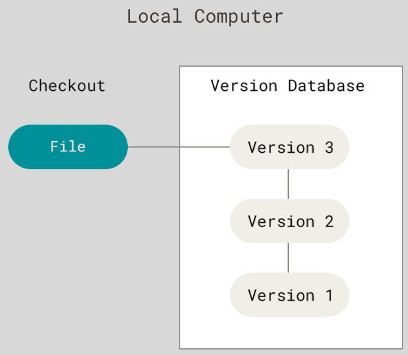

**集中化的版本控制系统**（Centralized Version Control Systems，CVCS）为了能让在不同系统上的开发者协同工作，使用一个集中管理的服务器保存所有文件的修订版本，而协同工作的人们都通过客户端连到这台服务器，取出最新的文件或者提交更新。CVCS为每个开发者设定不同权限，观察任何文件的变化，并且降低项目的维护成本。然而，如果中央服务器发生损坏，又没有备份，那么将丢失所有数据——包括项目的整个变更历史，只剩下各自机器上保留的单独快照。RCS也存在类似问题。

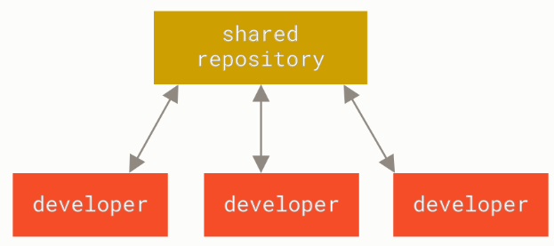

**分布式版本控制系统**（Distributed Version Control System，DVCS）让客户端把代码仓库完整备份下来，包括完整的历史记录。这样，任何一处服务器发生故障，都可以用任何一个镜像出来的本地仓库恢复。此外，DVCS可以指定和若干不同的远端代码仓库进行交互，使得开发者可以在同一个项目中和不同工作小组的人相互协作。

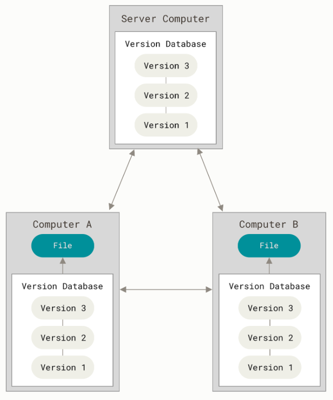

### 关于Git

Linux内核开源项目有着为数众多的参与者。绝大多数的Linux内核维护工作都花在了提交补丁和保存归档的繁琐事务上（1991-2002年间）。到2002年，整个项目组开始启用一个专有的分布式版本控制系统BitKeeper来管理和维护代码。

到了2005年，开发BitKeeper的商业公司同Linux内核开源社区的合作关系结束，他们收回了Linux内核社区免费使用BitKeeper的权力。这迫使Linux开源社区（特别是Linux的缔造者Linus Torvalds）基于使用BitKeeper时的经验教训，开发出自己的版本系统。他们对新的系统制订了若干目标：

- 速度
- 简单的设计
- 对非线性开发模式的强力支持（允许成千上万个并行开发的分支）
- 完全分布式
- 有能力高效管理类似Linux内核一样的超大规模项目（速度和数据量）

自诞生于2005年以来，Git日臻成熟完善，在高度易用的同时，仍然保留着初期设定的目标。它的速度飞快，极其适合管理大项目，有着令人难以置信的非线性分支管理系统。

Git和其它版本控制系统（包括Subversion和近似工具）的主要差别在于**对待数据的方式**。其它大部分系统以**文件变更列表**的方式存储信息，这类系统（CVS、Subversion、Perforce等等）将它们存储的信息看作是**一组基本文件和每个文件随时间逐步累积的差异**（它们通常称作**基于差异（delta-based）**的版本控制）。

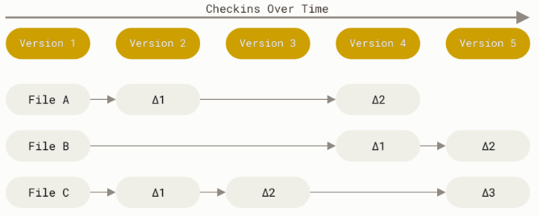

Git则把数据看作是**对小型文件系统的一系列快照**。在Git中，每当提交更新或保存项目状态时，它基本上就会对当时的全部文件创建一个快照并保存这个快照的索引。为了效率，如果文件没有修改，Git不再重新存储该文件，而是只保留一个链接指向之前存储的文件。Git对待数据更像是一个**快照流**。

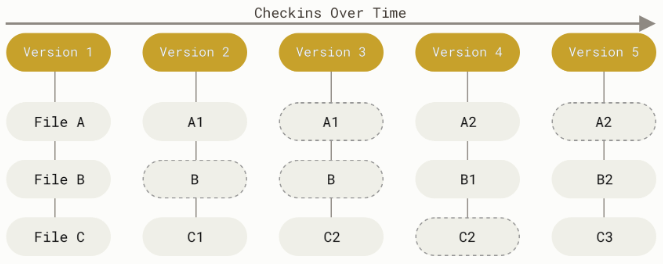

Git是一个快速、可扩展的分布式版本控制系统，具有丰富的指令集，同时提供高级操作以及对内部结构的完全控制。

- 绝大多数操作只需要**访问本地文件和资源**，不需要来自网络上其它计算机的信息，因此大部分操作执行速度较快。
- 所有的数据在存储前都计算校验和，然后**以校验和来引用**。这意味着不可能在Git不知情时更改任何文件或目录内容。
- 几乎所有的操作只会往数据库中添加数据，几乎**不会执行任何可能导致文件不可恢复的操作**。

> Git用以计算校验和的机制叫做SHA-1散列，这是一个基于Git中文件的内容或目录结构计算出来由40个十六进制字符组成的字符串。实际上，Git数据库中保存的信息都是以文件内容的哈希值来索引，而不是文件名。

Git中文件有三种状态：

- 已修改（Modified）：表示已修改该文件，但尚未保存到数据库中。
- 已暂存（Staged）：表示对已修改文件的当前版本做了标记，使之包含在下次提交的快照中。
- 已提交（Commited）：表示数据已经安全地保存在本地数据库中。

这会让Git项目拥有三个阶段：

- 工作区：是对项目的某个版本独立提取出来的内容，以供使用或修改。
- 暂存区：是一个文件，保存了下次要提交的文件列表信息，通常咋Git目录中。
- Git目录中：是Git保存项目的元数据和对象数据库的地方。

基本的Git工作流如下：

1. 在工作区中修改文件；
2. 将下次要提交的更改选择性地暂存，即添加到暂存区；
3. 提交更新，即将暂存区的文件快照永久性存储到Git目录中。

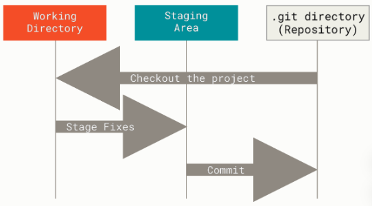

因此，Git中文件会处以三种状态之一：如果Git目录中保存着特定版本的文件，就属于已提交状态；如果文件已修改并放入暂存区，就属于已暂存状态；如果自上次检出后，作了修改但还没有放到暂存区域，就是已修改状态。

Git有多种使用方式，可以使用命令行或GUI，只有命令行才能执行Git的所有指令。

### 安装和配置

可以在Windows、Linux或MacOS上通过包管理器、安装程序等方式进行安装。

#### 配置文件

Git自带`git config`工具以对Git进行配置，这些配置存储在三个不同的位置：

- */etc/gitconfig*文件：包含系统上每一个用于及其仓库的通用配置。如果在执行`git config`时使用`--system`，则会读写此文件中的配置变量（需要管理员或超级用户权限）。
- *~/.gitconfig* 或 *~/.config/git/config* 文件：只针对当前用户。如果在执行`git config`时使用`--global`，则会读写此文件中的配置变量，会对所有的仓库生效。
- 当前仓库的Git目录中的 *.git/config* 文件：只针对某个仓库。如果在执行`git config`时使用`--local`（默认），则会读写此文件中的配置变量，只会对该仓库。

每个级别的配置会覆盖上一级别，因此 *.git/config* 的配置会覆盖 */etc/gitconfig* 中的。

在Windows中，Git会查找 *$HOME* （一般是*C:\Users\$USER*）目录下的 *.gitconfig* 文件。Git同样也会寻找 */etc/gitconfig* 文件，但只限于MSys的根目录下，即安装Git时所选的目标位置。如果在Windows上使用Git 2.x以后的版本，那么还有一个系统级的配置文件，Windows XP上在*C:\Documents and Settings\All Users\Application Data\Git\config*，Windows Vista其以后的版本在*C:\ProgramData\Git\config*。此文件只能以管理员权限通过`git config -f <file>`来修改。

可以通过以下指令检查配置信息。

```bash
# 查看所有的配置，会重复显示不同文件中的配置
git config --list

# 查看所有的配置及其所在文件
git config --list --show-origin

# 查看某一项配置
git config <key>

# 查看某一项配置及其所在文件
git config --show-origin <key>
```

#### 基础配置

使用`user.name`和`user.email`配置用户名和邮件地址。

```bash
git config --global user.name "NAME"
git config --global user.email XXX@XX.com
```

使用`core.editor`配置文本编辑器。在Windows系统上，必须指定可执行文件的完整路径。

```bash
# 指定Emacs作为默认文本编辑器
git config --global core.editor emacs

# 在Windows上使用Notepad++
git config --global core.editor "'C:/Program Files/Notepad++/notepad++.exe' -multiInst -notabbar -nosession -noPlugin"
```

#### 帮助

若在使用Git时需要获取帮助，可以使用以下指令：

```bash
git help <verb>
git <verb> --help
# 获取指令快速参考
git <verb> -h

#例如获取git config指令的帮助
git help config
```

## 基础

### 获取Git仓库

通常有两种方式获取Git仓库，这两种方式都会在本地机器上得到一个工作就绪的Git仓库。

将尚未进行版本控制的本地目录转化为Git仓库：

```bash
# 进入该项目目录
cd <directory>
# 初始化仓库：创建一个含有初始化Git仓库所有必须文件的.git目录
git init
# 追踪和提交
git add <file>
git commit -m '<message>'
```

从其它服务器克隆一个已存在的Git仓库：

```bash
# 克隆远程仓库
git clone <url> [local directory]
```

### 记录每次更新到仓库

工作目录下的文件无不处于**已跟踪**或**未跟踪**两种状态。已跟踪文件指已被纳入版本控制的文件，在上一次快照中有其记录，在工作一段时间后，其的状态可能是已提交、已修改或已暂存。未跟踪文件则既不存在于上次快照炉具中，也未被放入暂存区。

可以使用`git status`查看哪些文件处于什么状态，其中`Untracked files`后显示未跟踪文件，`Changes not staged for commit`后显示已修改文件，`Changes to be committed`后显示已暂存文件。该指令可以使用`-s`或`--short`参数简化输出，其中`M`表示已修改，`??`表示未跟踪，`A`表示已暂存，`MM`表示暂存后又作了修改，`D`表示已删除。该指令还显示了当前所在分支、与远程服务器上对应的分支是否偏离。

也可以使用`git diff`以文件补丁的格式更加具体地查看当前做的哪些更新尚未暂存、有哪些更新已暂存并准备提交。无参数的`git diff`比较的是工作目录中当前文件和暂存区域快照之间的差异，即修改之后尚未暂存起来的变化内容。`git diff --staged`或`git diff --cched`则对比已暂存文件与最后一次提交的文件差异。当然，也可以使用图形化工具或外部工具比较差异，即使用`git difftool`调用差异比较软件输出分析结果。使用`git difftool --tool-help`查看系统支持哪些Git差异比较插件。

使用`git add <file>`将一个未跟踪文件/目录或已修改文件添加到暂存区。需要注意的是，Git仅暂存了运行`git add`时的文件版本，如果在之后又对已暂存状态文件进行了修订，需要重新运行`git add`以暂存最新版本。

使用`git commit`提交，然后在文本编辑器中输入提交说明。可以添加`-m`选项将提交信息与指令放在同一行。可以添加`-a`选项以跳过繁琐的暂存操作，Git会自动将所有已跟踪文件暂存并提交。提交后可以看到提交所在分支、完整SHA-1校验和以及此次提交中多有文件修订过、多少行添加和删改过。

使用`git rm <file>`删除某个文件，如果要删除之前修改过或已经放到暂存区的文件，则必须使用强制删除选项`-f`。`--cached`选项可以仅从Git仓库中删除但仍保留在磁盘上。

使用`git mv <old> <new>`移动或重命名文件。`git mv`相当于运行了`mv <old> <new>`、`git rm <old>`和`git add <new>`。在使用其他工具重命名文件时，需要在提交前`git rm`删除旧文件名，再`git add`添加新文件名。

### 忽略文件

可以使用 *.gitignore* 文件列出要忽略的文件的模式，其语法为：

- 以'#'开始的行被视为注释。
- 可以使用标准的glob模式匹配，它会递归地应用在整个工作区中。
- 以`/`开头可防止递归，以`/`结尾表示目录。
- 以`*`通配零或多个字符。
- 使用`**`表示匹配任意中间目录。
- 以`?`通配单个字符。
- 以`[]`包含单个字符的匹配列表。
- 如果在`[]`中使用短划线分隔两个字符，表示所有在这两个字符范围内的都可以单个匹配。
- 以`!`表示不忽略（跟踪）匹配到的文件或目录。

```bash
# 忽略所有.a文件
*.a
# 但跟踪lib.a，即使忽略了.a文件
!lib.a
# 只忽略当前文件夹下的TODO文件，而不是subdir/TODO
/TODO
# 忽略任何目录下的build文件夹
build/
# 忽略doc/notes.txt，但不忽略doc/server/arch.txt
doc/*.txt
# 忽略doc/目录及其所有子目录下的.pdf文件
doc/**/*.pdf
# 忽略所有.o和.a文件.
*.[oa]
```

在最简单的情况下，一个仓库可能只根目录下有一个 *.gitignore* 文件，它递归地应用到整个仓库中。然而，子目录下也可以有 *.gitignore* 文件，其只作用于它所在的目录中。

### 查看提交历史

使用`git log`查看每次提交的SHA-1校验和、作者名和邮件地址、提交时间以及提交说明。此指令有许多选项可以帮助搜寻所要找的提交：

- `-p`或`--patch`：按补丁格式输出每次提交所引入的差异。
- `--stat`：显示每次提交的简略统计信息。
- `--shortstat`：只显示`--stat`中最后的行数修改添加移除统计。
- `--name-only`：仅在提交信息后显示已修改的文件清单。
- `--name-status`：仅在提交信息后显示已修改的文件清单。
- `--abbrev-commit`：仅显示SHA-1校验和所有40个字符中的前几个字符。
- `--relative-date`：使用较短的相对时间而不是完整格式显示日期（比如“2 weeks ago”）。
- `--graph`：在日志旁以ASCII图形显示分支与合并历史。
- `--pretty=`：选择不同的方式显示提交历史，其中`oneline`表示每个提交在一行显示，`short`、`full`和`fuller`以不同的详尽程度显示每个提交，`format`可以定制显示格式。
- `--oneline`：`--pretty=oneline --abbrev-commit`合用的简写。
- `-<n>`：限定只显示最近的n次提交。
- `--since=`、`--after`、`--until=`和`--before`：按时间限定显示提交。
- `--author`和`--committer`：显示限定作者和提交者的提交。
- `--grep`：显示提交说明中包含关键字的提交。
- `--all-match`：使用多个限定条件时，添加此选择表示匹配所有条件。
- `-S <string>`：只显示那些添加或和删除了目标字符串的提交。
- `--<path>`：定制路径。
- `--no-merges`：不显示合并提交。

```bash
# 每个提交在一行显示
git log --pretty=oneline
ca82a6dff817ec66f44342007202690a93763949 changed the version number
085bb3bcb608e1e8451d4b2432f8ecbe6306e7e7 removed unnecessary test
a11bef06a3f659402fe7563abf99ad00de2209e6 first commit

# 定制显示格式
git log --pretty=format:"%h - %an, %ar : %s"
ca82a6d - Scott Chacon, 6 years ago : changed the version number
085bb3b - Scott Chacon, 6 years ago : removed unnecessary test
a11bef0 - Scott Chacon, 6 years ago : first commit
```

下面列出了`format`接受的常用格式占位符：

- `%H`：提交的完整哈希值。
- `%h`：提交的简写哈希值。
- `%T`：树的完整哈希值。
- `%t`：树的简写哈希值。
- `%P`：父提交的完整哈希值。
- `%p`：父提交的简写哈希值。
- `%an`：作者名。
- `%ae`：作者的邮件地址。
- `%ad`：作者修订日期（可以使用`--date=`选项定制格式）。
- `%ar`：作者修订日期，按多久以前的方式显示。
- `%cn`：提交者的名字。
- `%ce`：提交者的邮件地址。
- `%cd`：提交日期。
- `%cr`：提交日期（距今多长时间）。
- `%s`：提交说明。

> 作者指实际作出修改的人，提交者指最后将此工作成果提交到仓库的人。

### 撤销操作

有时候提交完了才发现漏掉了几个文件没有添加，或者提交信息写错了。此时，可以运行带有`git commit --amend`来重新提交。此指令会将暂存区中的文件提交。如果自上次提交以来还未做任何修改（例如在上次提交后马上执行了此指令），那么快照会保持不变，而所修改的只是提交信息。最终第二次提交将代替第一次提交的结果。

如果意外地将某个文件添加到暂存区，可以使用`git reset <file>`取消暂存。

如果不想保留对某个文件的修改，可以使用`git checkout <file>`撤销对该文件所做的修改。

### 远程仓库的使用

远程仓库是指托管在因特网或其他网络中的项目的版本库。与他人协作涉及管理远程仓库以及根据需要推送或拉取数据。

可以使用`git remote`查看已配置的远程仓库服务器，至少会显示`origin`——Git给克隆的仓库服务器的默认名称。可以添加`-v`选项显示需要读写远程仓库使用的Git保存的简写与其对应的URL。

还可以使用`git remote show <remote>`查看某一个远程仓库的更多信息，如在特定的分支上执行`git push`会自动地推送到哪一个远程分支，执行`git pull`时哪些本地分支可以与它跟踪的远程分支自动合并，哪些远程分支不在本地，哪些远程分支已经从服务器上移除。

运行`git remote add <shortname> <url>`添加一个新的远程Git仓库，同时指定一个方便使用的简称。

可以使用`git remote rename`修改一个远程仓库的简写，这样也会修改所有远程跟踪的分支名字。

可以使用`git remote remove <remote>`或`git remote rm <remote>`移除某个远程仓库，此时与该远程仓库相关的远程跟踪分支以及配置信息也会一起被删除。

运行`git fetch <remote>`从远程仓库中获得数据。此指令只会将数据下载到本地仓库，而不会自动合并或修改当前的工作。

如果当前分支设置了跟踪远程分支，可以用`git pull`（通常从最初克隆的服务器上）自动抓取后合并自动尝试该远程分支到当前分支。

> `git clone`克隆仓库时会自动将其添加为远程仓库，默认以“origin”作为简称，并设置本地master分支跟踪克隆的远程仓库的master分支（或其他名字的默认分支）。

使用`git push <remote> <branch>`将某分支推送到远程仓库服务器。只有拥有写入权限，并且之前没有人推送过时，才能够推送成功。如果已有人推送过要推送过的文件，则必须先抓取他们的工作并将其合并后才能推送。

### 标签

Git可以给仓库历史中的某一个提交打上标签，以示重要。Git支持两种标签：轻量标签（Lightweight）与附注标签（Annotated）。**轻量标签**很像一个不会改变的分支——它只是某个特定提交的引用。而**附注标签**是存储在Git数据库中的一个完整对象，可以被校验，包含打标签者的名字、电子邮件地址、日期时间，此外还有一个可以使用GNU Privacy Guard （GPG）签名并验证的标签信息。

使用`git tag`列出已有标签，可附加`-l`或`--list`选项以按照某种模式查找标签。使用`git show <tag>`查看标签信息和提交信息。

使用`git tag <tag>`创建轻量标签，使用`git tag -a <tag> -m <message>`创建附注标签，使用`git tag -a <tag> <commit-SHA-1>`为历史提交打标签。

默认情况下，`git push`不会推送标签到远程仓库服务器上。在创建完标签后必须显示推送标签到服务器上。

可以使用`git push <remote> <tag>`推送标签，使用`git push <remote> --tags`将不在远程仓库服务器上的标签全部推送上去。

可以使用`git tag -d <tag>`删除本地仓库上的标签。此后，必须使用`git push <remote> :refs/tags/<tag>`或`git push <remote> --delete <tag>`更新远程仓库。

### 别名

可以通过`git config`为每一个指令设置别名。

```bash
git config --global alias.co checkout
git config --global alias.br branch

# 取消暂存文件
git config --global alias.unstage 'reset HEAD --'
# 以下两指令等价
git unstage filaA
git reset HEAD -- fileA
```

## 分支

使用分支意味着可以把工作从开发主线上分离开来，以免影响开发主线。几乎所有的版本控制系统都以某种形式支持分支。

Git保存的不是文件的变化或者差异，而是一系列不同时刻的快照。在进行提交操作时，Git会保存一个提交对象（Commit object），该提交对象会包含一个指向暂存内容快照的指针、作者姓名和邮箱、提交时输入的信息以及指向其父对象的指针。首次提交产生的提交对象没有父对象，普通提交操作产生的提交对象有一个父对象，而由多个分支合并产生的提交对象有多个父对象。

假设现在有一个工作目录，里面包含了三个将要被暂存和提交的文件。暂存操作会为每一个文件计算校验和，然后把当前版本的文件快照保存到Git仓库中，最终将校验和加入到暂存区域等待提交。进行提交操作时，Git会先计算每一个子目录（本例中只有项目根目录）的校验和，然后在Git仓库中将这些校验和保存为树对象。随后，Git便会创建一个提交对象，它除了包含上面提到的那些信息外，还包含指向这个树对象（项目根目录）的指针。如此一来，Git就可以在需要的时候重现此次保存的快照。现在，Git仓库中有五个对象：三个保存着文件快照的对象、一个记录着目录结构和文件快照索引的树对象以及一个包含着指向前述树对象的指针和所有提交信息的提交对。

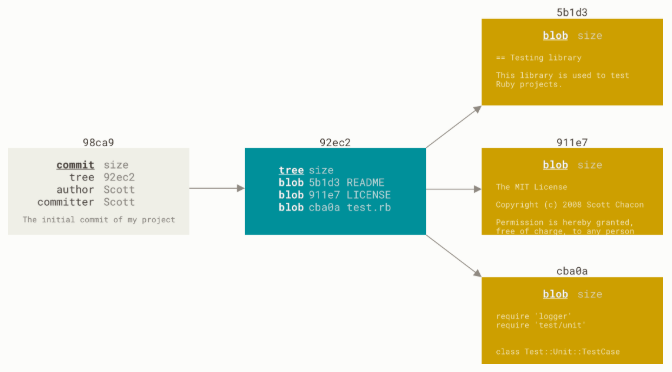

**Git的分支本质上仅仅是指向提交对象的可变指针**，所以创建和销毁分支都异常高效。Git默认分支名为master，而master分支在每次提交时自动向前移动。

Git通过名为HEAD的特殊指针标识当前所在本地分支。

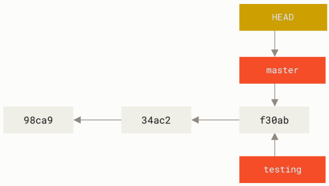

### 分支的创建与合并

可以使用`git branch <branch>`创建新分支，它实际上只是创建了一个可以移动的新指针。可以使用`gi checkout <branch>`切换到已存在的分支。创建分支和切换分支可以合用`git checkout -b <branch>`。分支切换会改变HEAD的位置和工作目录中的文件。

此外，不带任何选项的`git branch`可以显示当前所有分支列表，`*`标记当前检出的分支。添加`-v`可以查看每一个分支的最后一次提，`--merged`和`--no-merged`可以过滤列表中已经合并或尚未合并到当前分支的分支，甚至可以在`--merged`和`--no-merged`后添加`<branch>`参数查看其他分支的合并状态而不检出。

在创建分支、提交、切换分支等操作后，项目的提交历史已经产生了分叉。可以在不同分支间切换和工作，并在时机成熟时合并。可以使用`git log --decorate`查看各个分支当前所指的对象，添加`--oneline`、`--graph`和`--all`可以更形象的查看分叉历史。

可以使用`git branch -b <branch>`删除指定分支。对于尚未合并的分支，删除会失败。如果针对想要删除只，可以使用`-D`选项强制删除之。

分支合并使用`get merge <branch>`。当试图合并两个分支时，如果一个分支走下去能够到达另一个分支，那么Git在合并二者时只会简单的将指针向前推进，即快进（Fast-forward）。

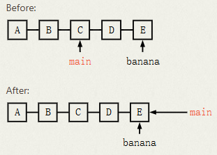

如果两个分支从更早的地方分叉开来（Diverged），Git将使用两个分支末端所指的快照以及这两个分支的公共祖先进行三方合并。Git会为三方合并的结果做了新的快照并自动创建一个新提交指向它，这被称作合并提交——此提交不止有一个父提交。当两个分支的修改都涉及到同一个文件的同一处，在合并它们时就会产生**合并冲突**。可以在合并冲突后的任意时刻使用`git status`查看因包含合并冲突而处于未合并（Unmerged）状态的文件。

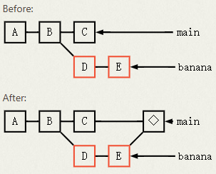

任何因包含合并冲突而有待解决的文件，都会以未合并状态标识出来。Git会在有冲突的文件中加入标准的冲突解决标记，这样可以打开这些包含冲突的文件然后手动解决冲突。出现冲突的文件会包含一些特殊区段：

```bash
<<<<<<< HEAD:index.html
<div id="footer">contact : email.support@github.com</div>
=======
<div id="footer">
 please contact us at support@github.com
</div>
>>>>>>> iss53:index.html
```

这表示HEAD所指示的版本（即在运行`git merge`时已经检出到的分支）在这个区段的上半部分（`=======`的上半部分），而iss53分支所指示的版本在`=======`的下半部分。为了解决冲突，必须选择由`=======`分割的两部分中的一个或自行合并这些内容，并且删除`<<<<<<<`、`=======`和`>>>>>>>`。可以使用`git mergetool`运行可视化图形工具解决冲突。

在解决了所有文件里的冲突后，对每个文件使用`git add`将其标记为冲突已解决。一旦暂存这些原本有冲突的文件，Git就会将它们标记为冲突已解决。

当所有冲突文件都已经暂存，可以使用`git commit`完成合并提交。

### 分支开发工作流

由于Git创建、删除、合并分支非常高效和方便，因此分支开发工作流通常有两种方式：

- 长期分支：在master分支上保留完全稳定的代码，使用一些平行分支进行后续开发或测试，这些分支一旦任务完成就可以被合并到master分支。
- 主题分支：在master分支上开发，在其他分支上进行单一特性或其他工作的开发，待其完成后合并到主干并删除它们。

### 远程分支

远程引用是对远程仓库的引用（指针），包括分支、标签等，可以使用`git ls-remote <remote>`获得远程引用的完整列表，或通过`git remote show <remote>`获取远程分支的更多信息。

**远程跟踪分支**是远程分支状态的无法移动的本地引用，以`<remote>/<branch>`命名。一旦进行了网络通信，Git就会自动移动它们以精确反映远程仓库的状态。例如，如果想查看最后一次与远程仓库origin通信时master分支的状态，可以查看origin/master分支。

如果要与远程仓库同步数据，运行`git fetch <remote>`。此指令查找远程仓库是哪一个服务器，从中抓取本地没有的数据并更新本地数据库，移动远程跟踪分支，但不会进行合并。

当想要公开分享一个分支时，需要将其推送到有写入权限的远程仓库上——本地的分支并不会自动与远程仓库同步。推送分支的指令为`git push <remote> <branch>`，也可以运行`git push <remote> <branch:otherBranchName>`来推送本地分支到一个命名不同的远程分支。

从一个远程跟踪分支检出一个本地分支会自动创建**跟踪分支**，其跟踪的远程分支为**上游分支**。跟踪分支是与远程分支有直接关系的本地分支。如果在一个跟踪分支上运行`git pull`，Git能自动识别去哪个服务器上抓取、合并到哪个分支。

当克隆一个仓库时，Git通常会自动创建一个跟踪远程仓库默认分支的跟踪分支。当然，可以运行`git checkout -b <branch> <remote>/<branch>`设置其他的跟踪分支，或是一个在其他远程仓库上的跟踪分支，又或者不跟踪远程仓库默认分支，这个指令被简化为`git checkout --track <remote>/<branch>`。由于这个操作太常用了，所以当检出的分支不存在且刚好只有一个名字与之匹配的远程分支，那么Git就会为自动创建一个跟踪分支。如果想要将本地分支与远程分支设置为不同的名字，运行`git checkout -b <otherBranchName> <remote>/<branch>`即可。

设置已有的本地分支跟踪一个刚刚拉取下来的远程分支，或者想要修改正在跟踪的上游分支，可以使用`git branch -u <remote>/<branch>`或`git branch -set-upstream-to <remote>/<branch>`设置。

如果想要查看设置的所有跟踪分支，可以使用`git branch -vv`将所有的本地分支列出来并且包含更多的信息，如每一个分支正在跟踪哪个远程分支与本地分支是否是领先、落后或是都有。

如果远程分支已经完成所有工作，可以运行`git push <remote> --delete <branch>`删除远程分支。此指令只是从服务器上移除这个指针，而数据则会保留到垃圾回收运行。

### 变基

在Git中整合来自不同分支的修改出来使用合并，还可以使用**变基**（Rebase）。变基操作可以将当前分支中引入的补丁和修改，在变基操作的目标基底分支上应用一次，使用的指令是`git rebase <baseBranch>`，也可以使用`git rebase <baseBranch> <topicBranch>`省去切换分支操作。其原理是先找到两个要操作的分支的最近共同祖先，然后对比当前分支相对于该祖先的历次提交，提取相应的修改并存为临时文件，然后将当前分支指向目标基底分支，最后将此前创建的临时文件依序应用。变基操作结束后，回到目标基底分支进行快进合并。合并和变基的最终结果没有任何区别，但变基使得提交历史更加整洁，是一条没有分叉的直线。

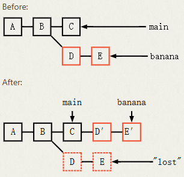

当然，对两个分支进行变基时，不一定要应用在目标基底分支，可以指定另一个分支进行应用，即使用`git rebase --onto <aimBranch> <baseBranch> <oprateBranch>`，该指令的意思是：取出oprateBranch分支，找出其从baseBranch分支分歧之后的补丁，然后把这些补丁应用到aimBranch分支上，之后就可以会计合并aimBranch分支了。

需要注意的是，**如果提交存在于本地仓库之外，而且别人有可能基于这些提交进行开发，则不要进行变基**。变基操作的实质是丢弃一些现有的提交，然后相应地创建一些内容一样但实际上不同的提交。如果某个提交已经被推送至某个仓库，而其他人已经从该仓库拉取提交并进行后续工作。此时，如果使用变基操作重新整理了提交并再次推送，其他人将不得不再次将其手头工作与新提交进行整合，而你也有可能拉取并整合其他人的提交。这种情况下，从远程仓库拉取数据时应该执行`git pull --rebase`或先`git fetch`再`git rebase <remote>/<branch>`。

基于以上，一个合理使用合并和变基的原则是：**只对尚未推送或分享给别人的本地修改执行变基操作来清理历史，对已推送至别处的提交执行合并操作**。

## 进阶

### Subtree

`Subtree`指令是Git提供的一个高效的**依赖管理**工具，它允许将一个独立的Git仓库（子仓库）完整地合并到另一个仓库（主仓库）中的指定目录中，从而实现代码的复用和集成。`Subtree`不会在主仓库中生成额外的配置文件（如 *.gitmodules* ），也不会跟踪子仓库的引用信息，而是将子仓库的代码直接作为主仓库的一部分进行管理，但保留了与原仓库的关联，支持后续的同步更新，避免了`Submodule`操作繁琐、易出现版本混乱的问题。

`Subtree`的核心操作包括添加子仓库、拉取子仓库更新、送子仓库修改、删除子仓库等，以下进行具体指令和示例说明。

需求：需要在主项目仓库main-project集成子仓库sub-project（远程地址为*github/test/sub-project*），计划在主仓库中创建 *./main-project/sub-project* 目录存放子仓库代码。

可以使用`git subtree add --prefix=<主仓库子目录路径> <子仓库URL> <子仓库分支> --squash`添加子仓库。

可以使用`git subtree pull --prefix=<主仓库子目录路径> <子仓库URL> <子仓库分支> --squash`同步更新子仓库的修改到主仓库。

如果主仓库中修改了子仓库的代码，可以使用`git subtree push --prefix=<主仓库子目录路径> <子仓库URL> <子仓库分支>`推送到子仓库，实现双向同步。

删除子仓库时需要手动删除子目录并清理相关提交历史（可选）。
