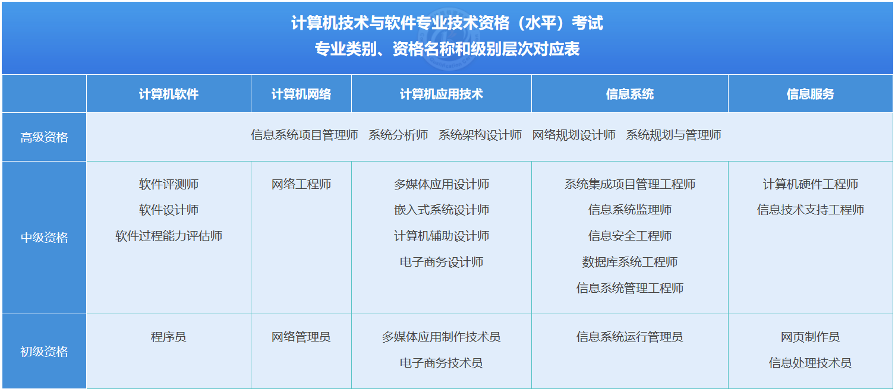

# 基本信息

计算机技术与软件专业技术资格（水平）考试（以下简称计算机软件资格考试，通常简称软考）是原中国计算机软件专业技术资格和水平考试（简称软件考试）的完善与发展。计算机软件资格考试是由国家人力资源和社会保障部、工业和信息化部领导下的**国家级考试**，其目的是科学、公正地对全国计算机与软件专业技术人员进行职业资格、专业技术资格认定和专业技术水平测试。工业和信息化部教育与考试中心负责全国考务管理工作，除台湾地区外，计算机软件资格考试在全国各省、自治区、直辖市及计划单列市和新疆生产建设兵团，以及香港特别行政区和澳门特别行政区，都建立了考试管理机构，负责本区域考试的组织实施工作。**计算机软件资格考试设置了27个专业资格，涵盖5个专业领域， 3个级别层次（初级、中级、高级）。**

根据原人事部、原信息产业部文件（国人部发[2003]39号）文件规定，计算机软件资格考试纳入全国专业技术人员职业资格证书制度的统一规划，实行统一大纲、统一试题、统一标准、统一证书的考试办法，每年举行两次。通过考试获得证书的人员，表明其已具备从事相应专业岗位工作的水平和能力，用人单位可根据工作需要从获得证书的人员中择优聘任相应专业技术职务（技术员、助理工程师、工程师、高级工程师）。**计算机软件资格考试全国统一实施后，不再进行计算机技术与软件相应专业和级别的专业技术职务任职资格评审工作。因此，计算机软件资格考试既是职业资格考试，又是职称资格考试。同时，该考试还具有水平考试性质，报考任何级别不需要学历、资历条件，只要达到相应的专业技术水平就可以报考相应的级别。**计算机软件资格考试部分专业岗位的考试标准与日本、韩国相关考试标准实现了互认，中国信息技术人员在这些国家还可以享受相应的待遇。考试合格者将颁发由中华人民共和国人力资源和社会保障部、工业和信息化部用印的计算机技术与软件专业技术资格（水平）证书。该证书在**全国范围内有效**。

> 中国法院网：[计算机技术与软件专业技术资格（水平）考试暂行规定](https://www.chinacourt.org/law/detail/2003/10/id/90558.shtml)
> 软考官方网站：[中国计算机技术职业资格网](https://www.ruankao.org.cn/ "中国计算机技术职业资格网")

作用：

- 积分落户。
- 升职加薪。
- 职称资格。
- 证书补贴。
- 抵扣个税。

# 科目设置

软考有27个科目，分为初级、中级、高级三个等级，**可以跨级考试**。每年会有两次考试安排，部分科目上下年都会考试，还有的科目只有在上半年或者下半年考试。

